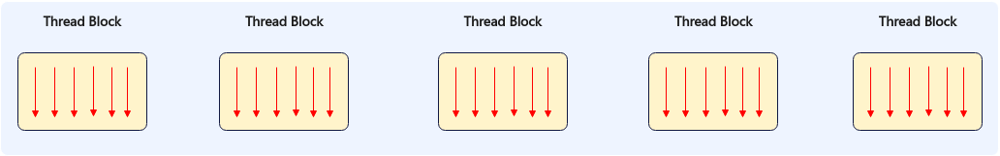
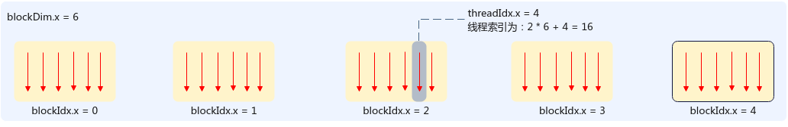
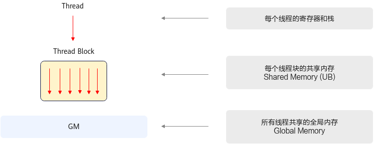
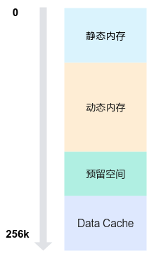
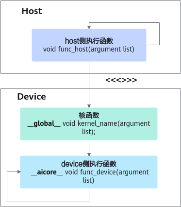

# AI Core纯SIMT编程<a name="ZH-CN_TOPIC_0000002554431451"></a>

> **说明：** 
>**纯SIMT编程场景当前不支持使用SIMT API，敬请期待后续版本的正式发布**。

与传统CPU相比，AI处理器更适合模型训练和推理场景，这得益于其内部更多的计算单元和对应的向量计算指令，使得单个硬件指令能完成多组数据的计算。AI处理器提供了以下两种编程模型：

-   SIMD（Single Instruction Multiple Data）：单指令多数据。以单条指令多个数据的形式来实现并行计算。
-   SIMT（Single Instruction Multiple Thread）：单指令多线程。以单条指令多个线程的形式来实现并行计算。

SIMT编程主要用于向量计算，特别适合处理离散访问、复杂控制逻辑等场景，当前仅支持Ascend 950PR/Ascend 950DT。本章将通过介绍Ascend C SIMT编程模型的核心概念，帮助用户更深入地理解SIMT编程。

## 核函数<a name="section962384613331"></a>

Ascend C支持开发者自定义核函数来扩展C++，核函数在AI处理器上执行时实际是若干线程在并行执行，每个线程有独立的寄存器和栈，共同完成数据计算任务。

核函数的定义示例如下：

```
 __global__ void kernel_name(argument list)
```

定义核函数时需要遵循以下规则：

-   使用函数类型限定符\_\_global\_\_， 标识它是一个核函数。
-   核函数必须具有void返回类型。
-   函数入参支持的类型如下：
    -   基础数据类型，如int32\_t、float等。
    -   基础数据类型的指针类型，如int32\_t\*、float\*等，实际上这些指针指向的是GlobalMemory内存。

-   使用[内核调用符<<<...\>\>\>](#li14421838161813)的语法形式调用核函数。

    ```
    kernel_name<<<...>>>(args...)
    ```

## 线程架构<a name="section1474765372617"></a>

SIMT编程模型的线程层次结构分为两层：

-   线程块网格（Grid）：由多个线程块（Thread Block）组成，使用内置变量gridDim来表示启用的线程块的个数，同一时刻一个AIV核只执行一个线程块任务。
-   线程块（Thread Block）：由若干线程（thread）组成，使用内置变量blockDim表示一个线程块启用的的线程个数，一个线程块最多可以启用2048个线程。

基于SIMT编程模型的程序，在AIV核上执行多个结构相同的线程块，执行的总线程数等于gridDim\*blockDim。



gridDim由三维结构[dim3](SIMT-BuiltIn关键字和API.md#li194695815222)来表示，\{dimx，dimy，dimz\}用于指定3个不同维度的线程块的大小，三维乘积的总数不超过65535，各线程块可通过线程块索引blockIdx进行标识。blockDim也由dim3三维结构表示，三维乘积的总数不超过2048，各线程可通过线程块内线程索引threadIdx进行标识。线程索引的计算示例如下图所示：



底层调度过程中，同一时刻一个AIV只能执行一个线程块任务，每个线程块会被切分成多个Warp依次调度并完成执行。Warp是执行相同指令的线程的集合，每个Warp包含32个线程。每个AIV核包含4个Warp调度器（Warp Scheduler），调度器编号scheduler id为warp id % 4。

## 内存模型<a name="section838620171433"></a>

SIMT编程可使用的内存空间包含如下三种：

-   每个线程独立的寄存器和栈，用于存储局部变量。可用寄存器数量与线程块中线程数有关，具体支持情况请见[表3 LAUNCH\_BOUND的Thread数量与每个Thread可用寄存器数](zh-cn_topic_0000002523303834.md#table167091123820)。
-   线程块内所有线程共享的本地内存，即Unified Buffer。该内存区域由线程块内所有线程共同访问，且其生命周期和线程块一致。
-   所有线程均可直接访问的全局内存，即Global Memory。



Unified Buffer内存空间总大小为256KB，按功能划分为四个主要区域，从低地址向高地址依次为静态内存、动态内存、 预留空间、Data Cache。



具体结构如下：

1.  静态内存：从内存的起始地址分配一段指定大小的内存空间，其大小在编译时确定，不可动态修改，开发者通过数组分配申请使用。**_该方式将在后续版本中支持_**。

    ```
    _ubuf_ half staticBuf[1024];
    ```

2.  动态内存：位于静态内存之后，通过<<<\>\>\>中参数dynUBufSize指定的动态内存大小空间，可通过使用动态数组分配。**_该方式将在后续版本中支持_**。

    ```
    __ubuf__ char dynamicBuf[];
    ```

3.  预留空间：编译器和Ascend C预留空间，大小固定为8KB。
4.  Data Cache：SIMT专有的Data Cache空间，其内存大小受用户配置的静态和动态内存大小影响。DataCache =  UB总大小（256KB） - 静态内存 - 动态内存 - 预留空间（8KB）。用户需要合理配置静态和动态内存大小，以确保DataCache大于或等于32KB。

> **说明：** 
>**静态内存分配、动态内存的动态数组分配方式目前开发中，将在后续版本中支持，请关注后续版本。**
>-   若DataCache小于32KB，会出现校验报错。
>-   纯SIMT场景，算子开发不能使用全部的Unified Buffer空间，除了预留8KB空间外，还需至少为SIMT预留32KB的Data Cache空间。

## 异构并行编程模型<a name="section9203101713551"></a>

SIMT编程场景中的Host-Device异构协同机制旨在解决传统编程模型在处理复杂计算任务时的效率和可扩展性问题，Host侧主要负责运行时管理，包括存储管理、设备管理和Stream管理等，确保任务的高效调度与资源的合理分配；Device侧则执行开发者基于Ascend C SIMT实现的[核函数](#section962384613331)，通过并发完成多线程的计算任务来实现计算加速。

算子程序中的函数可以分为三类：host侧执行函数、核函数（device侧执行）、device侧执行函数（除核函数之外）。下图以Kernel直调算子开发方式为例，描述三者的调用关系：

-   host侧执行函数可以调用其它host执行函数，也就是通用C/C++编程中的函数调用；也可以通过<<<...\>\>\>调用核函数。
-   核函数可以调用除核函数之外的其它device侧执行函数。
-   device侧执行函数（除核函数之外）使用类型限定符\_\_aicore\_\_标识，可以调用同类的其它device侧执行函数。

**图 1**  算子程序中三种函数间的调用关系<a name="fig14484835135913"></a>  


Host侧通过内核调用符<<<...\>\>\>的语法形式调用核函数，如下所示：

```
kernel_name<<<numBlocks, threadsPerBlock, dynUBufSize, stream>>>(args...)
```

执行配置由4个参数决定：

-   <a name="li14421838161813"></a>numBlocks：为核函数配置的线程块的个数，即启用的核数,  支持int32\_t和dim3类型；
-   threadsPerBlock：每个线程块内并发执行的线程数量，支持int32\_t和dim3类型；
-   dynUBufSize：动态申请内存空间总大小，一般情况设置为0；
-   stream：用于host侧和device侧的流同步。

更多内容请参考[Host-Device异构协同机制](异构并行编程模型.md#section7325227154312)。

## 同步机制<a name="section384113910568"></a>

SIMT是一种单指令多线程的编程模式，其异步编程模型旨在通过多线程并发执行达到内存操作加速的目的。在这一编程模型中，线程作为执行计算或操作内存的最小抽象单位，其操作是相互独立的。然而，在某些应用场景中，需要支持线程间的同步，或防止不同线程对同一内存区域的读写操作引发的数据竞争。为此，Ascend C提供了相应的同步接口，这些接口允许开发者根据需求选择合适的同步机制，以确保异步操作的正确性和性能。

<a name="table1153875685516"></a>
<table><thead align="left"><tr id="row16538115615511"><th class="cellrowborder" valign="top" width="19.88%" id="mcps1.1.3.1.1"><p id="p125381156115512"><a name="p125381156115512"></a><a name="p125381156115512"></a>接口名</p>
</th>
<th class="cellrowborder" valign="top" width="80.12%" id="mcps1.1.3.1.2"><p id="p17538756175510"><a name="p17538756175510"></a><a name="p17538756175510"></a>功能说明</p>
</th>
</tr>
</thead>
<tbody><tr id="row82556463018"><td class="cellrowborder" valign="top" width="19.88%" headers="mcps1.1.3.1.1 "><p id="p13255194620010"><a name="p13255194620010"></a><a name="p13255194620010"></a><a href="asc_syncthreads.md">asc_syncthreads</a></p>
</td>
<td class="cellrowborder" valign="top" width="80.12%" headers="mcps1.1.3.1.2 "><p id="p32556461908"><a name="p32556461908"></a><a name="p32556461908"></a>等待当前线程块内所有线程代码都执行到该函数位置。</p>
</td>
</tr>
<tr id="row155387562553"><td class="cellrowborder" valign="top" width="19.88%" headers="mcps1.1.3.1.1 "><p id="p20538185685510"><a name="p20538185685510"></a><a name="p20538185685510"></a><a href="asc_threadfence.md">asc_threadfence</a></p>
</td>
<td class="cellrowborder" valign="top" width="80.12%" headers="mcps1.1.3.1.2 "><p id="p135393567552"><a name="p135393567552"></a><a name="p135393567552"></a>用于保证不同线程对同一份全局、共享内存的访问过程中，写入操作的时序性。它不会阻塞线程，仅保证内存操作的可见性顺序。</p>
</td>
</tr>
</tbody>
</table>

## 编程语法及使用限制<a name="section614243410128"></a>

SIMT编程需要使用的内置关键字和API请参见[SIMT BuiltIn关键字和API](SIMT-BuiltIn关键字和API.md)、[SIMT语言扩展层C API](SIMT语言扩展层C-API.md)。当前SIMT编程暂不支持部分语法结构，相关限制请参考[函数](函数.md)。

## 编程示例<a name="section14722145418565"></a>

考虑如下计算场景：从形状为100000 \* 128的二维向量中获取指定索引的12288行数据。算子输出output第i行数据的计算公式为：

```
output[i] = input[index[i]]
```

在核函数中完成一行数据量的计算逻辑，通过配置多个线程完成不同行的数据计算操作。核函数的实现逻辑具体为：

-   通过每个线程独有的线程索引找到当前线程需要计算的数据偏移量。

    ```
    int32_t out_row = blockIdx.x * blockDim.x + threadIdx.x;
    ```

    一个线程完成一次核函数的计算操作，核函数内通过计算blockIdx.x \* blockDim.x + threadIdx.x得到索引偏移，其中blockIdx是当前线程块的索引，blockDim是用户设置的线程块数，threadIdx是当前线程在线程块内的索引，更多详细介绍请参考[SIMT BuiltIn关键字和API](SIMT-BuiltIn关键字和API.md)。

-   通过下标偏移将偏移位置的输入数据拷贝到输出中，从而完成获取指定数据的功能。

    ```
    uint32_t in_row = index[out_row];
    for (int32_t col = 0; col < in_width; col++) { 
        //每个线程完成一行数据的计算操作
        int input_idx = in_row * in_width + col;
        int output_idx = out_row * in_width + col;
        gather_output[output_idx] = input[input_idx];
    }
    ```

核函数的实现参考如下代码。完整的样例请参考[pure\_simt\_gather算子样例](https://gitcode.com/cann/asc-devkit/tree/master/examples/00_introduction/04_simple_operator/pure_simt_gather)。

```
template <typename type_data, typename type_idx>
__global__ void gather_custom(type_data* input, type_idx* index, type_data* gather_output, uint32_t in_width, uint32_t index_total_length)
{
    // 计算计算索引偏移量
    int32_t out_row = blockIdx.x * blockDim.x + threadIdx.x;
    // 从index中取出需要处理的行索引
    uint32_t in_row = index[out_row];
    // 循环处理该行所有数据
    for (int32_t col = 0; col < in_width; col++) {
        int input_idx = in_row * in_width + col;
        int output_idx = out_row * in_width + col;
        gather_output[output_idx] = input[input_idx]; // 将输入数据拷贝到输出中
    }
}
```

算子需要处理总共12288行数据，每行数据由核函数完成处理，因此需要12288个线程来完成对所有数据的处理。在Host侧通过<<<...\>\>\>调用核函数，同时设置启动48个线程块、每个线程块包含256个线程，示例代码如下。

```
int main(int argc, char* argv[])
{
   …    
    gather_custom<<<48, 256, 0, stream>>>(input_device, index_device, output_device, in_shape[1], index_total_length);
   … 
}
```

