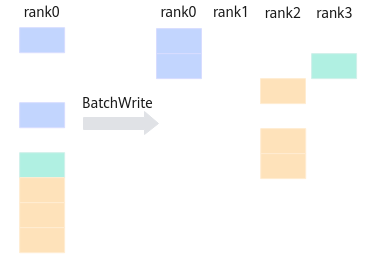

# BatchWrite<a name="ZH-CN_TOPIC_0000002554423459"></a>

## 产品支持情况<a name="section1586581915393"></a>

<a name="table169596713360"></a>
<table><thead align="left"><tr id="row129590715369"><th class="cellrowborder" valign="top" width="57.99999999999999%" id="mcps1.1.3.1.1"><p id="p17959971362"><a name="p17959971362"></a><a name="p17959971362"></a><span id="ph895914718367"><a name="ph895914718367"></a><a name="ph895914718367"></a>产品</span></p>
</th>
<th class="cellrowborder" align="center" valign="top" width="42%" id="mcps1.1.3.1.2"><p id="p89594763612"><a name="p89594763612"></a><a name="p89594763612"></a>是否支持</p>
</th>
</tr>
</thead>
<tbody><tr id="row18959673369"><td class="cellrowborder" valign="top" width="57.99999999999999%" headers="mcps1.1.3.1.1 "><p id="p1595910763613"><a name="p1595910763613"></a><a name="p1595910763613"></a><span id="ph1595918753613"><a name="ph1595918753613"></a><a name="ph1595918753613"></a>Ascend 950PR/Ascend 950DT</span></p>
</td>
<td class="cellrowborder" align="center" valign="top" width="42%" headers="mcps1.1.3.1.2 "><p id="p1695957133611"><a name="p1695957133611"></a><a name="p1695957133611"></a>x</p>
</td>
</tr>
</tbody>
</table>

## 功能说明<a name="section618mcpsimp"></a>

集合通信BatchWrite的任务下发接口，返回该任务的标识handleId给用户。BatchWrite实现了一种点对点通信，这是一种直接传输数据的通信模式，能够同时将多份数据发送到不同的Global Memory地址上。

**图 1**  BatchWrite示意图<a name="fig5325133243120"></a>  


## 函数原型<a name="section620mcpsimp"></a>

```
template <bool commit = false>
__aicore__ inline HcclHandle BatchWrite(GM_ADDR batchWriteInfo, uint32_t itemNum, uint16_t queueID = 0U)
```

## 参数说明<a name="section622mcpsimp"></a>

**表 1**  模板参数说明

<a name="table149053404318"></a>
<table><thead align="left"><tr id="zh-cn_topic_0000002554424815_zh-cn_topic_0235751031_row27598891"><th class="cellrowborder" valign="top" width="17.77%" id="mcps1.2.4.1.1"><p id="zh-cn_topic_0000002554424815_zh-cn_topic_0235751031_p20917673"><a name="zh-cn_topic_0000002554424815_zh-cn_topic_0235751031_p20917673"></a><a name="zh-cn_topic_0000002554424815_zh-cn_topic_0235751031_p20917673"></a>参数名</p>
</th>
<th class="cellrowborder" valign="top" width="11.799999999999999%" id="mcps1.2.4.1.2"><p id="zh-cn_topic_0000002554424815_zh-cn_topic_0235751031_p16609919"><a name="zh-cn_topic_0000002554424815_zh-cn_topic_0235751031_p16609919"></a><a name="zh-cn_topic_0000002554424815_zh-cn_topic_0235751031_p16609919"></a>输入/输出</p>
</th>
<th class="cellrowborder" valign="top" width="70.43%" id="mcps1.2.4.1.3"><p id="zh-cn_topic_0000002554424815_zh-cn_topic_0235751031_p59995477"><a name="zh-cn_topic_0000002554424815_zh-cn_topic_0235751031_p59995477"></a><a name="zh-cn_topic_0000002554424815_zh-cn_topic_0235751031_p59995477"></a>描述</p>
</th>
</tr>
</thead>
<tbody><tr id="zh-cn_topic_0000002554424815_row42461942101815"><td class="cellrowborder" valign="top" width="17.77%" headers="mcps1.2.4.1.1 "><p id="zh-cn_topic_0000002554424815_p163481714145518"><a name="zh-cn_topic_0000002554424815_p163481714145518"></a><a name="zh-cn_topic_0000002554424815_p163481714145518"></a>commit</p>
</td>
<td class="cellrowborder" valign="top" width="11.799999999999999%" headers="mcps1.2.4.1.2 "><p id="zh-cn_topic_0000002554424815_p33487148556"><a name="zh-cn_topic_0000002554424815_p33487148556"></a><a name="zh-cn_topic_0000002554424815_p33487148556"></a>输入</p>
</td>
<td class="cellrowborder" valign="top" width="70.43%" headers="mcps1.2.4.1.3 "><p id="zh-cn_topic_0000002554424815_p186182538493"><a name="zh-cn_topic_0000002554424815_p186182538493"></a><a name="zh-cn_topic_0000002554424815_p186182538493"></a>bool类型。参数取值如下：</p>
<a name="zh-cn_topic_0000002554424815_ul77246714401"></a><a name="zh-cn_topic_0000002554424815_ul77246714401"></a><ul id="zh-cn_topic_0000002554424815_ul77246714401"><li>true：在调用Prepare接口时，Commit同步通知服务端可以执行该通信任务。</li><li>false：在调用Prepare接口时，不通知服务端执行该通信任务。</li></ul>
</td>
</tr>
</tbody>
</table>

**表 2**  接口参数说明

<a name="table180119381514"></a>
<table><thead align="left"><tr id="row148011835158"><th class="cellrowborder" valign="top" width="17.77%" id="mcps1.2.4.1.1"><p id="p1280114381517"><a name="p1280114381517"></a><a name="p1280114381517"></a>参数名</p>
</th>
<th class="cellrowborder" valign="top" width="11.799999999999999%" id="mcps1.2.4.1.2"><p id="p380111321517"><a name="p380111321517"></a><a name="p380111321517"></a>输入/输出</p>
</th>
<th class="cellrowborder" valign="top" width="70.43%" id="mcps1.2.4.1.3"><p id="p28014351520"><a name="p28014351520"></a><a name="p28014351520"></a>描述</p>
</th>
</tr>
</thead>
<tbody><tr id="row17761811191614"><td class="cellrowborder" valign="top" width="17.77%" headers="mcps1.2.4.1.1 "><p id="p167771011181619"><a name="p167771011181619"></a><a name="p167771011181619"></a>batchWriteInfo</p>
</td>
<td class="cellrowborder" valign="top" width="11.799999999999999%" headers="mcps1.2.4.1.2 "><p id="p377721181614"><a name="p377721181614"></a><a name="p377721181614"></a>输入</p>
</td>
<td class="cellrowborder" valign="top" width="70.43%" headers="mcps1.2.4.1.3 "><p id="p1477711161611"><a name="p1477711161611"></a><a name="p1477711161611"></a>通信任务信息的Global Memory地址。一组通信数据的相关信息必须按指定的格式保存，在执行通信任务时，可以同时指定多组通信任务信息，执行通信任务时批量发送数据。</p>
</td>
</tr>
<tr id="row98411158123817"><td class="cellrowborder" valign="top" width="17.77%" headers="mcps1.2.4.1.1 "><p id="p78421658173815"><a name="p78421658173815"></a><a name="p78421658173815"></a>itemNum</p>
</td>
<td class="cellrowborder" valign="top" width="11.799999999999999%" headers="mcps1.2.4.1.2 "><p id="p19487144113910"><a name="p19487144113910"></a><a name="p19487144113910"></a>输入</p>
</td>
<td class="cellrowborder" valign="top" width="70.43%" headers="mcps1.2.4.1.3 "><p id="p1779721603916"><a name="p1779721603916"></a><a name="p1779721603916"></a>批量任务的个数。该参数取值必须与batchWriteInfo中通信任务信息的组数一致。</p>
</td>
</tr>
<tr id="row1391619475216"><td class="cellrowborder" valign="top" width="17.77%" headers="mcps1.2.4.1.1 "><p id="p8916154155216"><a name="p8916154155216"></a><a name="p8916154155216"></a>queueID</p>
</td>
<td class="cellrowborder" valign="top" width="11.799999999999999%" headers="mcps1.2.4.1.2 "><p id="p39161649523"><a name="p39161649523"></a><a name="p39161649523"></a>输入</p>
</td>
<td class="cellrowborder" valign="top" width="70.43%" headers="mcps1.2.4.1.3 "><p id="p1063215143103"><a name="p1063215143103"></a><a name="p1063215143103"></a>指定当前通信所在的队列ID，默认值为0。</p>
</td>
</tr>
</tbody>
</table>

## 返回值说明<a name="section640mcpsimp"></a>

返回该任务的标识handleId，handleId大于等于0。调用失败时，返回 -1。

## 约束说明<a name="section633mcpsimp"></a>

-   调用本接口前确保已调用过[InitV2](InitV2.md)和[SetCcTilingV2](SetCcTilingV2.md)接口。
-   若HCCL对象的[config模板参数](HCCL模板参数.md#table884518212555)未指定下发通信任务的核，该接口只能在AIC核或者AIV核两者之一上调用。若HCCL对象的[config模板参数](HCCL模板参数.md#table884518212555)中指定了下发通信任务的核，则该接口可以在AIC核和AIV核上同时调用，接口内部会根据指定的核的类型，只在AIC核、AIV核二者之一下发该通信任务。
-   一个通信域内，所有Prepare接口和InterHcclGroupSync接口的总调用次数不能超过63。
-   通信任务信息写入batchWriteInfo前，必须通过调用[DataCacheCleanAndInvalid](DataCacheCleanAndInvalid.md)接口，保证预期的数据成功刷新到Global Memory上。

