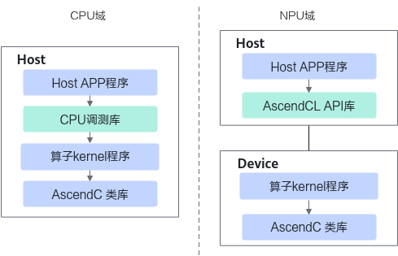

# CPU域孪生调试<a name="ZH-CN_TOPIC_0000002554351465"></a>

本节介绍CPU域调试的方法：CPU侧验证核函数，gdb调试、使用printf命令打印。

> **说明：** 
>-   当前您可以基于[Kernel直调样例工程](基于样例工程完成Kernel直调.md)实现CPU域调试功能。
>    [异构编译](AI-Core算子编译.md)场景，开发者使用命令行或者编写Cmake文件进行编译的情况，暂不支持CPU孪生调试并将在后续的版本中逐步支持。
>-   CPU调测过程中，配置日志相关环境变量，可以记录程序的运行过程及异常信息，有助于开发者进行功能调测。
>    关于环境变量的使用约束以及详细说明，可参见《环境变量参考》中“辅助功能 \> 日志”章节。

## CPU侧验证核函数<a name="section1758101617714"></a>

在非昇腾设备上，开发者可以利用CPU仿真环境先行进行算子开发和测试，并在准备就绪后，利用昇腾设备进行加速计算。在[编译与运行](编译与运行.md)章节，我们已经介绍了算子Kernel程序NPU域的编译运行。相比于NPU域的算子运行逻辑，CPU域调试，实际上是通过标准的GCC编译器编译算子Kernel程序。此时算子Kernel程序链接CPU调测库，执行编译生成的可执行文件，可以完成算子CPU域的运行验证。CPU侧的运行程序，通过GDB通用调试工具进行单步调试，可以精准验证程序执行流程是否符合预期。

**图 1**  CPU域和NPU域的核函数运行逻辑对比<a name="fig1274642720202"></a>  


如果通过<<<\>\>\>调用核函数，则需要使用单独的[调测接口](CPU孪生调试.md)进行内存分配等操作，并对CPU域和NPU域的代码进行宏隔离。

## gdb调试<a name="section13838280458"></a>

可使用**gdb**单步调试算子计算精度。由于cpu调测已转为多进程调试，每个核都会拉起独立的子进程，故gdb需要转换成子进程调试的方式。

-   调试单独一个子进程

    启动gdb，示例中的add\_custom\_cpu为CPU域的算子可执行文件，参考[修改并执行一键式编译运行脚本](基于样例工程完成Kernel直调.md#section188001652105215)，将一键式编译运行脚本中的run-mode设置成cpu，即可编译生成CPU域的算子可执行文件。

    gdb启动后，首先设置跟踪子进程，之后再打断点，就会停留在子进程中，但是这种方式只会停留在遇到断点的第一个子进程中，其余子进程和主进程会继续执行直到退出。涉及到核间同步的算子无法使用这种方法进行调试。

    ```
    gdb --args add_custom_cpu  // 启动gdb，add_custom_cpu为算子可执行文件
    (gdb) set follow-fork-mode child
    ```

-   调试多个子进程

    如果涉及到核间同步，那么需要能同时调试多个子进程。

    在gdb启动后，首先设置调试模式为只调试一个进程，挂起其他进程。设置的命令如下：

    ```
    (gdb) set detach-on-fork off
    ```

    查看当前调试模式的命令为：

    ```
    (gdb) show detach-on-fork
    ```

    中断gdb程序要使用捕捉事件的方式，即gdb程序捕捉fork这一事件并中断。这样在每一次起子进程时就可以中断gdb程序。设置的命令为：

    ```
    (gdb) catch fork
    ```

    当执行r后，可以查看当前的进程信息：

    ```
    (gdb) info inferiors
      Num  Description
    * 1    process 19613
    ```

    可以看到，当第一次执行fork的时候，程序断在了主进程fork的位置，子进程还未生成。

    执行c后，再次查看info inferiors，可以看到此时第一个子进程已经启动。

    ```
    (gdb) info inferiors
      Num  Description 
    * 1    process 19613
      2    process 19626
    ```

    这个时候可以使用切换到第二个进程，也就是第一个子进程，再打上断点进行调试，此时主进程是暂停状态：

    ```
    (gdb) inferior 2
    [Switching to inferior 2 [process 19626] ($HOME/demo)]
    (gdb) info inferiors
      Num  Description
      1    process 19613
    * 2    process 19626
    ```

    请注意，inferior后跟的数字是进程的序号，而不是进程号。

    如果遇到同步阻塞，可以切换回主进程继续生成子进程，然后再切换到新的子进程进行调试，等到同步条件完成后，再切回第一个子进程继续执行。

如下是调试一个单独子进程的命令样例：

```
gdb --args add_custom_cpu
set follow-fork-mode child
break add_custom.cpp:45
run
list
backtrace
print i
break add_custom.cpp:56
continue
display xLocal
quit
```

## 使用printf打印命令打印<a name="section1829231615466"></a>

在代码中直接编写printf\(...\)来观察数值的输出。样例代码如下：

```
printf("xLocal size: %d\n", xLocal.GetSize()); 
printf("tileLength: %d\n", tileLength);
```

