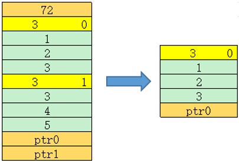

# GetDataPtr

**页面ID:** atlasascendc_api_07_00068  
**来源:** https://www.hiascend.com/document/detail/zh/CANNCommunityEdition/850/API/ascendcopapi/atlasascendc_api_07_00068.html

---

#### 产品支持情况

| 产品 | 是否支持 |
| --- | --- |
| Atlas A3 训练系列产品/Atlas A3 推理系列产品 | √ |
| Atlas A2 训练系列产品/Atlas A2 推理系列产品 | √ |
| Atlas 200I/500 A2 推理产品 | x |
| Atlas 推理系列产品AI Core | √ |
| Atlas 推理系列产品Vector Core | √ |
| Atlas 训练系列产品 | x |

#### 功能说明

获取储存Tensor数据地址。

#### 函数原型

```
T* GetDataPtr()
```

#### 参数说明

无

#### 返回值说明

返回储存Tensor数据地址。T数据类型。

#### 约束说明

无

#### 调用示例

示例中待解析的srcGm内存排布如下图所示：



```
AscendC::ListTensorDesc listTensorDesc(reinterpret_cast<__gm__ void *>(srcGm)); // srcGm为待解析的gm地址
uint32_t size = listTensorDesc.GetSize();                                       // size = 2
auto dataPtr0 = listTensorDesc.GetDataPtr<int32_t>(0);                          // 获取ptr0
auto dataPtr1 = listTensorDesc.GetDataPtr<int32_t>(1);                          // 获取ptr1

uint64_t buf[100] = {0}; // 示例中Tensor的dim为3, 此处的100表示预留足够大的空间
AscendC::TensorDesc<int32_t> desc;
desc.SetShapeAddr(buf);          // 为desc指定用于储存shape信息的地址
listTensorDesc.GetDesc(desc, 0); // 获取索引0的shape信息

uint64_t dim = desc.GetDim();   // dim = 3
uint64_t idx = desc.GetIndex(); // idx = 0
uint64_t shape[3] = {0};
for (uint32_t i = 0; i < desc.GetDim(); i++)
{
    shape[i] = desc.GetShape(i); // GetShape(0) = 1, GetShape(1) = 2, GetShape(2) = 3
}
auto ptr = desc.GetDataPtr();
```
