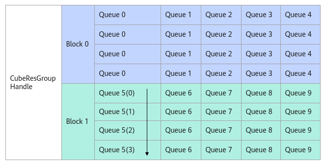

# AllocMessage

**页面ID:** atlasascendc_api_07_0293  
**来源:** https://www.hiascend.com/document/detail/zh/CANNCommunityEdition/850/API/ascendcopapi/atlasascendc_api_07_0293.html

---

#### 产品支持情况

| 产品 | 是否支持 |
| --- | --- |
| Atlas A3 训练系列产品            /             Atlas A3 推理系列产品 | x |
| Atlas A2 训练系列产品            /             Atlas A2 推理系列产品 | √ |
| Atlas 200I/500 A2 推理产品 | x |
| Atlas 推理系列产品            AI Core | x |
| Atlas 推理系列产品            Vector Core | x |
| Atlas 训练系列产品 | x |

#### 功能说明

AIV从消息队列里申请消息空间，用于存放消息结构体，返回当前申请的消息空间的地址。消息队列的深度固定为4，申请消息空间的顺序为自上而下，然后循环。当消息队列指针指向的消息空间为FREE状态时，AllocMessage返回空间的地址，否则循环等待，直到当前空间的状态为FREE。

**图1 **AllocMessage示意图


#### 函数原型

```
template <PipeMode pipeMode = PipeMode::SCALAR_MODE>             
__aicore__ inline __gm__ CubeMsgType *AllocMessage()
```

#### 参数说明

**表1 **模板参数说明

| 参数名 | 描述 |
| --- | --- |
| 用于配置发送消息的执行单元。PipeMode类型，其定义如下：                                                                                                                           ``` enum class PipeMode : uint8_t {    SCALAR_MODE = 0, // Scalar执行单元往GM上写消息。   MTE3_MODE = 1, // 使用MTE3单元往GM上写消息。   MAX  } ```                                                                                                注意，pipeMode为MTE3_MODE时，后续只能使用PostMessage接口发送消息。同时两个接口AllocMessage与PostMessage的模板参数pipeMode需要相同。 |  |

#### 返回值说明

当前申请的消息空间的地址。

#### 约束说明

无

#### 调用示例

```
auto queIdx = AscendC::GetBlockIdx();
handle.AssignQueue(queIdx);
auto msgPtr = handle.AllocMessage();        // 绑定队列后，从该队列中申请消息空间，消息空间地址为msgPtr。
```
