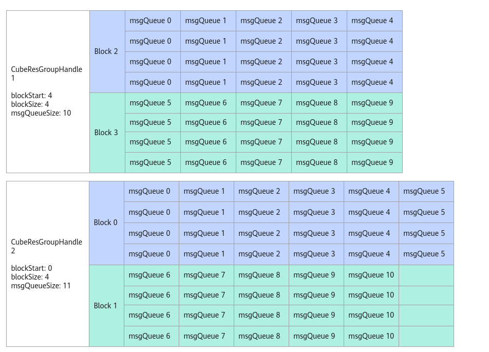

# CubeResGroupHandle构造函数

**页面ID:** atlasascendc_api_07_0291  
**来源:** https://www.hiascend.com/document/detail/zh/CANNCommunityEdition/850/API/ascendcopapi/atlasascendc_api_07_0291.html

---

#### 产品支持情况

| 产品 | 是否支持 |
| --- | --- |
| Atlas A3 训练系列产品            /             Atlas A3 推理系列产品 | x |
| Atlas A2 训练系列产品            /             Atlas A2 推理系列产品 | √ |
| Atlas 200I/500 A2 推理产品 | x |
| Atlas 推理系列产品            AI Core | x |
| Atlas 推理系列产品            Vector Core | x |
| Atlas 训练系列产品 | x |

#### 功能说明

构造CubeResGroupHandle对象，完成组内的AIC和消息队列分配。构造CubeResGroupHandle对象时需要传入模板参数CubeMsgType，CubeMsgType是由用户定义的消息结构体，请参考表1。使用此接口需要用户自主管理地址、同步事件等，因此更推荐使用CreateCubeResGroup接口快速创建CubeResGroupHandle对象。

#### 函数原型

```
template <typename CubeMsgType>
class CubeResGroupHandle;
__aicore__ inline CubeResGroupHandle() = default
__aicore__ inline CubeResGroupHandle(GM_ADDR workspace, uint8_t blockStart, uint8_t blockSize, uint8_t msgQueueSize, uint8_t evtIDIn)
```

#### 参数说明

**表1 **CubeResGroupHandle参数说明

| 参数 | 输入/输出 | 说明 |
| --- | --- | --- |
| workspace | 输入 | 该CubeResGroupHandle的消息通讯区在GM上的起始地址。 |
| blockStart | 输入 | 该CubeResGroupHandle在AIV视角下起始AIC对应的序号，即AIC的起始序号*2。例如，如果AIC起始序号为0，则填入0*2；如果为1，则填入1*2。 |
| blockSize | 输入 | 该CubeResGroupHandle在AIV视角下分配的Block个数，即实际的AIC个数*2。 |
| msgQueueSize | 输入 | 该CubeResGroupHandle分配的消息队列总数。 |
| evtIDIn | 输入 | 通信框架内用于AIV侧消息的同步事件。 |

如下图所示，CubeResGroupHandle1的blockStart为4，blockSize为4，表示起始的AIC序号为2，即blockStart / 2；AIC数量为2，即blockSize / 2。msgQueueSize为10，表示消息队列个数为10，每个Block分配的消息队列个数为Ceil(msgQueueSize，blockSize/2)，Block2和Block3分配到的消息队列个数均为5。CubeResGroupHandle2的msgQueueSize数量为11，最后一个Block只能分配5个消息队列。

**图1 **Block和消息队列映射示意图


#### 约束说明

- 假设芯片的AIV核数为x，那么blockStart + blockSize <= x - 1, msgQueueSize <= x。
- 每个AIC至少被分配1个消息队列msgQueue。
- blockStart和blockSize必须为偶数。
- 使用该接口，UB空间末尾的1600B + sizeof(CubeMsgType)将被占用。
- 1个AIC只能属于1个CubeGroupHandle，即多个CubeGroupHandle的[blockStart / 2, blockStart / 2+blockSize / 2]区间不能重叠。
- 不能和REGIST_MATMUL_OBJ接口同时使用。使用资源管理API时，用户自主管理AIC和AIV的核间通信，REGIST_MATMUL_OBJ内部是由框架管理AIC和AIV的核间通信，同时使用可能会导致通信消息错误等异常。

#### 调用示例

```
uint8_t blockStart = 4;
uint8_t blockSize = 4;
uint8_t msgQueueSize = 10;
uint8_t evtIDIn = 0; //用户自行管理事件ID
AscendC::KfcWorkspace desc(workspace); // 用户自行管理的workspace指针。
AscendC::CubeResGroupHandle<CubeMsgBody> handle;
handle = AscendC::CubeResGroupHandle<MatmulApiType, MyCallbackFunc, CubeMsgBody>(desc.GetMsgStart(), blockStart, blockSize, msgQueueSize, evtIDIn);
```
