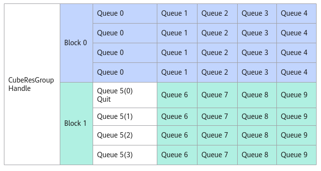

# SetQuit

**页面ID:** atlasascendc_api_07_0296  
**来源:** https://www.hiascend.com/document/detail/zh/CANNCommunityEdition/850/API/ascendcopapi/atlasascendc_api_07_0296.html

---

#### 产品支持情况

| 产品 | 是否支持 |
| --- | --- |
| Atlas A3 训练系列产品            /             Atlas A3 推理系列产品 | x |
| Atlas A2 训练系列产品            /             Atlas A2 推理系列产品 | √ |
| Atlas 200I/500 A2 推理产品 | x |
| Atlas 推理系列产品            AI Core | x |
| Atlas 推理系列产品            Vector Core | x |
| Atlas 训练系列产品 | x |

#### 功能说明

通过AllocMessage接口获取到消息空间地址后，发送退出消息，告知该消息队列对应的AIC无需处理该队列的消息。如下图，Queue5对应的AIV发了退出消息后，Block1将不再处理Queue5的任何消息。

**图1 **消息队列退出示意图


#### 函数原型

```
__aicore__ inline void SetQuit(__gm__ CubeMsgType* msg)
```

#### 参数说明

**表1 **接口参数说明

| 参数 | 输入/输出 | 说明 |
| --- | --- | --- |
| msg | 输入 | 该CubeResGroupHandle中的消息空间地址。 |

#### 返回值说明

无。

#### 约束说明

无

#### 调用示例

```
handle.AssignQueue(queIdx);  
auto msgPtr = a.AllocMessage();        // 获取消息空间指针msgPtr
handle.SetQuit(msgPtr);              // 发送退出消息
```
