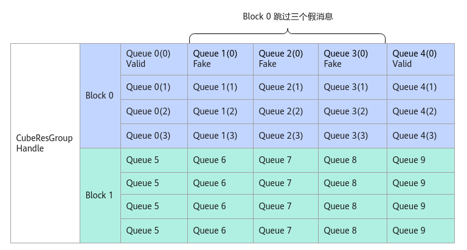

# SetSkipMsg

**页面ID:** atlasascendc_api_07_0299  
**来源:** https://www.hiascend.com/document/detail/zh/CANNCommunityEdition/850/API/ascendcopapi/atlasascendc_api_07_0299.html

---

# SetSkipMsg

#### 产品支持情况

| 产品 | 是否支持 |
| --- | --- |
| Atlas A3 训练系列产品            /             Atlas A3 推理系列产品 | x |
| Atlas A2 训练系列产品            /             Atlas A2 推理系列产品 | √ |
| Atlas 200I/500 A2 推理产品 | x |
| Atlas 推理系列产品            AI Core | x |
| Atlas 推理系列产品            Vector Core | x |
| Atlas 训练系列产品 | x |

#### 功能说明

AIC跳过指定个数假消息的处理，仅在回调函数中调用。下图中Block0通过调用SetSkipMsg跳过三个假消息。

**图1 **SetSkipMsg示意图


#### 函数原型

```
__aicore__ inline void SetSkipMsg(uint8_t skipCnt)
```

#### 参数说明

**表1 **接口参数说明

| 参数 | 输入/输出 | 说明 |
| --- | --- | --- |
| skipCnt | 输入 | AIC需要跳过的消息数。 |

#### 返回值说明

无。

#### 约束说明

该任务的消息空间后skipCnt个消息队列需要发送FAKE消息。

#### 调用示例

```
__aicore__ inline static void Call(
    MatmulApiCfg &mm, __gm__ CubeMsgBody *rcvMsg, CubeResGroupHandle<CubeMsgBody> &handle)
{
    //  AIC上计算逻辑，用户自行实现
    auto skipNum = 3;//(rcvMsg->head).skipCnt，假消息个数可由用户在回调计算结构体中定义，也可以通过自定义消息结构体传递。
    auto tmpId = handle.FreeMessage(rcvMsg, AscendC::CubeMsgState::VALID);    // 当前消息处理完，调用FreeMessage，代表rcvMsg已处理完
    for (int i = 1; i < skipNum + 1; i++) {  
         // 由于后续发了三个假消息，也需要调用FreeMessage，代表假消息处理完毕。                              
         auto tmpId = handle.FreeMessage(rcvMsg + i, AscendC::CubeMsgState::FAKE);
    }
    // 当假消息存在，需要调用SetSkipMsg，通知Cube核不去处理后面三个假消息。
    handle.SetSkipMsg(skipNum);
};
```
