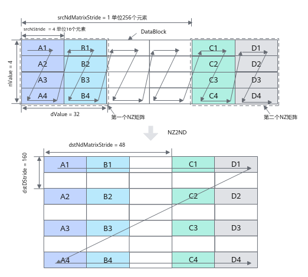
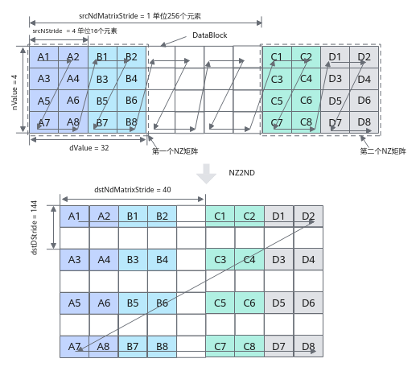

# 随路转换NZ2ND搬运

**页面ID:** atlasascendc_api_07_00128  
**来源:** https://www.hiascend.com/document/detail/zh/CANNCommunityEdition/850/API/ascendcopapi/atlasascendc_api_07_00128.html

---

#### 产品支持情况

| 产品 | 是否支持 |
| --- | --- |
| Atlas A3 训练系列产品/Atlas A3 推理系列产品 | √ |
| Atlas A2 训练系列产品/Atlas A2 推理系列产品 | √ |
| Atlas 200I/500 A2 推理产品 | x |
| Atlas 推理系列产品AI Core | √ |
| Atlas 推理系列产品Vector Core | x |
| Atlas 训练系列产品 | x |

#### 功能说明

支持在数据搬运时进行NZ到ND格式的转换。

#### 函数原型

```
template <typename T>
__aicore__ inline void DataCopy(const GlobalTensor<T>& dst, const LocalTensor<T>& src, const Nz2NdParamsFull& intriParams)
```

> **注意:** 

各原型支持的具体数据通路和数据类型，请参考支持的通路和数据类型。

#### 参数说明

**表1 **模板参数说明

| 参数名 | 描述 |
| --- | --- |
| T | 源操作数或者目的操作数的数据类型。支持的数据类型请参考支持的通路和数据类型。 |

**表2 **接口参数说明

| 参数名称 | 输入/输出 | 含义 |
| --- | --- | --- |
| dst | 输出 | 目的操作数，类型为GlobalTensor。 |
| src | 输入 | 源操作数，类型为LocalTensor。 |
| intriParams | 输入 | 搬运参数，类型为Nz2NdParamsFull。 具体定义请参考${INSTALL_DIR}/include/ascendc/basic_api/interface/kernel_struct_data_copy.h，${INSTALL_DIR}请替换为CANN软件安装后文件存储路径。 |

**表3 **Nz2NdParamsFull结构体内参数定义

| 参数名称 | 含义 |
| --- | --- |
| ndNum | 传输NZ矩阵的数目，取值范围：ndNum∈[0, 4095]。 |
| nValue | NZ矩阵的行数，取值范围：nValue∈[1, 8192]。 |
| dValue | NZ矩阵的列数，取值范围：dValue∈[1, 8192]。dValue必须为16的倍数。 |
| srcNdMatrixStride | 源相邻NZ矩阵的偏移（头与头），取值范围：srcNdMatrixStride∈[1, 512]，单位256 (16 * 16) 个元素。 |
| srcNStride | 源同一NZ矩阵的相邻Z排布的偏移（头与头），取值范围：srcNStride∈[0, 4096]，单位16个元素。 |
| dstDStride | 目的ND矩阵的相邻行的偏移（头与头），取值范围：dstDStride∈[1, 65535]，单位为元素。 |
| dstNdMatrixStride | 目的ND矩阵中，来自源相邻NZ矩阵的偏移（头与头），取值范围：dstNdMatrixStride∈[1, 65535]，单位为元素。 |

以half数据类型为例，NZ2ND转换示意图如下，样例中参数设置值和解释说明如下：

- ndNum = 2，表示源NZ矩阵的数目为2 (NZ矩阵1为A1~A4 + B1~B4，NZ矩阵2为C1~C4 + D1~D4)。
- nValue = 4，NZ矩阵的行数，也就是矩阵的高度为4。
- dValue = 32，NZ矩阵的列数，也就是矩阵的宽度为32个元素。
- srcNdMatrixStride = 1，表达相邻NZ矩阵起始地址间的偏移，即为A1~C1的距离，即为256个元素(16个DataBlock * 16个元素)。
- srcNStride = 4,  表示同一个源NZ矩阵的相邻Z排布的偏移，即为A1到B1的距离，即为64个元素(4个DataBlock* 16个元素)。
- dstDStride = 160，表达一个目的ND矩阵的相邻行之间的偏移，即A1和A2之间的距离，即为10个DataBlock，即10 * 16 = 160个元素。
- dstNdMatrixStride = 48，表达dst中第x个目的ND矩阵的起点和第x+1个目的ND矩阵的起点的偏移，即A1和C1之间的距离，即为3个DataBlock，3 * 16 = 48个元素。

**图1 **NZ2ND转换示意图（half数据类型）


以float数据类型为例，NZ2ND转换示意图如下，样例中参数设置值和解释说明如下：

- ndNum = 2，表示源NZ矩阵的数目为2 (NZ矩阵1为A1~A8 + B1~B8，NZ矩阵2为C1~C8 + D1~D8)。
- nValue = 4，NZ矩阵的行数，也就是矩阵的高度为4。
- dValue = 32，NZ矩阵的列数，也就是矩阵的宽度为32个元素。
- srcNdMatrixStride = 1，表达相邻NZ矩阵起始地址间的偏移，即A1到C1的距离，为256个元素(32个DataBlock * 8个元素)
- srcNStride = 4,  表示同一个源NZ矩阵的相邻Z排布的偏移，即A1到B1的距离，为64个元素 (8个DataBlock * 8个元素)。
- dstDStride = 144，表示一个目的ND矩阵的相邻行之间的偏移，即A1和A3之间的距离，为18个DataBlock，即18 * 8 = 144个元素。
- dstNdMatrixStride = 40，表示dst中第x个目的ND矩阵的起点和第x+1个目的ND矩阵的起点的偏移，即A1和C1之间的距离，为5个DataBlock，5 * 8 = 40个元素。

**图2 **NZ2ND转换示意图（float数据类型）


#### 约束说明

无

#### 支持的通路和数据类型

下文的数据通路均通过逻辑位置TPosition来表达，并注明了对应的物理通路。TPosition与物理内存的映射关系见表1。

**表4 **Local Memory -> Global Memory具体通路和支持的数据类型

| 产品型号 | 数据通路 | 源操作数和目的操作数的数据类型 (两者保持一致) |
| --- | --- | --- |
| Atlas 推理系列产品AI Core | VECOUT、CO2 -> GM（UB -> GM） | int16_t、uint16_t、int32_t、uint32_t、half、float |
| Atlas A2 训练系列产品/Atlas A2 推理系列产品 | VECOUT -> GM（UB -> GM） | int16_t、uint16_t、int32_t、uint32_t、half、bfloat16_t、float |
| Atlas A3 训练系列产品/Atlas A3 推理系列产品 | VECOUT -> GM（UB -> GM） | int16_t、uint16_t、int32_t、uint32_t、half、bfloat16_t、float |

#### 调用示例

```
#include "kernel_operator.h"
class KernelDataCopyUb2GmNz2Nd {
public:
    __aicore__ inline KernelDataCopyUb2GmNz2Nd()
    {}
    __aicore__ inline void Init(__gm__ uint8_t* dstGm, __gm__ uint8_t* srcGm)
    {
        AscendC::Nz2NdParamsFull intriParamsIn{1, 32, 32, 1, 32, 32, 1};
        intriParams = intriParamsIn;
        srcGlobal.SetGlobalBuffer((__gm__ half *)srcGm);
        dstGlobal.SetGlobalBuffer((__gm__ half *)dstGm);
        pipe.InitBuffer(inQueueSrcVecIn, 1, intriParams.nValue * intriParams.dValue * sizeof(half));
        pipe.InitBuffer(inQueueSrcVecOut, 1, intriParams.nValue * intriParams.dValue * sizeof(half));
    }
    __aicore__ inline void Process()
    {
        CopyIn();
        Compute();
        CopyOut();
    }
private:
    __aicore__ inline void CopyIn()
    {
        AscendC::LocalTensor<half> srcLocal = inQueueSrcVecIn.AllocTensor<half>();
        AscendC::DataCopy(srcLocal, srcGlobal, intriParams.nValue * intriParams.dValue);
        inQueueSrcVecIn.EnQue(srcLocal);
    }
    __aicore__ inline void Compute()
    {
        AscendC::LocalTensor<half> dstLocal = inQueueSrcVecIn.DeQue<half>();
        AscendC::LocalTensor<half> srcOutLocal = inQueueSrcVecOut.AllocTensor<half>();
        AscendC::DataCopy(srcOutLocal, dstLocal, intriParams.nValue * intriParams.dValue);
        inQueueSrcVecOut.EnQue(srcOutLocal);
        inQueueSrcVecIn.FreeTensor(dstLocal);
    }
    __aicore__ inline void CopyOut()
    {
        AscendC::LocalTensor<half> srcOutLocalDe = inQueueSrcVecOut.DeQue<half>();
        AscendC::DataCopy(dstGlobal, srcOutLocalDe, intriParams);
        inQueueSrcVecOut.FreeTensor(srcOutLocalDe);
    }
private:
    AscendC::TPipe pipe;
    AscendC::TQue<AscendC::TPosition::VECIN, 1> inQueueSrcVecIn;
    AscendC::TQue<AscendC::TPosition::VECOUT, 1> inQueueSrcVecOut;
    AscendC::GlobalTensor<half> srcGlobal;
    AscendC::GlobalTensor<half> dstGlobal;
    AscendC::Nz2NdParamsFull intriParams;
};
extern "C" __global__ __aicore__ void kernel_data_copy_nz2nd_ub2out(__gm__ uint8_t* src_gm, __gm__ uint8_t* dst_gm)
{
    KernelDataCopyUb2GmNz2Nd op;
    op.Init(dst_gm, src_gm);
    op.Process();
}
```

结果示例：

```
输入数据(srcGlobal): [1 2 3 ... 1024]
输出数据(dstGlobal):[1 2 ... 15 16 513 514 ... 527 528 17 18 ... 31 32 529 530 ... 543 544 ...497 498 ...  511 512  1009 1010... 1023 1024]
```
