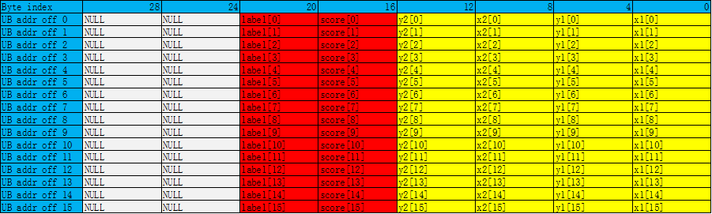

# ProposalConcat

**页面ID:** atlasascendc_api_07_0227  
**来源:** https://www.hiascend.com/document/detail/zh/CANNCommunityEdition/850/API/ascendcopapi/atlasascendc_api_07_0227.html

---

# ProposalConcat

#### 产品支持情况

| 产品 | 是否支持 |
| --- | --- |
| Atlas A3 训练系列产品/Atlas A3 推理系列产品 | x |
| Atlas A2 训练系列产品/Atlas A2 推理系列产品 | x |
| Atlas 200I/500 A2 推理产品 | x |
| Atlas 推理系列产品AI Core | √ |
| Atlas 推理系列产品Vector Core | x |
| Atlas 训练系列产品 | √ |

#### 功能说明

将连续元素合入Region Proposal内对应位置，每次迭代会将16个连续元素合入到16个Region Proposals的对应位置里。

**Region Proposal说明：**

目前仅支持两种数据类型：half、float。

每个Region Proposal占用连续8个half/float类型的元素，约定其格式：

```
[x1, y1, x2, y2, score, label, reserved_0, reserved_1]
```

对于数据类型half，每一个Region Proposal占16Bytes，Byte[15:12]是无效数据，Byte[11:0]包含6个half类型的元素，其中Byte[11:10]定义为label，Byte[9:8]定义为score，Byte[7:6]定义为y2，Byte[5:4]定义为x2，Byte[3:2]定义为y1，Byte[1:0]定义为x1。

如下图所示，总共包含16个Region Proposals。


对于数据类型float，每一个Region Proposal占32Bytes，Byte[31:24]是无效数据，Byte[23:0]包含6个float类型的元素，其中Byte[23:20]定义为label，Byte[19:16]定义为score，Byte[15:12]定义为y2，Byte[11:8]定义为x2，Byte[7:4]定义为y1，Byte[3:0]定义为x1。

如下图所示，总共包含16个Region Proposals。



#### 函数原型

```
template <typename T>
__aicore__ inline void ProposalConcat(const LocalTensor<T>& dst, const LocalTensor<T>& src, const int32_t repeatTime, const int32_t modeNumber)
```

#### 参数说明

**表1 **模板参数说明

| 参数名 | 描述 |
| --- | --- |
| T | 操作数数据类型。 Atlas 训练系列产品，支持的数据类型为：half Atlas 推理系列产品AI Core，支持的数据类型为：half/float |

**表2 **参数说明

| 参数名称 | 输入/输出 | 含义 |
| --- | --- | --- |
| dst | 输出 | 目的操作数。 类型为LocalTensor，支持的TPosition为VECIN/VECCALC/VECOUT。 LocalTensor的起始地址需要32字节对齐。 |
| src | 输入 | 源操作数。 类型为LocalTensor，支持的TPosition为VECIN/VECCALC/VECOUT。 LocalTensor的起始地址需要32字节对齐。 源操作数的数据类型需要与目的操作数保持一致。 |
| repeatTime | 输入 | 重复迭代次数，int32_t类型，每次迭代完成16个元素合入到16个Region Proposals里，下次迭代跳至相邻的下一组16个Region Proposals和下一组16个元素。取值范围：repeatTime∈[0,255]。 |
| modeNumber | 输入 | 合入位置参数，取值范围：modeNumber∈[0, 5]，int32_t类型，仅限于以下配置：- 0 – 合入x1- 1 – 合入y1- 2 – 合入x2- 3 – 合入y2- 4 – 合入score- 5 – 合入label |

#### 返回值说明

无

#### 约束说明

- 用户需保证dst中存储的proposal数目大于等于实际所需数目，否则会存在tensor越界错误。
- 用户需保证src中存储的元素大于等于实际所需数目，否则会存在tensor越界错误。

#### 调用示例

- 接口使用样例

```
// repeatTime = 2, modeNumber = 4, 把32个数合入到32个Region Proposal中的score域中
AscendC::ProposalConcat(dstLocal, srcLocal, 2, 4);
```

- 完整样例

```
#include "kernel_operator.h"

class KernelVecProposal {
public:
    __aicore__ inline KernelVecProposal() {}
    __aicore__ inline void Init(__gm__ uint8_t* src, __gm__ uint8_t* dstGm)
    {
        srcGlobal.SetGlobalBuffer((__gm__ half*)src);
        dstGlobal.SetGlobalBuffer((__gm__ half*)dstGm);
        pipe.InitBuffer(inQueueSrc, 1, srcDataSize * sizeof(half));
        pipe.InitBuffer(outQueueDst, 1, dstDataSize * sizeof(half));
    }
    __aicore__ inline void Process()
    {
        CopyIn();
        Compute();
        CopyOut();
    }

private:
    __aicore__ inline void CopyIn()
    {
        AscendC::LocalTensor<half> srcLocal = inQueueSrc.AllocTensor<half>();
        AscendC::DataCopy(srcLocal, srcGlobal, srcDataSize);
        inQueueSrc.EnQue(srcLocal);
    }
    __aicore__ inline void Compute()
    {
        AscendC::LocalTensor<half> srcLocal = inQueueSrc.DeQue<half>();
        AscendC::LocalTensor<half> dstLocal = outQueueDst.AllocTensor<half>();
        AscendC::ProposalConcat(dstLocal, srcLocal, repeat, mode); // 此处仅演示Concat指令用法，需要注意，dstLocal中非score处的数据可能是随机值
        outQueueDst.EnQue<half>(dstLocal);
        inQueueSrc.FreeTensor(srcLocal);
    }
    __aicore__ inline void CopyOut()
    {
        AscendC::LocalTensor<half> dstLocal = outQueueDst.DeQue<half>();
        AscendC::DataCopy(dstGlobal, dstLocal, dstDataSize);
        outQueueDst.FreeTensor(dstLocal);
    }

private:
    AscendC::TPipe pipe;
    AscendC::TQue<AscendC::TPosition::VECIN, 1> inQueueSrc;
    AscendC::TQue<AscendC::TPosition::VECOUT, 1> outQueueDst;
    AscendC::GlobalTensor<half> srcGlobal, dstGlobal;
    int srcDataSize = 32;
    int dstDataSize = 256;
    int repeat = srcDataSize / 16;
    int mode = 4;
};

extern "C" __global__ __aicore__ void vec_proposal_kernel(__gm__ uint8_t* src, __gm__ uint8_t* dstGm)
{
    KernelVecProposal op;
    op.Init(src, dstGm);
    op.Process();
}
```

```
示例结果 
输入数据(src_gm):
[ 33.3    67.56   68.5   -11.914  25.19  -72.8    11.79  -49.47   49.44
  84.4   -14.36   45.97   52.47   -5.387 -13.12  -88.9    54.    -51.62
 -20.67   59.56   35.72   -6.12  -39.4   -11.46   -7.066  30.23  -11.18
 -35.84  -40.88   60.9   -73.3    38.47 ]
输出数据(dst_gm):
[  0.      0.      0.      0.     33.3     0.      0.      0.      0.
   0.      0.      0.     67.56    0.      0.      0.      0.      0.
   0.      0.     68.5     0.      0.      0.      0.      0.      0.
   0.    -11.914   0.      0.      0.      0.      0.      0.      0.
  25.19    0.      0.      0.      0.      0.      0.      0.    -72.8
   0.      0.      0.      0.      0.      0.      0.     11.79    0.
   0.      0.      0.      0.      0.      0.    -49.47    0.      0.
   0.      0.      0.      0.      0.     49.44    0.      0.      0.
   0.      0.      0.      0.     84.4     0.      0.      0.      0.
   0.      0.      0.    -14.36    0.      0.      0.      0.      0.
   0.      0.     45.97    0.      0.      0.      0.      0.      0.
   0.     52.47    0.      0.      0.      0.      0.      0.      0.
  -5.387   0.      0.      0.      0.      0.      0.      0.    -13.12
   0.      0.      0.      0.      0.      0.      0.    -88.9     0.
   0.      0.      0.      0.      0.      0.     54.      0.      0.
   0.      0.      0.      0.      0.    -51.62    0.      0.      0.
   0.      0.      0.      0.    -20.67    0.      0.      0.      0.
   0.      0.      0.     59.56    0.      0.      0.      0.      0.
   0.      0.     35.72    0.      0.      0.      0.      0.      0.
   0.     -6.12    0.      0.      0.      0.      0.      0.      0.
 -39.4     0.      0.      0.      0.      0.      0.      0.    -11.46
   0.      0.      0.      0.      0.      0.      0.     -7.066   0.
   0.      0.      0.      0.      0.      0.     30.23    0.      0.
   0.      0.      0.      0.      0.    -11.18    0.      0.      0.
   0.      0.      0.      0.    -35.84    0.      0.      0.      0.
   0.      0.      0.    -40.88    0.      0.      0.      0.      0.
   0.      0.     60.9     0.      0.      0.      0.      0.      0.
   0.    -73.3     0.      0.      0.      0.      0.      0.      0.
  38.47    0.      0.      0.   ]
```
