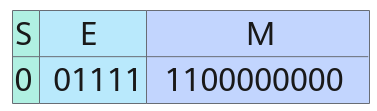
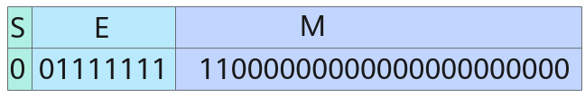
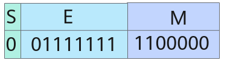
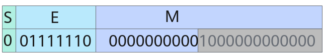
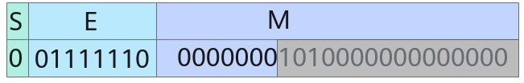
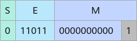
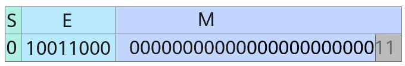

# Cast

**页面ID:** atlasascendc_api_07_0073  
**来源:** https://www.hiascend.com/document/detail/zh/CANNCommunityEdition/850/API/ascendcopapi/atlasascendc_api_07_0073.html

---

# Cast

#### 产品支持情况

| 产品 | 是否支持 |
| --- | --- |
| Atlas A3 训练系列产品            /             Atlas A3 推理系列产品 | √ |
| Atlas A2 训练系列产品            /             Atlas A2 推理系列产品 | √ |
| Atlas 200I/500 A2 推理产品 | √ |
| Atlas 推理系列产品            AI Core | √ |
| Atlas 推理系列产品            Vector Core | x |
| Atlas 训练系列产品 | √ |

#### 功能说明

根据源操作数和目的操作数Tensor的数据类型进行精度转换。

在了解精度转换规则之前，需要先了解浮点数的表示方式和二进制的舍入规则：

- 浮点数的表示方式 

  - half共16bit，包括1bit符号位（S），5bit指数位（E）和10bit尾数位（M）。 

当E不全为0或不全为1时，表示的结果为：

(-1)S * 2E - 15 * (1 + M)

当E全为0时，表示的结果为：

(-1)S * 2-14 * M

当E全为1时，若M全为0，表示的结果为±inf（取决于符号位）；若M不全为0，表示的结果为nan。



上图中S=0，E=15，M = 2-1 + 2-2，表示的结果为1.75。

  - float共32bit，包括1bit符号位（S），8bit指数位（E）和23bit尾数位（M）。 

当E不全为0或不全为1时，表示的结果为：

(-1)S * 2E - 127 * (1 + M)

当E全为0时，表示的结果为：

(-1)S * 2-126 * M

当E全为1时，若M全为0，表示的结果为±inf（取决于符号位）；若M不全为0，表示的结果为nan。



上图中S = 0，E = 127，M = 2-1 + 2-2，最终表示的结果为1.75 。

  - bfloat16_t共16bit，包括1bit符号位（S），8bit指数位（E）和7bit尾数位（M）。 

当E不全为0或不全为1时，表示的结果为：

(-1)S * 2E - 127 * (1 + M)

当E全为0时，表示的结果为：

(-1)S * 2-126 * M

当E全为1时，若M全为0，表示的结果为±inf（取决于符号位）；若M不全为0，表示的结果为nan。



上图中S = 0，E = 127，M = 2-1 + 2-2，最终表示的结果为1.75。

- 二进制的舍入规则和十进制类似，具体如下： 


  - CAST_RINT模式下，若待舍入部分的第一位为0，则不进位；若第一位为1且后续位不全为0，则进位；若第一位为1且后续位全为0，当M的最后一位为0则不进位，当M的最后一位为1则进位。

  - CAST_FLOOR模式下，若S为0，则不进位；若S为1，当待舍入部分全为0则不进位，否则，进位。
  - CAST_CEIL模式下，若S为1，则不进位；若S为0，当待舍入部分全为0则不进位；否则，进位。
  - CAST_ROUND模式下，若待舍入部分的第一位为0，则不进位；否则，进位。
  - CAST_TRUNC模式下，总是不进位。
  - CAST_ODD模式下，若待舍入部分全为0，则不进位；若待舍入部分不全为0，当M的最后一位为1则不进位，当M的最后一位为0则进位。

精度转换规则如下表所示（为方便描述下文描述中的src代表源操作数，dst代表目的操作数）：

**表1 **精度转换规则

| src类型 | dst类型 | 精度转换规则介绍 |
| --- | --- | --- |
| float | float | 将src按照roundMode（精度转换处理模式，参见参数说明中的roundMode参数）取整，仍以float格式存入dst中。          示例：输入0.5，          CAST_RINT模式输出0.0，CAST_FLOOR模式输出0.0，CAST_CEIL模式输出1.0，CAST_ROUND模式输出1.0，CAST_TRUNC模式输出0.0。 |
| half | 将src按照roundMode取到half所能表示的数，以half格式（溢出默认按照饱和处理）存入dst中。          示例：输入0.5 + 2-12，写成float的表示形式：2-1 * (1 + 2-11)，因此E = -1 + 127 = 126，M = 2-11。                    half的指数位可以表示出2-1，E = -1 + 15 = 14，但half只有10 bit尾数位，因此灰色部分要进行舍入。          CAST_RINT模式舍入得尾数0000000000，E = 14，M = 0，最终表示的结果为0.5；          CAST_FLOOR模式舍入得尾数0000000000，E = 14，M = 0，最终表示的结果为0.5；          CAST_CEIL模式舍入得尾数0000000001，E = 14，M = 2-10，最终表示的结果为0.5 + 2-11；          CAST_ROUND模式舍入得尾数0000000001，E = 14，M = 2-10，最终表示的结果为0.5 + 2-11；          CAST_TRUNC模式舍入得尾数0000000000，E = 14，M = 0，最终表示的结果为0.5；          CAST_ODD模式舍入得尾数0000000001，E = 14，M = 2-10，最终表示的结果为0.5 + 2-11 。 |  |
| int64_t | 将src按照roundMode取整，以int64_t格式（溢出默认按照饱和处理）存入dst中。          示例：输入222 + 0.5，          CAST_RINT模式输出222，CAST_FLOOR模式输出222，CAST_CEIL模式输出222 + 1，CAST_ROUND模式输出222 + 1，CAST_TRUNC模式输出222。 |  |
| int32_t | 将src按照roundMode取整，以int32_t格式（溢出默认按照饱和处理）存入dst中。          示例：输入222  + 0.5，          CAST_RINT模式输出222，CAST_FLOOR模式输出222 ，CAST_CEIL模式输出222 + 1，CAST_ROUND模式输出222 + 1，CAST_TRUNC模式输出222。 |  |
| int16_t | 将src按照roundMode取整，以int16_t格式（溢出默认按照饱和处理）存入dst中。          示例：输入222 + 0.5，          CAST_RINT模式输出215 - 1（溢出处理），CAST_FLOOR模式输出215 - 1（溢出处理），CAST_CEIL模式输出215 - 1（溢出处理），CAST_ROUND模式输出215 - 1（溢出处理），CAST_TRUNC模式输出215 - 1（溢出处理）。 |  |
| bfloat16_t | 将src按照roundMode取到bfloat16_t所能表示的数，以bfloat16_t格式（溢出默认按照饱和处理）存入dst中。          示例：输入0.5+ 2-9 + 2-11 ，写成float的表示形式：2-1 * (1 + 2-8 + 2-10)，因此E = -1 + 127 = 126，M = 2-8 + 2-10 。                    bfloat16_t的指数位位数和float的相同，有E = 126，但bfloat16_t只有7bit尾数位，因此灰色部分要进行舍入。          CAST_RINT模式舍入得尾数0000001，E = 126，M = 2-7，最终表示的结果为0.5 + 2-8；          CAST_FLOOR模式舍入得尾数0000000，E = 126，M = 0，最终表示的结果为0.5；          CAST_CEIL模式舍入得尾数0000001，E = 126，M = 2-7，最终表示的结果为0.5 + 2-8；          CAST_ROUND模式舍入得尾数0000001，E = 126，M = 2-7，最终表示的结果为0.5 + 2-8；          CAST_TRUNC模式舍入得尾数0000000，E = 126，M = 0，最终表示的结果为0.5。 |  |
| half | float | 将src以float格式存入dst中，不存在精度转换问题，无舍入模式。          示例：输入1.5 - 2-10，输出1.5 - 2-10。 |
| int32_t | 将src按照roundMode取整，以int32_t格式存入dst中。          示例：输入-1.5，          CAST_RINT模式输出-2，CAST_FLOOR模式输出-2，CAST_CEIL模式输出-1，CAST_ROUND模式输出-2，CAST_TRUNC模式输出-1。 |  |
| int16_t | 将src按照roundMode取整，以int16_t格式（溢出默认按照饱和处理）存入dst中。          示例：输入27 - 0.5，          CAST_RINT模式输出27，CAST_FLOOR模式输出27 - 1，CAST_CEIL模式输出27，CAST_ROUND模式输出27，CAST_TRUNC模式输出27 - 1。 |  |
| int8_t | 将src按照roundMode取整，以int8_t格式（溢出默认按照饱和处理）存入dst中。          示例：输入27 - 0.5，          CAST_RINT模式输出27 - 1（溢出处理），CAST_FLOOR模式输出27 - 1，CAST_CEIL模式输出27 - 1（溢出处理），CAST_ROUND模式输出27 - 1（溢出处理），CAST_TRUNC模式输出27 - 1。 |  |
| uint8_t | 将src按照roundMode取整，以uint8_t格式（溢出默认按照饱和处理）存入dst中。          负数输入会被视为异常。          示例：输入1.75，          CAST_RINT模式输出2，CAST_FLOOR模式输出1，CAST_CEIL模式输出2，CAST_ROUND模式输出2，CAST_TRUNC模式输出1。 |  |
| int4b_t | 将src按照roundMode取整，以int4b_t格式（溢出默认按照饱和处理）存入dst中。          示例：输入1.5，          CAST_RINT模式输出2，CAST_FLOOR模式输出1，CAST_CEIL模式输出2，CAST_ROUND模式输出2，CAST_TRUNC模式输出1。 |  |
| bfloat16_t | float | 将src以float格式存入dst中，不存在精度转换问题，无舍入模式。          示例：输入1.5 - 2-6，输出1.5 - 2-6。 |
| int32_t | 将src按照roundMode取整，以int32_t格式（溢出默认按照饱和处理）存入dst中。          示例：输入26 + 0.5          CAST_RINT模式输出26，CAST_FLOOR模式输出26 ，CAST_CEIL模式输出26 + 1，CAST_ROUND模式输出26 + 1，CAST_TRUNC模式输出26。 |  |
| uint8_t | half | 将src以half格式存入dst中，不存在精度转换问题，无舍入模式。          示例：输入1，输出1.0。 |
| int8_t | half | 将src以half格式存入dst中，不存在精度转换问题，无舍入模式。          示例：输入-1，输出-1.0。 |
| int16_t | half | 将src按照roundMode取到half所能表示的数，以half格式存入dst中。          示例：输入212 + 2，写成half的表示形式：212 * (1 + 2-11)，要求E = 12 + 15 = 27，M = 2-11：                    由于half只有10bit尾数位，因此灰色部分要进行舍入。          CAST_RINT模式舍入得尾数0000000000，E = 27，M = 0，最终表示的结果为212；          CAST_FLOOR模式舍入得尾数0000000000，E = 27，M = 0，最终表示的结果为212；          CAST_CEIL模式舍入得尾数0000000001，E = 27，M = 2-10，最终表示的结果为212 + 4；          CAST_ROUND模式舍入得尾数0000000001，E = 27，M = 2-10，最终表示的结果为212 + 4；          CAST_TRUNC模式舍入得尾数0000000000，E = 27，M = 0，最终表示的结果为212。 |
| float | 将src以float格式存入dst中，不存在精度转换问题，无舍入模式。          示例：输入215 - 1，输出215 - 1。 |  |
| int32_t | float | 将src按照roundMode取到float所能表示的数，以float格式存入dst中。          示例：输入225 + 3，写成float的表示形式：225 * (1 + 2-24 + 2-25)，要求E = 25 + 127 = 152， M = 2-24 + 2-25。                    由于float只有23bit尾数位，因此灰色部分要进行舍入。          CAST_RINT模式舍入得尾数00000000000000000000001，E = 152，M = 2-23，最终表示的结果为225 + 4；          CAST_FLOOR模式舍入得尾数00000000000000000000000，E = 152，M = 0，最终表示的结果为225；          CAST_CEIL模式舍入得尾数00000000000000000000001，E = 152，M = 2-23，最终表示的结果为225 + 4；          CAST_ROUND模式舍入得尾数00000000000000000000001，E = 152，M = 2-23，最终表示的结果为225 + 4；          CAST_TRUNC模式舍入得尾数00000000000000000000000，E = 152，M = 0，最终表示的结果为225 。 |
| int64_t | 将src以int64_t格式存入dst中，不存在精度转换问题，无舍入模式。          示例：输入231 - 1，输出231 - 1。 |  |
| int16_t | 将src以int16_t格式（溢出默认按照饱和处理）存入dst中，不存在精度转换问题，无舍入模式。          示例：输入231 - 1，输出215 - 1。 |  |
| half | 与SetDeqScale(half scale)接口配合使用，输出src / 217 * scale * 217。 |  |

#### 函数原型

- tensor前n个数据计算 

```
template <typename T, typename U>
__aicore__ inline void Cast(const LocalTensor<T>& dst, const LocalTensor<U>& src, const RoundMode& roundMode, const uint32_t count)
```

- tensor高维切分计算 

  - mask逐bit模式 

```
template <typename T, typename U, bool isSetMask = true>
__aicore__ inline void Cast(const LocalTensor<T>& dst, const LocalTensor<U>& src, const RoundMode& roundMode, const uint64_t mask[], const uint8_t repeatTime, const UnaryRepeatParams& repeatParams)
```

  - mask连续模式 

```
template <typename T, typename U, bool isSetMask = true>
__aicore__ inline void Cast(const LocalTensor<T>& dst, const LocalTensor<U>& src, const RoundMode& roundMode, const uint64_t mask, const uint8_t repeatTime, const UnaryRepeatParams& repeatParams)
```

#### 参数说明

**表2 **模板参数说明

| 参数名 | 描述 |
| --- | --- |
| T | 目的操作数数据类型。                       Atlas A3 训练系列产品            /             Atlas A3 推理系列产品            ，支持的数据类型见表7                       Atlas A2 训练系列产品            /             Atlas A2 推理系列产品            ，支持的数据类型见表6                       Atlas 200I/500 A2 推理产品            ，支持的数据类型见表8                       Atlas 推理系列产品            AI Core，支持的数据类型见表5                       Atlas 训练系列产品            ，支持的数据类型见表4 |
| U | 源操作数数据类型。                       Atlas A3 训练系列产品            /             Atlas A3 推理系列产品            ，支持的数据类型见表7                       Atlas A2 训练系列产品            /             Atlas A2 推理系列产品            ，支持的数据类型见表6                       Atlas 200I/500 A2 推理产品            ，支持的数据类型见表8                       Atlas 推理系列产品            AI Core，支持的数据类型见表5                       Atlas 训练系列产品            ，支持的数据类型见表4 |
| isSetMask | 是否在接口内部设置mask。                     - true，表示在接口内部设置mask。           - false，表示在接口外部设置mask，开发者需要使用SetVectorMask接口设置mask值。这种模式下，本接口入参中的mask值必须设置为占位符MASK_PLACEHOLDER。 |

**表3 **参数说明

| 参数名 | 输入/输出 | 描述 |
| --- | --- | --- |
| dst | 输出 | 目的操作数。          类型为LocalTensor，支持的TPosition为VECIN/VECCALC/VECOUT。          LocalTensor的起始地址需要32字节对齐。 |
| src | 输入 | 源操作数。          类型为LocalTensor，支持的TPosition为VECIN/VECCALC/VECOUT。          LocalTensor的起始地址需要32字节对齐。 |
| 精度转换处理模式，类型是RoundMode。          RoundMode为枚举类型，用以控制精度转换处理模式，具体定义为：                                                                                                                           ``` enum class RoundMode {     CAST_NONE = 0,  // 在转换有精度损失时表示CAST_RINT模式，不涉及精度损失时表示不舍入     CAST_RINT,      // rint，四舍六入五成双舍入     CAST_FLOOR,     // floor，向负无穷舍入     CAST_CEIL,      // ceil，向正无穷舍入     CAST_ROUND,     // round，四舍五入舍入     CAST_TRUNC,     // trunc，向零舍入     CAST_ODD,       // Von Neumann rounding，最近邻奇数舍入      }; ```                                                                                      对于             Atlas 训练系列产品            ，CAST_ROUND表示反向0取整，远离0，对正数x.y变成(x + 1)，对负数-x.y，变成-(x + 1)。 |  |  |
| count | 输入 | 参与计算的元素个数。 |
| mask/mask[] | 输入 | mask用于控制每次迭代内参与计算的元素。                     - 逐bit模式：可以按位控制哪些元素参与计算，bit位的值为1表示参与计算，0表示不参与。             mask为数组形式，数组长度和数组元素的取值范围和操作数的数据类型有关。当操作数为16位时，数组长度为2，mask[0]、mask[1]∈[0, 264-1]并且不同时为0；当操作数为32位时，数组长度为1，mask[0]∈(0, 264-1]；当操作数为64位时，数组长度为1，mask[0]∈(0, 232-1]。            例如，mask=[8, 0]，8=0b1000，表示仅第4个元素参与计算。                               - 连续模式：表示前面连续的多少个元素参与计算。取值范围和操作数的数据类型有关，数据类型不同，每次迭代内能够处理的元素个数最大值不同。当操作数为16位时，mask∈[1, 128]；当操作数为32位时，mask∈[1, 64]；当操作数为64位时，mask∈[1, 32]。 |
| repeatTime | 输入 | 重复迭代次数。矢量计算单元，每次读取连续的256Bytes数据进行计算，为完成对输入数据的处理，必须通过多次迭代（repeat）才能完成所有数据的读取与计算。repeatTime表示迭代的次数，repeatTime∈[0,255]。          关于该参数的具体描述请参考高维切分API。 |
| repeatParams | 输入 | 控制操作数地址步长的参数，UnaryRepeatParams类型。包含操作数相邻迭代间的地址步长，操作数同一迭代内datablock的地址步长等参数。其中dstRepStride/srcRepStride∈[0,255]。          相邻迭代间的地址步长参数说明请参考repeatStride；同一迭代内DataBlock的地址步长参数说明请参考dataBlockStride。 |

**表4 **
         Atlas 训练系列产品
        Cast指令参数说明

| src数据类型 | dst数据类型 | 支持的roundMode |
| --- | --- | --- |
| half | float | CAST_NONE |
| int32_t | CAST_RINT/CAST_FLOOR/CAST_CEIL/CAST_ROUND/CAST_TRUNC |  |
| int8_t | CAST_FLOOR/CAST_CEIL/CAST_ROUND/CAST_TRUNC/CAST_NONE |  |
| uint8_t | CAST_FLOOR/CAST_CEIL/CAST_ROUND/CAST_TRUNC/CAST_NONE |  |
| float | half | CAST_NONE/CAST_ODD |
| int32_t | CAST_RINT/CAST_FLOOR/CAST_CEIL/CAST_ROUND/CAST_TRUNC |  |
| uint8_t | half | CAST_NONE |
| int8_t | half | CAST_NONE |
| int32_t | float | CAST_NONE |

**表5 **
         Atlas 推理系列产品
        AI CoreCast指令参数说明

| src数据类型 | dst数据类型 | 支持的roundMode |
| --- | --- | --- |
| half | int32_t | CAST_RINT/CAST_FLOOR/CAST_CEIL/CAST_ROUND/CAST_TRUNC |
| int16_t | CAST_RINT |  |
| float | CAST_NONE |  |
| int8_t | CAST_FLOOR/CAST_CEIL/CAST_ROUND/CAST_TRUNC/CAST_NONE |  |
| uint8_t | CAST_FLOOR/CAST_CEIL/CAST_ROUND/CAST_TRUNC/CAST_NONE |  |
| int4b_t | CAST_NONE |  |
| float | int32_t | CAST_RINT/CAST_FLOOR/CAST_CEIL/CAST_ROUND/CAST_TRUNC |
| half | CAST_NONE/CAST_ODD |  |
| uint8_t | half | CAST_NONE |
| int8_t | half | CAST_NONE |
| int16_t | half | CAST_NONE |
| int32_t | float | CAST_NONE |
| int16_t | CAST_NONE |  |
| half | roundMode不生效，与SetDeqScale(half scale)接口配合使用。 |  |

**表6 **
         Atlas A2 训练系列产品
        /
         Atlas A2 推理系列产品
        Cast指令参数说明

| src数据类型 | dst数据类型 | 支持的roundMode |
| --- | --- | --- |
| half | int32_t | CAST_RINT/CAST_FLOOR/CAST_CEIL/CAST_ROUND/CAST_TRUNC |
| int16_t | CAST_RINT/CAST_FLOOR/CAST_CEIL/CAST_ROUND/CAST_TRUNC |  |
| float | CAST_NONE |  |
| int8_t | CAST_RINT/CAST_FLOOR/CAST_CEIL/CAST_ROUND/CAST_TRUNC/CAST_NONE |  |
| uint8_t | CAST_RINT/CAST_FLOOR/CAST_CEIL/CAST_ROUND/CAST_TRUNC/CAST_NONE |  |
| int4b_t | CAST_RINT/CAST_FLOOR/CAST_CEIL/CAST_ROUND/CAST_TRUNC/CAST_NONE |  |
| float | float | CAST_RINT/CAST_FLOOR/CAST_CEIL/CAST_ROUND/CAST_TRUNC |
| int32_t | CAST_RINT/CAST_FLOOR/CAST_CEIL/CAST_ROUND/CAST_TRUNC |  |
| half | CAST_RINT/CAST_FLOOR/CAST_CEIL/CAST_ROUND/CAST_TRUNC/CAST_ODD/CAST_NONE |  |
| int64_t | CAST_RINT/CAST_FLOOR/CAST_CEIL/CAST_ROUND/CAST_TRUNC |  |
| int16_t | CAST_RINT/CAST_FLOOR/CAST_CEIL/CAST_ROUND/CAST_TRUNC |  |
| float | bfloat16_t | CAST_RINT/CAST_FLOOR/CAST_CEIL/CAST_ROUND/CAST_TRUNC |
| bfloat16_t | float | CAST_NONE |
| int32_t | CAST_RINT/CAST_FLOOR/CAST_CEIL/CAST_ROUND/CAST_TRUNC |  |
| int4b_t | half | CAST_NONE |
| uint8_t | half | CAST_NONE |
| int8_t | half | CAST_NONE |
| int16_t | half | CAST_RINT/CAST_FLOOR/CAST_CEIL/CAST_ROUND/CAST_TRUNC/CAST_NONE |
| float | CAST_NONE |  |
| int32_t | float | CAST_RINT/CAST_FLOOR/CAST_CEIL/CAST_ROUND/CAST_TRUNC/CAST_NONE |
| int16_t | CAST_NONE |  |
| half | roundMode不生效，与SetDeqScale(half scale)接口配合使用。 |  |
| int64_t | CAST_NONE |  |
| int64_t | int32_t | CAST_NONE |
| float | CAST_RINT/CAST_FLOOR/CAST_CEIL/CAST_ROUND/CAST_TRUNC |  |

**表7 **
         Atlas A3 训练系列产品
        /
         Atlas A3 推理系列产品
        Cast指令参数说明

| src数据类型 | dst数据类型 | 支持的roundMode |
| --- | --- | --- |
| half | int32_t | CAST_RINT/CAST_FLOOR/CAST_CEIL/CAST_ROUND/CAST_TRUNC |
| int16_t | CAST_RINT/CAST_FLOOR/CAST_CEIL/CAST_ROUND/CAST_TRUNC |  |
| float | CAST_NONE |  |
| int8_t | CAST_RINT/CAST_FLOOR/CAST_CEIL/CAST_ROUND/CAST_TRUNC/CAST_NONE |  |
| uint8_t | CAST_RINT/CAST_FLOOR/CAST_CEIL/CAST_ROUND/CAST_TRUNC/CAST_NONE |  |
| int4b_t | CAST_RINT/CAST_FLOOR/CAST_CEIL/CAST_ROUND/CAST_TRUNC/CAST_NONE |  |
| float | float | CAST_RINT/CAST_FLOOR/CAST_CEIL/CAST_ROUND/CAST_TRUNC |
| int32_t | CAST_RINT/CAST_FLOOR/CAST_CEIL/CAST_ROUND/CAST_TRUNC |  |
| half | CAST_RINT/CAST_FLOOR/CAST_CEIL/CAST_ROUND/CAST_TRUNC/CAST_ODD/CAST_NONE |  |
| int64_t | CAST_RINT/CAST_FLOOR/CAST_CEIL/CAST_ROUND/CAST_TRUNC |  |
| int16_t | CAST_RINT/CAST_FLOOR/CAST_CEIL/CAST_ROUND/CAST_TRUNC |  |
| float | bfloat16_t | CAST_RINT/CAST_FLOOR/CAST_CEIL/CAST_ROUND/CAST_TRUNC |
| bfloat16_t | float | CAST_NONE |
| int32_t | CAST_RINT/CAST_FLOOR/CAST_CEIL/CAST_ROUND/CAST_TRUNC |  |
| int4b_t | half | CAST_NONE |
| uint8_t | half | CAST_NONE |
| int8_t | half | CAST_NONE |
| int16_t | half | CAST_RINT/CAST_FLOOR/CAST_CEIL/CAST_ROUND/CAST_TRUNC/CAST_NONE |
| float | CAST_NONE |  |
| int32_t | float | CAST_RINT/CAST_FLOOR/CAST_CEIL/CAST_ROUND/CAST_TRUNC/CAST_NONE |
| int16_t | CAST_NONE |  |
| half | roundMode不生效，与SetDeqScale(half scale)接口配合使用。 |  |
| int64_t | CAST_NONE |  |
| int64_t | int32_t | CAST_NONE |
| float | CAST_RINT/CAST_FLOOR/CAST_CEIL/CAST_ROUND/CAST_TRUNC |  |

**表8 **
         Atlas 200I/500 A2 推理产品
        Cast指令参数说明

| src数据类型 | dst数据类型 | 支持的roundMode |
| --- | --- | --- |
| half | int32_t | CAST_RINT/CAST_FLOOR/CAST_CEIL/CAST_ROUND/CAST_TRUNC |
| int16_t | CAST_RINT/CAST_FLOOR/CAST_CEIL/CAST_ROUND/CAST_TRUNC |  |
| float | CAST_NONE |  |
| int8_t | CAST_RINT/CAST_FLOOR/CAST_CEIL/CAST_ROUND/CAST_TRUNC/CAST_NONE |  |
| uint8_t | CAST_RINT/CAST_FLOOR/CAST_CEIL/CAST_ROUND/CAST_TRUNC/CAST_NONE |  |
| float | float | CAST_RINT/CAST_FLOOR/CAST_CEIL/CAST_ROUND/CAST_TRUNC |
| int32_t | CAST_RINT/CAST_FLOOR/CAST_CEIL/CAST_ROUND/CAST_TRUNC |  |
| half | CAST_RINT/CAST_FLOOR/CAST_CEIL/CAST_ROUND/CAST_TRUNC/CAST_ODD/CAST_NONE |  |
| int64_t | CAST_RINT/CAST_FLOOR/CAST_CEIL/CAST_ROUND/CAST_TRUNC |  |
| int16_t | CAST_RINT/CAST_FLOOR/CAST_CEIL/CAST_ROUND/CAST_TRUNC |  |
| float | bfloat16_t | CAST_RINT/CAST_FLOOR/CAST_CEIL/CAST_ROUND/CAST_TRUNC |
| bfloat16_t | float | CAST_NONE |
| int32_t | CAST_RINT/CAST_FLOOR/CAST_CEIL/CAST_ROUND/CAST_TRUNC |  |
| uint8_t | half | CAST_NONE |
| int8_t | half | CAST_NONE |
| int16_t | half | CAST_RINT/CAST_FLOOR/CAST_CEIL/CAST_ROUND/CAST_TRUNC/CAST_NONE |
| float | CAST_NONE |  |
| int32_t | float | CAST_RINT/CAST_FLOOR/CAST_CEIL/CAST_ROUND/CAST_TRUNC/CAST_NONE |
| int16_t | CAST_NONE |  |
| half | CAST_NONE |  |
| int64_t | CAST_NONE |  |
| int64_t | int32_t | CAST_NONE |
| float | CAST_RINT/CAST_FLOOR/CAST_CEIL/CAST_ROUND/CAST_TRUNC |  |

#### 返回值说明

无

#### 约束说明

- 每个repeat能处理的数据量取决于数据精度、AI处理器型号，如float->half转换每次迭代操作64个源/目的元素。
- 当源操作数和目的操作数位数不同时，计算输入参数以数据类型的字节较大的为准。例如，源操作数为half类型，目的操作数为int32_t类型时，为保证输出和输入是连续的，dstRepStride应设置为8，srcRepStride应设置为4。
- 当dst或src为int4b_t时，由于一个int4b_t只占半个字节，故申请Tensor空间时，只需申请相同数量的int8_t数据空间的一半。host侧目前暂不支持int4b_t，故在申请int4b_t类型的tensor时，应先申请一个类型为int8_t的tensor，再用Reinterpretcast转化为int4b_t并调用Cast指令，详见调用示例。
- 当dst或src为int4b_t时，tensor高维切分计算接口的连续模式的mask与tensor前n个数据计算接口的count必须为偶数；对于tensor高维切分计算接口的逐bit模式，对应同一字节的相邻两个比特位的数值必须一致，即0-1位数值一致，2-3位数值一致，4-5位数值一致，以此类推。

#### 调用示例

本样例中只展示Compute流程中的部分代码。本样例的srcLocal为half类型，dstLocal为int32_t类型，计算mask时以int32_t为准。

如果您需要运行样例代码，请将该代码段拷贝并替换样例模板中Compute函数的部分代码即可。

- tensor高维切分计算样例-mask连续模式 

```
uint64_t mask = 256 / sizeof(int32_t);
// repeatTime = 8, 64 elements one repeat, 512 elements total
// dstBlkStride, srcBlkStride = 1, no gap between blocks in one repeat
// dstRepStride = 8, srcRepStride = 4, no gap between repeats
AscendC::Cast(dstLocal, srcLocal, AscendC::RoundMode::CAST_CEIL, mask, 8, { 1, 1, 8, 4 });
```

- tensor高维切分计算样例-mask逐bit模式 

```
uint64_t mask[2] = { 0, UINT64_MAX };
// repeatTime = 8, 64 elements one repeat, 512 elements total
// dstBlkStride, srcBlkStride = 1, no gap between blocks in one repeat
// dstRepStride = 8, srcRepStride = 4, no gap between repeats
AscendC::Cast(dstLocal, srcLocal, AscendC::RoundMode::CAST_CEIL, mask, 8, { 1, 1, 8, 4 });
```

- tensor前n个数据计算样例 

```
AscendC::Cast(dstLocal, srcLocal, AscendC::RoundMode::CAST_CEIL, 512);
```

结果示例如下：

```
输入数据(srcLocal): 
[29.5    83.6    16.75   45.1    40.62   69.06   47.6    96.5    72.7
 57.56   61.25   69.7    29.27   91.2    70.1    14.484   9.625  21.58
  9.336   3.125  63.72    9.9    17.28   73.2    75.7    29.81   98.8
 99.06   72.94    3.785  24.94   25.56   39.1    58.94   39.6    78.4
  5.43   25.48    9.58   60.8    77.56   29.7    70.3     6.312   4.047
 87.1    81.6    76.56   59.28   55.66   81.75   73.56   76.9    54.38
  7.254  37.84   11.08   77.6    83.6    89.2    93.06    2.96   76.56
 62.16   76.25   95.44   86.6    86.75   29.83   82.2    55.03   64.9
 56.44   12.89   87.06   39.34   72.25   43.06   63.4    51.72   63.9
  0.703  47.84   27.73   99.     89.     97.3     1.277  58.44   14.05
 78.9    98.5    28.55   44.8    41.03   40.75   74.2    74.06   10.51
 69.2    25.83   35.8    85.5    25.12   82.25   95.3    36.75   55.88
 90.9    57.47    7.13   18.1    40.97   31.     99.3    69.4    72.94
 62.44   63.7    80.     37.94   11.11   37.     39.72   87.94   31.72
 25.7    54.7    32.8    21.64   14.53   55.1     3.607  40.16   77.7
 15.15   77.44   43.25   85.75   67.3    30.33   67.56   60.72   58.16
 19.84   89.2    18.75   55.56   31.61    9.445   6.5    27.95   48.5
 37.16    7.805  37.72   69.6    36.2    92.56   24.72   41.56   48.44
 19.27   25.94   25.      8.836  55.75   77.8    25.84   46.16   71.7
 63.62   33.28    3.719  55.22   45.97   35.8    27.86   42.22    3.078
 92.06    0.805  51.97   76.4    32.03   74.56   28.1    91.2    35.38
  0.2009 74.25   87.5    92.75   76.25   51.28   22.9    34.4    28.23
 87.5    78.75   63.1    61.56   79.94    6.766  95.1    55.     56.75
 39.66   94.75   24.19   29.83   72.6    99.9    12.43   46.56   51.9
 92.3    42.66   91.8    95.8    35.2    13.08   60.7    22.22    6.055
  2.23   13.875  71.3    99.56   91.94   92.     96.06   97.5    68.75
  8.61    1.157  68.2    20.73   63.44   90.     38.78   64.4    88.9
 20.75   14.03   97.06   66.8    57.9    86.94   28.5     0.2279 51.8
 84.56   39.53   93.     15.66   15.23   71.75   11.44   45.28   57.38
 82.5    88.7     9.74   90.4    61.56   68.56   11.22   69.3    40.28
 24.78   84.44   23.92    8.4    20.88   48.2    17.42   59.84   93.2
  2.191  95.94   93.06   54.53   76.5    37.     41.7    82.7    69.5
 92.6     5.8    32.78   84.56   26.5    96.56    0.858  96.44   52.8
 90.9    30.52    2.656  32.03   35.72    8.125  21.94   84.5    66.7
 96.75   46.8     1.42   58.3    28.75   44.94   66.2    28.67   11.695
 41.75   67.25   26.75   17.72   35.9     5.72   55.88   94.7    80.8
 71.     86.06   36.78   81.06   56.8    61.34   11.42   74.     32.16
 14.695  78.6    56.1    64.4    61.75   50.88   39.6    79.94   71.25
 40.7     5.99   67.4    62.28   89.25   12.02   63.12   33.1    59.06
 28.2    19.22   59.66   51.6    53.28   97.8    42.25   82.     39.7
 50.6    95.06   20.64   26.62   54.9    55.     28.44   26.25   46.56
 87.06   98.44   49.34   37.2    97.4    34.3    83.4    57.4    94.
 29.31   79.44   19.72   54.9    50.25   58.75   92.5    17.3    17.88
 44.7     6.047  50.78   75.3    21.66   71.5    97.75   35.8    93.6
  4.367  31.02   66.5    48.25   34.     92.7    36.97   86.5    10.37
 82.     29.39   10.63   40.72   72.5    31.56   96.5    70.44    6.074
 37.34    7.58   21.72   44.97   77.6    14.22   18.62   47.97   54.6
 99.56   81.7    35.75   44.22   28.64   91.56    1.005  44.      8.125
 11.7    93.6    70.25   63.94   11.05   50.97   56.47   39.4    35.53
 84.     10.21   42.66   62.12   87.7    71.25   87.75   56.03   60.88
 31.81   68.1    91.1    67.3    53.6    96.06   43.75   27.86   46.6
 87.7    29.47    2.174  88.4    49.53   63.53   84.9    91.75   48.53
 91.94   88.44   58.3    88.44   23.11   91.56   71.4    59.66   93.44
 28.56   93.3    59.94   90.     18.95   52.8    70.3    58.     21.47
 93.7    45.03   84.25   34.06   23.86   38.4     5.566  41.5    35.1
 34.8    32.8    81.44   74.75   95.9    23.56    3.562  48.72   92.7
 43.88   83.75   69.06   85.8    22.84   63.78   90.94   52.78  ]
输出数据(dstLocal): 
[ 30  84  17  46  41  70  48  97  73  58  62  70  30  92  71  15  10  22
  10   4  64  10  18  74  76  30  99 100  73   4  25  26  40  59  40  79
   6  26  10  61  78  30  71   7   5  88  82  77  60  56  82  74  77  55
   8  38  12  78  84  90  94   3  77  63  77  96  87  87  30  83  56  65
  57  13  88  40  73  44  64  52  64   1  48  28  99  89  98   2  59  15
  79  99  29  45  42  41  75  75  11  70  26  36  86  26  83  96  37  56
  91  58   8  19  41  31 100  70  73  63  64  80  38  12  37  40  88  32
  26  55  33  22  15  56   4  41  78  16  78  44  86  68  31  68  61  59
  20  90  19  56  32  10   7  28  49  38   8  38  70  37  93  25  42  49
  20  26  25   9  56  78  26  47  72  64  34   4  56  46  36  28  43   4
  93   1  52  77  33  75  29  92  36   1  75  88  93  77  52  23  35  29
  88  79  64  62  80   7  96  55  57  40  95  25  30  73 100  13  47  52
  93  43  92  96  36  14  61  23   7   3  14  72 100  92  92  97  98  69
   9   2  69  21  64  90  39  65  89  21  15  98  67  58  87  29   1  52
  85  40  93  16  16  72  12  46  58  83  89  10  91  62  69  12  70  41
  25  85  24   9  21  49  18  60  94   3  96  94  55  77  37  42  83  70
  93   6  33  85  27  97   1  97  53  91  31   3  33  36   9  22  85  67
  97  47   2  59  29  45  67  29  12  42  68  27  18  36   6  56  95  81
  71  87  37  82  57  62  12  74  33  15  79  57  65  62  51  40  80  72
  41   6  68  63  90  13  64  34  60  29  20  60  52  54  98  43  82  40
  51  96  21  27  55  55  29  27  47  88  99  50  38  98  35  84  58  94
  30  80  20  55  51  59  93  18  18  45   7  51  76  22  72  98  36  94
   5  32  67  49  34  93  37  87  11  82  30  11  41  73  32  97  71   7
  38   8  22  45  78  15  19  48  55 100  82  36  45  29  92   2  44   9
  12  94  71  64  12  51  57  40  36  84  11  43  63  88  72  88  57  61
  32  69  92  68  54  97  44  28  47  88  30   3  89  50  64  85  92  49
  92  89  59  89  24  92  72  60  94  29  94  60  90  19  53  71  58  22
  94  46  85  35  24  39   6  42  36  35  33  82  75  96  24   4  49  93
  44  84  70  86  23  64  91  53]
```

- 当Cast涉及int4b_t时，调用示例如下： 

dstLocal为int8_t类型，srcLocal为half类型

```
inBufferSize_ = srcSize;  // src buffer size
outBufferSize_ = srcSize / 2;   //dst buffer size
uint64_t mask = 128;
AscendC::LocalTensor<half> srcLocal;
srcLocal.SetSize(inBufferSize_);
AscendC::LocalTensor<int8_t> dstLocal;
dstLocal.SetSize(outBufferSize_);
AscendC::LocalTensor<AscendC::int4b_t> dstLocalTmp = dstLocal.ReinterpretCast<AscendC::int4b_t>();
// repeatTime = 1, 128 elements one repeat, 128 elements total
// dstBlkStride, srcBlkStride = 1, no gap between blocks in one repeat
// dstRepStride = 2, srcRepStride = 8, no gap between repeats
AscendC::Cast<AscendC::int4b_t, half>(dstLocalTmp, srcLocal, AscendC::RoundMode::CAST_CEIL, mask, 1, {1, 1, 2, 8});
```

#### 样例模板

     为了方便您快速运行指令中的参考样例，本章节提供样例模板。 

```
#include "kernel_operator.h"
class KernelCast {
public:
    __aicore__ inline KernelCast() {}
    __aicore__ inline void Init(__gm__ uint8_t* srcGm, __gm__ uint8_t* dstGm)
    {
        srcGlobal.SetGlobalBuffer((__gm__ half*)srcGm);
        dstGlobal.SetGlobalBuffer((__gm__ int32_t*)dstGm);
        pipe.InitBuffer(inQueueSrc, 1, 512 * sizeof(half));
        pipe.InitBuffer(outQueueDst, 1, 512 * sizeof(int32_t));
    }
    __aicore__ inline void Process()
    {
        CopyIn();
        Compute();
        CopyOut();
    }
private:
    __aicore__ inline void CopyIn()
    {
        AscendC::LocalTensor<half> srcLocal = inQueueSrc.AllocTensor<half>();
        AscendC::DataCopy(srcLocal, srcGlobal, 512);
        inQueueSrc.EnQue(srcLocal);
    }
    __aicore__ inline void Compute()
    {
        AscendC::LocalTensor<half> srcLocal = inQueueSrc.DeQue<half>();
        AscendC::LocalTensor<int32_t> dstLocal = outQueueDst.AllocTensor<int32_t>();

        AscendC::Cast(dstLocal, srcLocal, AscendC::RoundMode::CAST_CEIL, 512);

        outQueueDst.EnQue<int32_t>(dstLocal);
        inQueueSrc.FreeTensor(srcLocal);
    }
    __aicore__ inline void CopyOut()
    {
        AscendC::LocalTensor<int32_t> dstLocal = outQueueDst.DeQue<int32_t>();
        AscendC::DataCopy(dstGlobal, dstLocal, 512);
        outQueueDst.FreeTensor(dstLocal);
    }
private:
    AscendC::TPipe pipe;
    AscendC::TQue<AscendC::TPosition::VECIN, 1> inQueueSrc;
    AscendC::TQue<AscendC::TPosition::VECOUT, 1> outQueueDst;
    AscendC::GlobalTensor<half> srcGlobal;
    AscendC::GlobalTensor<int32_t> dstGlobal;
};
extern "C" __global__ __aicore__ void cast_simple_kernel(__gm__ uint8_t* srcGm, __gm__ uint8_t* dstGm)
{
    KernelCast op;
    op.Init(srcGm, dstGm);
    op.Process();
}
```

#### 更多样例

更多地，您可以参考以下样例，了解如何使用Cast指令的tensor高维切分计算接口，进行更灵活的操作、实现更高级的功能。

- 通过tensor高维切分计算接口中的mask连续模式，实现数据非连续计算。 

```
uint64_t mask = 32;  // 每个迭代内只计算前32个数
AscendC::Cast(dstLocal, srcLocal, AscendC::RoundMode::CAST_CEIL, mask, 8, { 1, 1, 8, 4 });
```

结果示例如下：

```
输入数据(srcLocal): 
[37.4     7.11   53.5    19.44   22.66   43.     43.16    5.316  74.2
 15.7    87.75   86.94   92.56   25.45   36.06   94.6    73.6    30.48
 48.16   12.55   27.81   14.67    6.58   48.38   67.5    57.5    63.3
 85.2     3.654  68.7    52.53   16.38   13.945  63.84   87.2    82.5
 85.7    27.78   15.41   41.66   31.38   14.65   88.25    0.0332 43.06
 46.88   15.57   87.1    53.16   33.5    91.06   36.5    55.34   60.53
  3.238  23.92   97.5    91.1    78.44   54.47   82.     53.8    72.1
 25.06   32.12   15.88   33.38   36.7    33.3    84.4    19.25    1.743
 46.16   22.06    4.582  71.1    15.94   22.23   53.47   17.05   48.56
 94.44   77.4    90.2    46.56   92.4     9.45   68.44   35.7    31.62
 68.1    63.7    77.     92.06   20.45   27.67   93.4    22.39   17.22
 73.06    7.12   25.34   36.34   13.54   38.12   24.56   86.56   69.7
 68.3    30.38   68.4    86.1    54.44   70.     55.3    48.6    59.03
 64.44   15.45   66.5    92.7    60.7    52.22   47.     99.75   41.94
 43.06   89.5    36.9    62.5     1.306  48.06    9.37   62.25   20.61
 43.8    69.25   27.22   71.44   52.75   11.82   80.6    63.44   53.22
 85.44   25.25    2.309  26.88   84.5    29.83    9.93   81.9    97.75
 75.75   97.7    72.     19.86   26.62   88.7    74.06    9.24   42.5
 14.     39.44   98.56   66.94   89.     57.12   39.     11.57   19.05
 86.56   32.66   19.25   99.3    95.6    58.7    79.6    37.38   65.
 75.7     8.586  77.7     2.68   75.7    77.56   39.1    39.72   64.06
 98.44   30.27   31.9    94.4    85.94    4.965   2.758  92.4    49.53
 50.75    5.7    19.69   87.6    20.08   88.8    87.4    63.6    68.3
 78.9    45.66   10.01   35.25   71.9    37.38   39.7    43.47   11.67
 64.3    35.62   74.3    59.3    28.69   29.56   23.14   36.22    4.88
 70.5    25.05   72.6    71.6    32.28   34.66   80.     96.1    98.7
 12.91   95.4    61.97   87.94   19.1    40.47   89.6    84.     29.72
 17.8    81.44   23.25   33.03   18.67   78.     49.62   63.1    72.75
 77.25    3.74   38.9    17.92   76.     25.62   34.53   84.     32.03
 57.3     9.21    6.836  68.9    35.78   96.75   56.3    96.1    23.45
 78.75   94.25   12.44   56.7    24.55   25.11   90.7    50.94   78.4
  3.576  21.81   53.28   26.2    43.1     7.742  13.4    86.44   86.9
 13.93   16.48   91.06   42.3    95.5    66.8    40.6    98.06   71.9
 67.6    55.9    82.44   93.75   41.53   23.62   40.12   40.53   80.7
 80.25   96.3    51.38   93.6    91.3    32.84   88.     69.7    63.16
 41.75   43.22   43.22   31.73   84.9    91.6    80.     53.34   27.12
 76.6    97.25   44.5    30.28   74.3    76.06   40.     41.28   37.72
 99.56   18.73   16.45   92.75   79.1    40.3    68.     23.98   88.7
 86.6    24.97   59.6    28.25   82.94   46.12   60.12   34.53   79.7
 11.086  20.25   44.88   39.97   42.12   62.7    30.66   42.56   16.69
 85.2    90.8    78.75   26.16   18.14   94.06   40.3    20.16   38.
 12.99   95.44   76.25   26.03   76.     30.06   27.25   84.56   30.45
 66.1    83.25    3.732  39.1    54.22   82.8    43.22   53.03   11.66
 88.1     6.83   66.8    44.4     7.5    24.77   74.4    35.9    79.75
 41.62   37.06   60.12   57.9    96.94   84.25   39.88   22.55   72.7
 58.9    44.75   90.4    46.34   71.3    16.4    26.12   21.45   10.27
 91.     41.53   39.03   80.25    2.11    7.88   72.2    27.83   88.1
 67.56   10.72   52.84   91.2    97.6    51.44   74.7     3.527  79.25
 11.3    19.16   39.53    3.469  98.7    45.72   40.16   47.1    71.8
 11.81   52.97   71.44   37.7    26.81   46.22   26.94    4.805  12.18
 70.4    51.4    24.2    83.9     9.62   12.445  57.6    85.8    55.12
 88.25   32.38   62.88    1.903  47.72   35.9    48.94   86.06   32.44
  1.219  35.56   49.78   49.97   24.45   94.5    99.94   44.72    3.404
 83.6    23.14   76.7    91.7    24.33   20.62   24.72    4.55   88.94
 87.44   95.75   41.56   13.77   34.6    95.94   77.1    24.28   70.06
 10.06   11.38   88.8    57.22   94.56   35.     79.8    58.22   44.06
 26.9    16.25   99.94   51.1    42.38   84.25    0.9604 48.1   ]

输出数据(dstLocal): 
[        38          8         54         20         23         43
         44          6         75         16         88         87
         93         26         37         95         74         31
         49         13         28         15          7         49
         68         58         64         86          4         69
         53         17 1879993057 1827499998 1823960025 1570990114
 1828150463 1811639312 1794470101 1754296176 1888841335 1715628997
 1839753994 1850888497 1889364175 1891068936 1823369913 1769105534
 1815638091 1808559970 1601662785 1739089473 1863146361 1694785989
 1597138938 1836478181 1888774249 1637707434 1877372650 1796304934
 1887530885 1839295471 1707240971 1873242695         33         16
         34         37         34         85         20          2
         47         23          5         72         16         23
         54         18         49         95         78         91
         47         93         10         69         36         32
         69         64         77         93         21         28
 1753837732 1488743807 1711632378 1799581711 1818783215 1891790695
 1837723802 1752132873 1727950918 1760390205 1866887130 1824876865
 1807839436 1890544910 1889755550 1787129270 1502702106 1841065201
 1820156583 1779396288 1760521448 1844604520 1831039103 1843491014
 1891199259 1839493317 1801349958 1577807434 1811377215 1879404734
 1826057367 1837853054         37         63          2         49
         10         63         21         44         70         28
         72         53         12         81         64         54
         86         26          3         27         85         30
         10         82         98         76         98         72
         20         27         89         75 1890086927 1826517134
 1814783944 1824156809 1875733079 1842114682 1845456975 1830120794
 1787980861 1807380585 1535469972 1883860884 1889167601 1747872128
 1888317235 1720937006 1836806331 1654152236 1695309475 1892773593
 1840737395 1868392748 1833724316 1600153936 1869310159 1883467778
 1892641857 1776248953 1833201514 1886743848 1745972258 1860657622
         95         86          5          3         93         50
         51          6         20         88         21         89
         88         64         69         79         46         11
         36         72         38         40         44         12
         65         36         75         60         29         30
         24         37 1733652589 1756325317 1685744372 1780772214
 1660252348 1629973784 1847815925 1828941229 1683778661 1519480967
 1762160488 1844801381 1832742021 1891724641 1761701480 1695312651
 1429433841 1774275423 1828349211 1779786303 1835953259 1784896595
 1858432988 1413442268 1893363867 1886679050 1872588913 1473866635
 1793158916 1762946052 1719627087 1893231666         76         26
         35         84         33         58         10          7
         69         36         97         57         97         24
         79         95         13         57         25         26
         91         51         79          4         22         54
         27         44          8         14         87         87
 1208960410 1208567888 1215973275 1214859418 1210992732 1208305714
 1165379704 1215252623 1197033625 1212172318 1217415148 1211058280
 1206798479 1215645776 1209223143 1217611809 1212500082 1215383615
 1208567769 1200179260 1216694386 1218070398 1195526187 1211516213
 1213089850 1213941743 1216825148 1212565573 1216694248 1217546087
 1200178778 1215973524         92         80         54         28
         77         98         45         31         75         77
         40         42         38        100         19         17
         93         80         41         68         24         89
         87         25         60         29         83         47
         61         35         80         12 1189759014 1218070662
 1211057953 1216825400 1215121414 1214596952 1216169420 1210075102
 1209157633 1213941279 1195984973 1211648118 1201686666 1212041360
 1216103688 1212500024 1173112887 1194608648 1216825427 1209747582
 1207191587 1214859224 1203980407 1215711379 1213155353 1203259396
 1214859350 1211779156 1217218713 1202473003 1216628529 1196771437
         44         54         12         89          7         67
         45          8         25         75         36         80
         42         38         61         58         97         85
         40         23         73         59         45         91
         47         72         17         27         22         11
         91         42 1211516990 1198213215 1203848735 1217349746
 1212303398 1217808150 1215514752 1209878647 1214138433 1215711277
 1212041273 1215383541 1214728294 1197754500 1169574019 1208371214
 1214269569 1216301092 1216563283 1213548677 1217873970 1203128459
 1209812695 1218136029 1194805359 1204439186 1218005120 1213941626
 1217153046 1208109091 1215055928 1215318166          5         13
         71         52         25         84         10         13
         58         86         56         89         33         63
          2         48         36         49         87         33
          2         36         50         50         25         95
        100         45          4         84         24         77
 1202210969 1213679767 1209288847 1217480263 1184319410 1214072674
 1188382819 1217283870 1200769107 1217939416 1199327294 1213351841
 1206667407 1217153163 1215580283 1214138474 1206798167 1194477696
 1193690499 1214072706 1216825421 1216693888 1217611496 1198540949
 1199654414 1206405188 1214203847 1165183076 1213745302 1208830102
 1209944118 1215121459]
```
