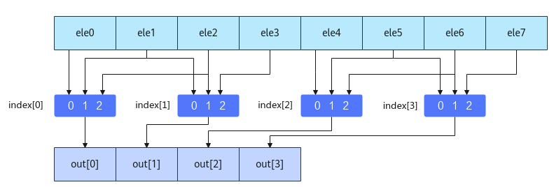

# MmadWithSparse

**页面ID:** atlasascendc_api_07_0250  
**来源:** https://www.hiascend.com/document/detail/zh/CANNCommunityEdition/850/API/ascendcopapi/atlasascendc_api_07_0250.html

---

# MmadWithSparse

#### 产品支持情况

| 产品 | 是否支持 |
| --- | --- |
| Atlas A3 训练系列产品/Atlas A3 推理系列产品 | √ |
| Atlas A2 训练系列产品/Atlas A2 推理系列产品 | √ |
| Atlas 200I/500 A2 推理产品 | x |
| Atlas 推理系列产品AI Core | x |
| Atlas 推理系列产品Vector Core | x |
| Atlas 训练系列产品 | x |

#### 功能说明

完成矩阵乘加操作，传入的左矩阵A为稀疏矩阵， 右矩阵B为稠密矩阵 。对于矩阵A，在MmadWithSparse计算时完成稠密化；对于矩阵B，在计算执行前的输入数据准备时自行完成稠密化（按照下文中介绍的稠密算法进行稠密化），所以输入本接口的B矩阵为稠密矩阵。B稠密矩阵需要通过调用LoadDataWithSparse载入，同时加载索引矩阵，索引矩阵在矩阵B稠密化的过程中生成，再用于A矩阵的稠密化。

#### 函数原型

```
template <typename T = int32_t, typename U = int8_t, typename Std::enable_if<Std::is_same<PrimT<T>, int32_t>::value, bool>::type = true, typename Std::enable_if<Std::is_same<PrimT<U>, int8_t>::value, bool>::type = true>
__aicore__ inline void MmadWithSparse(const LocalTensor<T>& dst, const LocalTensor<U>& fm, const LocalTensor<U>& filter, const MmadParams& mmadParams)
```

#### 参数说明

**表1 **模板参数说明

| 参数名 | 描述 |
| --- | --- |
| T | dst的数据类型。 |
| U | fm、filter的数据类型。 - 当dst、fm、filter为基础数据类型时， T必须为int32_t类型，U必须为int8_t类型，否则编译失败。 - 当dst、fm、filter为TensorTrait类型时，T的LiteType必须为int32_t类型，U的LiteType必须为int8_t类型，否则编译失败。 最后两个模板参数仅用于上述数据类型检查，用户无需关注。 |

**表2 **参数说明

| 参数名称 | 输入/输出 | 含义 |
| --- | --- | --- |
| dst | 输出 | 目的操作数，结果矩阵，类型为LocalTensor，支持的TPosition为CO1。 LocalTensor的起始地址需要256个元素（1024字节）对齐。 |
| fm | 输入 | 源操作数，左矩阵A，类型为LocalTensor，支持的TPosition为A2。 LocalTensor的起始地址需要512字节对齐。 |
| filter | 输入 | 源操作数，右矩阵B，类型为LocalTensor，支持的TPosition为B2。 LocalTensor的起始地址需要512字节对齐。 |
| mmadParams | 输入 | 矩阵乘相关参数，类型为MmadParams。 具体定义请参考${INSTALL_DIR}/include/ascendc/basic_api/interface/kernel_struct_mm.h，${INSTALL_DIR}请替换为CANN软件安装后文件存储路径。 参数说明请参考表3。 |

#### 约束说明

- 原始稀疏矩阵B每4个元素中应保证最多2个非零元素，如果存在3个或更多非零元素，则仅使用前2个非零元素。
- 当M、K、N中的任意一个值为0时，该指令不会被执行。

#### 稠密算法说明

假设原始稀疏矩阵B的每4个元素中至少有2个零，稠密化后的矩阵B是一个在每4个元素中过滤掉2个零的稠密矩阵。矩阵B稠密化的过程中生成索引矩阵，过程如下：对于稀疏矩阵B中的每4个元素，将在index矩阵中生成2个2位索引，并按照以下规则进行编码。索引必须在{0, 1, 2}范围内。

- 第一个索引用于指示前3个元素中第1个非零元素的相对位置。
- 第二个索引用于指示第2个非零元素在后3个元素中的相对位置。

具体可参考下表。其中，“-”表示算法不关心该位置上的值，因为其会被过滤。

| 示例 | ele0 | ele1 | ele2 | ele3 | Index_a[i] | Index_b[i] |
| --- | --- | --- | --- | --- | --- | --- |
| Two non-zero elements | 0 | 0 | X | Y | 2’b10 | 2’b10 |
| 0 | X | 0 | Y | 2’b01 | 2’b10 |  |
| X | 0 | 0 | Y | 2’b00 | 2’b10 |  |
| 0 | X | Y | - | 2’b01 | 2’b01 |  |
| X | 0 | Y | - | 2’b00 | 2’b01 |  |
| X | Y | - | - | 2’b00 | 2’b00 |  |
| One non-zero element | 0 | 0 | 0 | X | 2’b00 | 2’b10 |
| 0 | 0 | X | 0 | 2’b10 | 2’b00 |  |
| 0 | X | 0 | 0 | 2’b01 | 2’b00 |  |
| X | 0 | 0 | 0 | 2’b00 | 2’b00 |  |
| All zero | 0 | 0 | 0 | 0 | 2’b00 | 2’b00 |

该索引矩阵用于A矩阵的稠密化，根据索引矩阵从MatrixA中的4个元素中选择2个元素参与计算，如下图所示：



#### 调用示例

```
#include "kernel_operator.h"

class KernelMatmul {
public:
    __aicore__ inline KernelMatmul() {}
    __aicore__ inline void Init(__gm__ uint8_t* a, __gm__ uint8_t* b, __gm__ uint8_t* idx, __gm__ uint8_t* c, uint16_t m, uint16_t k, uint16_t n)
    {
        this->m = m;
        this->k = k;
        this->n = n;

        aSize = m * k;
        bSize = k / 2 * n;
        cSize = m * n;
        mBlocks = m / 16;
        nBlocks = n / 16;
        kBlocks = k / 32;

        aGM.SetGlobalBuffer((__gm__ int8_t*)a);
        bGM.SetGlobalBuffer((__gm__ int8_t*)b);
        idxGM.SetGlobalBuffer((__gm__ uint8_t*)idx);
        cGM.SetGlobalBuffer((__gm__ int32_t*)c);
        pipe.InitBuffer(inQueueA1, 1, aSize * sizeof(int8_t));
        pipe.InitBuffer(inQueueA2, 1, aSize * sizeof(int8_t));
        pipe.InitBuffer(inQueueB1, 1, bSize * sizeof(int8_t));
        pipe.InitBuffer(inQueueIdxB1, 1, (bSize / 4) * sizeof(int8_t));
        pipe.InitBuffer(inQueueB2, 1, bSize * sizeof(int8_t));
        pipe.InitBuffer(outQueueCO1, 1, cSize * sizeof(int32_t));
    }
    __aicore__ inline void Process()
    {
        CopyIn();
        SplitA();

        AscendC::LocalTensor<int8_t> b1Local = inQueueB1.DeQue<int8_t>();
        AscendC::LocalTensor<uint8_t> idexb1Local = inQueueIdxB1.DeQue<uint8_t>();
        AscendC::LocalTensor<int8_t> a2Local = inQueueA2.DeQue<int8_t>();
        SplitB(b1Local, idexb1Local);
        Compute(a2Local);
        inQueueB1.FreeTensor(b1Local);
        inQueueIdxB1.FreeTensor(idexb1Local);
        inQueueA2.FreeTensor(a2Local);

        CopyOut();
    }

private:
    __aicore__ inline void CopyIn()
    {
        AscendC::LocalTensor<int8_t> a1Local = inQueueA1.AllocTensor<int8_t>();
        AscendC::LocalTensor<int8_t> b1Local = inQueueB1.AllocTensor<int8_t>();
        AscendC::LocalTensor<uint8_t> idxb1Local = inQueueIdxB1.AllocTensor<uint8_t>();
        AscendC::DataCopy(a1Local, aGM, { 1, static_cast<uint16_t>(aSize * sizeof(int8_t) / 32), 0, 0 });
        AscendC::DataCopy(b1Local, bGM, { 1, static_cast<uint16_t>(bSize * sizeof(int8_t) / 32), 0, 0 });
        AscendC::DataCopy(idxb1Local, idxGM, { 1, static_cast<uint16_t>(bSize / 4 * sizeof(int8_t) / 32), 0, 0 });

        inQueueA1.EnQue(a1Local);
        inQueueB1.EnQue(b1Local);
        inQueueIdxB1.EnQue(idxb1Local);
    }
    __aicore__ inline void SplitA()
    {
        int srcOffset = 0;
        int dstOffset = 0;
        AscendC::LocalTensor<int8_t> a1Local = inQueueA1.DeQue<int8_t>();
        AscendC::LocalTensor<int8_t> a2Local = inQueueA2.AllocTensor<int8_t>();

        AscendC::LoadData2DParams loadDataParams;
        loadDataParams.repeatTimes = kBlocks * mBlocks;
        loadDataParams.srcStride = 1;
        loadDataParams.ifTranspose = false;

        AscendC::LoadData(a2Local, a1Local, loadDataParams);

        inQueueA2.EnQue<int8_t>(a2Local);
        inQueueA1.FreeTensor(a1Local);
    }
    __aicore__ inline void SplitB(AscendC::LocalTensor<int8_t>& b1Local, AscendC::LocalTensor<uint8_t>& idxb1Local)
    {
        AscendC::LocalTensor<int8_t> b2Local = inQueueB2.AllocTensor<int8_t>();

        // transform nz to zn
        AscendC::LoadData2DParams loadDataParams;
        loadDataParams.repeatTimes = kBlocks * nBlocks / 2;
        loadDataParams.srcStride = 0;
        loadDataParams.ifTranspose = false;

        AscendC::LoadDataWithSparse(b2Local, b1Local, idxb1Local, loadDataParams);

        inQueueB2.EnQue<int8_t>(b2Local);
    }
    __aicore__ inline void Compute(const AscendC::LocalTensor<int8_t>& a2Local)
    {
        AscendC::LocalTensor<int8_t> b2Local = inQueueB2.DeQue<int8_t>();
        AscendC::LocalTensor<int32_t> c1Local = outQueueCO1.AllocTensor<int32_t>();

        AscendC::MmadWithSparse(c1Local, a2Local, b2Local, { m, n, k, false, 0, false, false, false });

        outQueueCO1.EnQue<int32_t>(c1Local);
        inQueueB2.FreeTensor(b2Local);
    }
    __aicore__ inline void CopyOut()
    {
        AscendC::LocalTensor<int32_t> c1Local = outQueueCO1.DeQue<int32_t>();

        AscendC::FixpipeParamsV220 fixpipeParams;
        fixpipeParams.nSize = n;
        fixpipeParams.mSize = m;
        fixpipeParams.srcStride = m;
        fixpipeParams.dstStride = n;

        fixpipeParams.ndNum = 1;
        fixpipeParams.srcNdStride = 0;
        fixpipeParams.dstNdStride = 0;

        AscendC::Fixpipe(cGM, c1Local, fixpipeParams);

        outQueueCO1.FreeTensor(c1Local);
    }

private:
    AscendC::TPipe pipe;

    AscendC::TQue<AscendC::TPosition::A1, 1> inQueueA1;
    AscendC::TQue<AscendC::TPosition::A2, 1> inQueueA2;
    AscendC::TQue<AscendC::TPosition::B1, 1> inQueueB1;
    AscendC::TQue<AscendC::TPosition::B1, 1> inQueueIdxB1;
    AscendC::TQue<AscendC::TPosition::B2, 1> inQueueB2;
    // dst queue
    AscendC::TQue<AscendC::TPosition::CO1, 1> outQueueCO1;

    AscendC::GlobalTensor<int8_t> aGM, bGM;
    AscendC::GlobalTensor<uint8_t> idxGM;
    AscendC::GlobalTensor<int32_t> cGM;

    uint16_t m;
    uint16_t n;
    uint16_t k;

    uint16_t aSize, bSize, cSize, mBlocks, nBlocks, kBlocks;
};

#define KERNEL_MMAD_WITH_SPARSE_OPERATOR_TEST(m, k, n)                                        \
    extern "C" __global__ __aicore__ void kernel_mmad_with_sparse_operator##_##m##_##k##_##n( \
        GM_ADDR a, GM_ADDR b, GM_ADDR idx, GM_ADDR c)                                         \
    {                                                                                         \
        KernelMatmul op;                                                                      \
        op.Init(a, b, idx, c, m, k, n);                                                       \
        op.Process();                                                                         \
    }

KERNEL_MMAD_WITH_SPARSE_OPERATOR_TEST(16, 64, 16)
```
