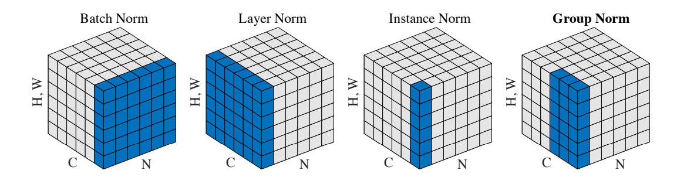

# GroupNorm

**页面ID:** atlasascendc_api_07_0816  
**来源:** https://www.hiascend.com/document/detail/zh/CANNCommunityEdition/850/API/ascendcopapi/atlasascendc_api_07_0816.html

---

#### 产品支持情况

| 产品 | 是否支持 |
| --- | --- |
| Atlas A3 训练系列产品/Atlas A3 推理系列产品 | √ |
| Atlas A2 训练系列产品/Atlas A2 推理系列产品 | √ |
| Atlas 200I/500 A2 推理产品 | x |
| Atlas 推理系列产品AI Core | x |
| Atlas 推理系列产品Vector Core | x |
| Atlas 训练系列产品 | x |

#### 功能说明

对一个特征进行标准化的一般公式如下所示：


其中，i表示特征中的索引， 和  表示特征中每个值标准化前后的值，μ和σ表示特征的均值和标准差，计算公式如下所示：


其中，ε是一个很小的常数，S表示参与计算的数据的集合，m表示集合的大小。不同类型的特征标准化方法（BatchNorm、LayerNorm、InstanceNorm、GroupNorm等）的主要区别在于参与计算的数据集合的选取上。不同Norm类算子参与计算的数据集合的选取方式如下：



对于一个shape为[N, C, H, W]的输入，GroupNorm将每个[C, H, W]在C维度上分为groupNum组，然后对每一组进行标准化。最后对标准化后的特征进行缩放和平移。其中缩放参数γ和平移参数β是可训练的。


#### 函数原型

- 接口框架申请临时空间

```
template <typename T, bool isReuseSource = false>
__aicore__ inline void GroupNorm(const LocalTensor<T>& output, const LocalTensor<T>& outputMean, const LocalTensor<T>& outputVariance, const LocalTensor<T>& inputX, const LocalTensor<T>& gamma, const LocalTensor<T>& beta, const T epsilon, GroupNormTiling& tiling)
```

- 通过sharedTmpBuffer入参传入临时空间

```
template <typename T, bool isReuseSource = false>
__aicore__ inline void GroupNorm(const LocalTensor<T>& output, const LocalTensor<T>& outputMean, const LocalTensor<T>& outputVariance, const LocalTensor<T>& inputX, const LocalTensor<T>& gamma, const LocalTensor<T>& beta, const LocalTensor<uint8_t>& sharedTmpBuffer, const T epsilon, GroupNormTiling& tiling)
```

#### 参数说明

**表1 **模板参数说明

| 参数名 | 描述 |
| --- | --- |
| T | 操作数的数据类型。 Atlas A3 训练系列产品/Atlas A3 推理系列产品，支持的数据类型为：half、float。 Atlas A2 训练系列产品/Atlas A2 推理系列产品，支持的数据类型为：half、float。 |
| isReuseSource | 是否允许修改源操作数，默认值为false。如果开发者允许源操作数被改写，可以使能该参数，使能后能够节省部分内存空间。 设置为**true**，则本接口内部计算时**复用**inputX的内存空间，节省内存空间；设置为**false**，则本接口内部计算时**不复用**inputX的内存空间。 对于float数据类型的输入支持开启该参数，half数据类型的输入不支持开启该参数。 isReuseSource的使用样例请参考更多样例。 |

**表2 **接口参数说明

| 参数名 | 输入/输出 | 描述 |
| --- | --- | --- |
| output | 输出 | 目的操作数，对标准化后的输入进行缩放和平移计算的结果。shape为[N, C, H, W]。 类型为LocalTensor，支持的TPosition为VECIN/VECCALC/VECOUT。 |
| outputMean | 输出 | 目的操作数，均值。shape为[N, groupNum]。 类型为LocalTensor，支持的TPosition为VECIN/VECCALC/VECOUT。 |
| outputVariance | 输出 | 目的操作数，方差。shape为[N, groupNum]。 类型为LocalTensor，支持的TPosition为VECIN/VECCALC/VECOUT。 |
| inputX | 输入 | 源操作数。shape为[N, C, H, W]。 类型为LocalTensor，支持的TPosition为VECIN/VECCALC/VECOUT。 |
| gamma | 输入 | 源操作数，缩放参数。该参数支持的取值范围为[-100, 100]。shape为[C]。 类型为LocalTensor，支持的TPosition为VECIN/VECCALC/VECOUT。 |
| beta | 输入 | 源操作数，平移参数。该参数支持的取值范围为[-100, 100]。shape为[C]。 类型为LocalTensor，支持的TPosition为VECIN/VECCALC/VECOUT。 |
| sharedTmpBuffer | 输入 | 接口内部复杂计算时用于存储中间变量，由开发者提供。 类型为LocalTensor，支持的TPosition为VECIN/VECCALC/VECOUT。 临时空间大小BufferSize的获取方式请参考GroupNorm Tiling。 |
| epsilon | 输入 | 防除0的权重系数。数据类型需要与inputX/output保持一致。 |
| tiling | 输入 | 输入数据的切分信息，Tiling信息的获取请参考GroupNorm Tiling。 |

#### 约束说明

- 当前仅支持ND格式的输入，不支持其他格式。

#### 调用示例

```
template <typename dataType, bool isReuseSource = false>
__aicore__ inline void MainGroupnormTest(GM_ADDR inputXGm, GM_ADDR gammGm, GM_ADDR betaGm, GM_ADDR outputGm,
    uint32_t n, uint32_t c, uint32_t h, uint32_t w, uint32_t g)
{
    dataType epsilon = 0.001;
    DataFormat dataFormat = DataFormat::ND;

    GlobalTensor<dataType> inputXGlobal;
    GlobalTensor<dataType> gammGlobal;
    GlobalTensor<dataType> betaGlobal;
    GlobalTensor<dataType> outputGlobal;
    uint32_t bshLength = n*c*h*w;
    uint32_t bsLength = g*n;

    inputXGlobal.SetGlobalBuffer(reinterpret_cast<__gm__ dataType*>(inputXGm), bshLength);
    gammGlobal.SetGlobalBuffer(reinterpret_cast<__gm__ dataType*>(gammGm), c);
    betaGlobal.SetGlobalBuffer(reinterpret_cast<__gm__ dataType*>(betaGm), c);
    outputGlobal.SetGlobalBuffer(reinterpret_cast<__gm__ dataType*>(outputGm), bshLength);

    TPipe pipe;
    TQue<TPosition::VECIN, 1>  inQueueX;
    TQue<TPosition::VECIN, 1>  inQueueGamma;
    TQue<TPosition::VECIN, 1>  inQueueBeta;
    TQue<TPosition::VECOUT, 1> outQueue;
    TBuf<TPosition::VECCALC> meanBuffer, varBuffer;

    uint32_t hwAlignSize = (sizeof(dataType) * h * w + ONE_BLK_SIZE - 1) / ONE_BLK_SIZE * ONE_BLK_SIZE / sizeof(dataType);
    pipe.InitBuffer(inQueueX, 1, sizeof(dataType) * n * c * hwAlignSize);
    pipe.InitBuffer(inQueueGamma, 1, (sizeof(dataType) * c + 31) / 32 * 32);
    pipe.InitBuffer(inQueueBeta, 1, (sizeof(dataType) * c + 31) / 32 * 32);
    pipe.InitBuffer(outQueue, 1, sizeof(dataType) * n * c * hwAlignSize);
    pipe.InitBuffer(meanBuffer, (sizeof(dataType) * g * n + 31) / 32 * 32);
    pipe.InitBuffer(varBuffer, (sizeof(dataType) * g * n + 31) / 32 * 32);

    LocalTensor<dataType> inputXLocal = inQueueX.AllocTensor<dataType>();
    LocalTensor<dataType> gammaLocal = inQueueGamma.AllocTensor<dataType>();
    LocalTensor<dataType> betaLocal = inQueueBeta.AllocTensor<dataType>();
    LocalTensor<dataType> outputLocal = outQueue.AllocTensor<dataType>();
    LocalTensor<dataType> meanLocal = meanBuffer.Get<dataType>();
    LocalTensor<dataType> varianceLocal = varBuffer.Get<dataType>();

    DataCopyParams copyParams{static_cast<uint16_t>(n*c), static_cast<uint16_t>(h*w*sizeof(dataType)), 0, 0};
    DataCopyPadParams padParams{true, 0, static_cast<uint8_t>(hwAlignSize - h * w), 0};
    DataCopyPad(inputXLocal, inputXGlobal, copyParams, padParams);
    DataCopyParams copyParamsGamma{1, static_cast<uint16_t>(c*sizeof(dataType)), 0, 0};
    DataCopyPadParams padParamsGamma{false, 0, 0, 0};
    DataCopyPad(gammaLocal, gammGlobal, copyParamsGamma, padParamsGamma);
    DataCopyPad(betaLocal, betaGlobal, copyParamsGamma, padParamsGamma);

    PipeBarrier<PIPE_ALL>();

    uint32_t stackBufferSize = 0;
    {
        LocalTensor<float> stackBuffer;
        bool ans = PopStackBuffer<float, TPosition::LCM>(stackBuffer);
        stackBufferSize = stackBuffer.GetSize();
    }

    GroupNormTiling groupNormTiling;
    uint32_t inputShape[4] = {n, c, h, w};
    ShapeInfo shapeInfo{ (uint8_t)4, inputShape, (uint8_t)4, inputShape, dataFormat };

    GetGroupNormNDTillingInfo(shapeInfo, stackBufferSize, sizeof(dataType), isReuseSource, g, groupNormTiling);

    GroupNorm<dataType, isReuseSource>(outputLocal, meanLocal, varianceLocal, inputXLocal, gammaLocal, betaLocal, (dataType)epsilon, groupNormTiling);
    PipeBarrier<PIPE_ALL>();

    DataCopyPad(outputGlobal, outputLocal, copyParams);
    inQueueX.FreeTensor(inputXLocal);
    inQueueGamma.FreeTensor(gammaLocal);
    inQueueBeta.FreeTensor(betaLocal);
    outQueue.FreeTensor(outputLocal);
    PipeBarrier<PIPE_ALL>();
}
```
