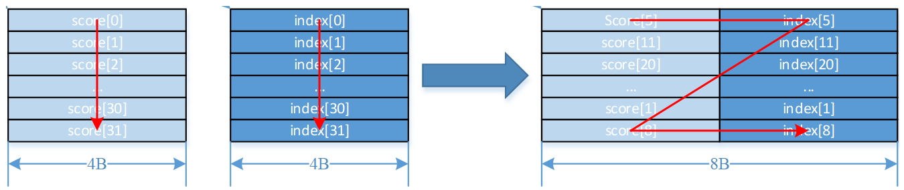
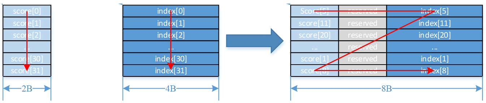

# Sort

**页面ID:** atlasascendc_api_07_0842  
**来源:** https://www.hiascend.com/document/detail/zh/CANNCommunityEdition/850/API/ascendcopapi/atlasascendc_api_07_0842.html

---

# Sort

#### 产品支持情况

| 产品 | 是否支持 |
| --- | --- |
| Atlas A3 训练系列产品/Atlas A3 推理系列产品 | √ |
| Atlas A2 训练系列产品/Atlas A2 推理系列产品 | √ |
| Atlas 200I/500 A2 推理产品 | x |
| Atlas 推理系列产品AI Core | √ |
| Atlas 推理系列产品Vector Core | x |
| Atlas 训练系列产品 | x |

#### 功能说明

排序函数，按照数值大小进行降序排序。排序后的数据按照如下排布方式进行保存：

Atlas A3 训练系列产品/Atlas A3 推理系列产品采用方式一。

Atlas A2 训练系列产品/Atlas A2 推理系列产品采用方式一。

Atlas 推理系列产品AI Core采用方式二。

- 排布方式一：一次迭代可以完成32个数的排序，排序好的score与其对应的index一起以（score, index）的结构存储在dst中。不论score为half还是float类型，dst中的（score, index）结构总是占据8Bytes空间。如下所示：

  - 当score为float，index为uint32类型时，计算结果中index存储在高4Bytes，score存储在低4Bytes。



  - 当score为half，index为uint32类型时，计算结果中index存储在高4Bytes，score存储在低2Bytes， 中间的2Bytes保留。



- 排布方式二：Region Proposal排布输入输出数据均为Region Proposal，一次迭代可以完成16个region proposal的排序。每个Region Proposal占用连续8个half/float类型的元素，约定其格式：

```
[x1, y1, x2, y2, score, label, reserved_0, reserved_1]
```

对于数据类型half，每一个Region Proposal占16Bytes，Byte[15:12]是无效数据，Byte[11:0]包含6个half类型的元素，其中Byte[11:10]定义为label，Byte[9:8]定义为score，Byte[7:6]定义为y2，Byte[5:4]定义为x2，Byte[3:2]定义为y1，Byte[1:0]定义为x1。

如下图所示，总共包含16个Region Proposals。


对于数据类型float，每一个Region Proposal占32Bytes，Byte[31:24]是无效数据，Byte[23:0]包含6个float类型的元素，其中Byte[23:20]定义为label，Byte[19:16]定义为score，Byte[15:12]定义为y2，Byte[11:8]定义为x2，Byte[7:4]定义为y1，Byte[3:0]定义为x1。

如下图所示，总共包含16个Region Proposals。


#### 函数原型

```
template <typename T, bool isFullSort>
__aicore__ inline void Sort(const LocalTensor<T>& dst, const LocalTensor<T>& concat, const LocalTensor<uint32_t>& index, LocalTensor<T>& tmp, const int32_t repeatTime)
```

#### 参数说明

**表1 **模板参数说明

| 参数名 | 含义 |
| --- | --- |
| T | 操作数的数据类型。 Atlas A3 训练系列产品/Atlas A3 推理系列产品，支持的数据类型为：half、float。 Atlas A2 训练系列产品/Atlas A2 推理系列产品，支持的数据类型为：half、float。 Atlas 推理系列产品AI Core，支持的数据类型为：half、float。 |
| isFullSort | 是否开启全排序模式。全排序模式指将全部输入降序排序，非全排序模式下，排序方式请参考表2中的repeatTime说明。 |

**表2 **参数说明

| 参数名称 | 输入/输出 | 含义 |
| --- | --- | --- |
| dst | 输出 | 目的操作数，shape为[2n]。 类型为LocalTensor，支持的TPosition为VECIN/VECCALC/VECOUT。 LocalTensor的起始地址需要32字节对齐。 |
| concat | 输入 | 源操作数，即接口功能说明中的score，shape为[n]。 类型为LocalTensor，支持的TPosition为VECIN/VECCALC/VECOUT。 LocalTensor的起始地址需要32字节对齐。 此源操作数的数据类型需要与目的操作数保持一致。 |
| index | 输入 | 源操作数，shape为[n]。 类型为LocalTensor，支持的TPosition为VECIN/VECCALC/VECOUT。 LocalTensor的起始地址需要32字节对齐。 此源操作数固定为uint32_t数据类型。 |
| tmp | 输入 | 临时空间。接口内部复杂计算时用于存储中间变量，由开发者提供，临时空间大小BufferSize的获取方式请参考GetSortTmpSize。数据类型与源操作数保持一致。 类型为LocalTensor，支持的TPosition为VECIN/VECCALC/VECOUT。 LocalTensor的起始地址需要32字节对齐。 |
| repeatTime | 输入 | 重复迭代次数，int32_t类型。 - Atlas A3 训练系列产品/Atlas A3 推理系列产品：每次迭代完成32个元素的排序，下次迭代concat和index各跳过32个elements，dst跳过32*8 Byte空间。取值范围：repeatTime∈[0,255]。- Atlas A2 训练系列产品/Atlas A2 推理系列产品：每次迭代完成32个元素的排序，下次迭代concat和index各跳过32个elements，dst跳过32*8 Byte空间。取值范围：repeatTime∈[0,255]。- Atlas 推理系列产品AI Core：每次迭代完成16个region proposal的排序，下次迭代concat和dst各跳过16个region proposal。取值范围：repeatTime∈[0,255]。 |

#### 返回值说明

无

#### 约束说明

- 当存在score[i]与score[j]相同时，如果i>j，则score[j]将首先被选出来，排在前面，即index的顺序与输入顺序一致。
- 非全排序模式下，每次迭代内的数据会进行排序，不同迭代间的数据不会进行排序。

#### 调用示例

算子样例工程请通过[sort](https://gitee.com/ascend/ascendc-api-adv/tree/master/examples/sort/sort)链接获取。

- 处理128个half类型数据。

该样例适用于：

Atlas A2 训练系列产品/Atlas A2 推理系列产品

Atlas A3 训练系列产品/Atlas A3 推理系列产品

```
uint32_t elementCount = 128;
uint32_t m_sortRepeatTimes = m_elementCount / 32;
uint32_t m_extractRepeatTimes = m_elementCount / 32;
AscendC::Concat(concatLocal, valueLocal, concatTmpLocal, m_concatRepeatTimes);
AscendC::Sort<T, isFullSort>(sortedLocal, concatLocal, indexLocal, sortTmpLocal, m_sortRepeatTimes);
AscendC::Extract(dstValueLocal, dstIndexLocal, sortedLocal, m_extractRepeatTimes);
```

```
示例结果
输入数据（srcValueGm）: 128个half类型数据
[31 30 29 ... 2 1 0
 63 62 61 ... 34 33 32
 95 94 93 ... 66 65 64
 127 126 125 ... 98 97 96]
输入数据（srcIndexGm）:
[31 30 29 ... 2 1 0
 63 62 61 ... 34 33 32
 95 94 93 ... 66 65 64
 127 126 125 ... 98 97 96]
输出数据（dstValueGm）:
[127 126 125 ... 2 1 0]
输出数据（dstIndexGm）:
[127 126 125 ... 2 1 0]
```

- 处理64个half类型数据。

该样例适用于：

Atlas 推理系列产品AI Core

```
uint32_t elementCount = 64;
uint32_t m_sortRepeatTimes = m_elementCount / 16;
uint32_t m_extractRepeatTimes = m_elementCount / 16;
AscendC::Concat(concatLocal, valueLocal, concatTmpLocal, m_concatRepeatTimes);
AscendC::Sort<T, isFullSort>(sortedLocal, concatLocal, indexLocal, sortTmpLocal, m_sortRepeatTimes);
AscendC::Extract(dstValueLocal, dstIndexLocal, sortedLocal, m_extractRepeatTimes);
```

```
示例结果
输入数据（srcValueGm）: 64个half类型数据
[15 14 13 ... 2 1 0
 31 30 29 ... 18 17 16
 47 46 45 ... 34 33 32
 63 62 61 ... 50 49 48]
输入数据（srcIndexGm）:
[15 14 13 ... 2 1 0
 31 30 29 ... 18 17 16
 47 46 45 ... 34 33 32
 63 62 61 ... 50 49 48]
输出数据（dstValueGm）:
[63 62 61 ... 2 1 0]
输出数据（dstIndexGm）:
[63 62 61 ... 2 1 0]
```
