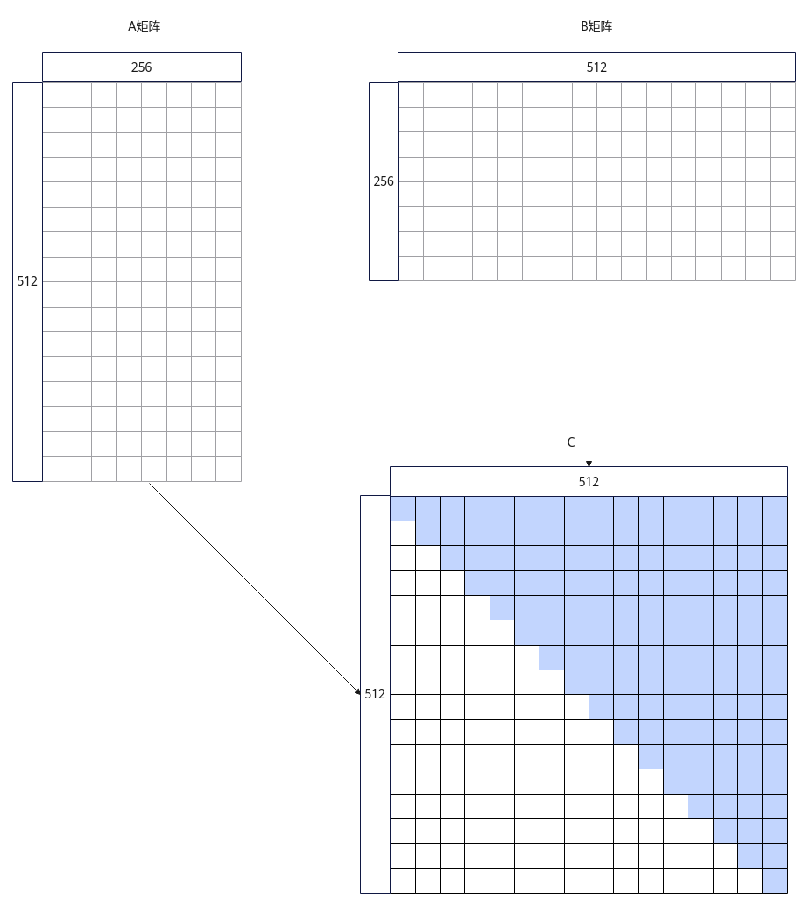
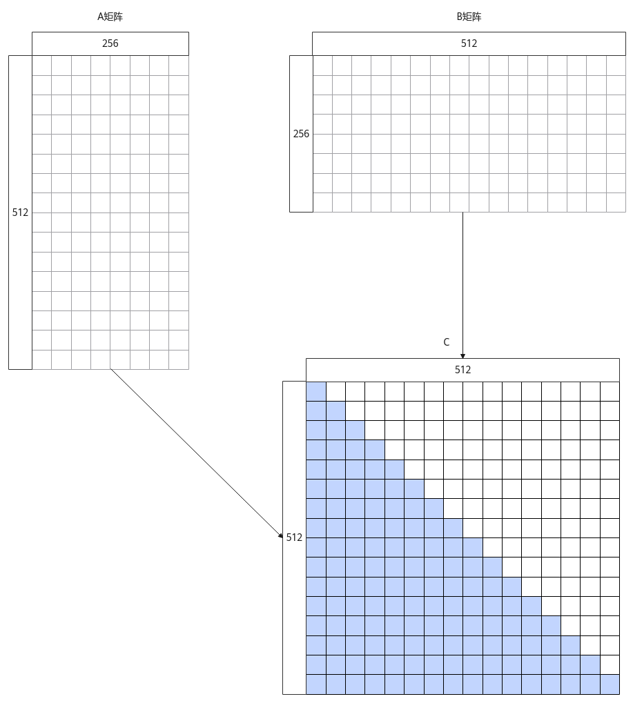
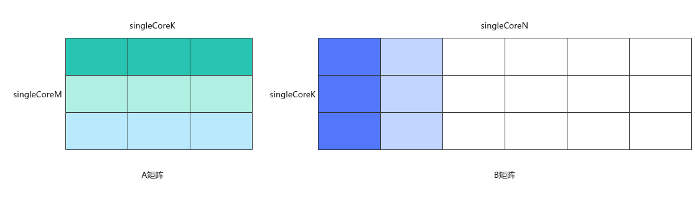

# MatmulPolicy

**页面ID:** atlasascendc_api_07_0619  
**来源:** https://www.hiascend.com/document/detail/zh/CANNCommunityEdition/850/API/ascendcopapi/atlasascendc_api_07_0619.html

---

#### 产品支持情况

| 产品 | MatmulPolicy | TrianUpperMatmulPolicy/TrianLowerMatmulPolicy | NBuffer33MatmulPolicy |
| --- | --- | --- | --- |
| Atlas A3 训练系列产品            /             Atlas A3 推理系列产品 | √ | √ | √ |
| Atlas A2 训练系列产品            /             Atlas A2 推理系列产品 | √ | √ | √ |
| Atlas 200I/500 A2 推理产品 | √ | x | x |
| Atlas 推理系列产品            AI Core | √ | x | x |
| Atlas 推理系列产品            Vector Core | x | x | x |
| Atlas 训练系列产品 | x | x | x |

#### 功能说明

     模板参数MatmulPolicy用于定义Matmul可拓展模块策略。目前支持设置以下四种Matmul内置模板策略。 

- MatmulPolicy（默认模板策略） 

使能Matmul API的默认实现策略。

- TrianUpperMatmulPolicy（上三角模板策略） 

一次矩阵乘指令计算的结果为baseM * baseN大小的矩阵块，称该矩阵块为基本块。若Matmul结果矩阵C中的基本块位于下三角位置，则Matmul内部做数据计算和数据搬出时，将忽略该基本块，最后得到的矩阵C为一个上三角矩阵。上三角模板策略如下图所示，图示中矩阵形状的相关大小为M=N=512，K=256，baseM=baseN=baseK=32。

**图1 **上三角模板策略示意图

- TrianLowerMatmulPolicy（下三角模板策略） 

一次矩阵乘指令计算的结果为baseM * baseN大小的矩阵块，称该矩阵块为基本块。若Matmul结果矩阵C中的基本块位于上三角位置，则Matmul内部做数据计算和数据搬出时，将忽略该基本块，最后得到的矩阵C为一个下三角矩阵。下三角模板策略如下图所示，图示中矩阵形状的相关大小为M=N=512，K=256，baseM=baseN=baseK=32。

**图2 **下三角模板策略示意图


- NBuffer33MatmulPolicy（NBuffer33模板策略） 

一次矩阵乘指令计算的结果为baseM * baseN大小的矩阵块，称该矩阵块为基本块。单核计算的A矩阵切分为3x3个基本块，该3x3个A矩阵的基本块全载和保持在L1 Buffer中，每次与3x1个B矩阵的基本块计算矩阵乘，同时DoubleBuffer并行搬入下次计算所需的3x1个B矩阵基本块，直到singleCoreN方向的矩阵乘计算完成。NBuffer33模板策略如下图所示，图中singleCoreM、singleCoreN、singleCoreK表示单核内A、B矩阵的shape大小，单核计算的A矩阵切分为3x3个基本块，3x3个基本块全载在L1 Buffer上，这些基本块每次与B矩阵的3x1个基本块计算矩阵乘。

**图3 **NBuffer33模板策略示意图


#### 约束说明

- TrianUpperMatmulPolicy当前只支持Norm模板和MDL模板。
- TrianLowerMatmulPolicy当前只支持Norm模板和MDL模板。
- NBuffer33MatmulPolicy： 

  - 当前只支持MDL模板。
  - A矩阵、B矩阵的内存逻辑位置只支持TPosition::GM。
  - 暂不支持MIX模式（包含矩阵计算和矢量计算），仅支持纯Cube模式（只有矩阵计算）。
  - 只支持通过IterateAll接口获取Matmul的计算结果C矩阵。
  - stepM、stepKa、stepKb小于等于3，且满足：stepKa=stepKb=ceil(singleCoreK/baseK)。
  - A矩阵全载的基本块大小与B矩阵载入的基本块大小之和不超过L1 Buffer大小。
  - 在使用GetTiling接口生成Tiling参数前，必须通过SetMatmulConfigParams接口将scheduleTypeIn参数设置为ScheduleType::N_BUFFER_33，以启用NBuffer33模板策略的Tiling生成逻辑。

#### 调用示例

默认模板策略MatmulPolicy为模板参数的默认值，下面主要介绍TrianUpperMatmulPolicy（上三角模板策略）和TrianLowerMatmulPolicy（下三角模板策略）的使用方式。

- 上三角模板策略使用示例 
      完整的算子样例请参考[使用上下三角模板策略的算子样例](https://gitee.com/ascend/ascendc-api-adv/blob/master/examples/matrix/matmul_triangle)。 

```
#include "lib/matmul_intf.h"

typedef AscendC::MatmulType<AscendC::TPosition::GM, CubeFormat::ND, half> aType; 
typedef AscendC::MatmulType<AscendC::TPosition::GM, CubeFormat::ND, half> bType;
typedef AscendC::MatmulType<AscendC::TPosition::GM, CubeFormat::ND, float> cType; 
typedef AscendC::MatmulType<AscendC::TPosition::GM, CubeFormat::ND, float> biasType;
// Matmul定义时传入TrianUpperMatmulPolicy
AscendC::Matmul<aType, bType, cType, biasType, CFG_NORM, MatmulCallBackFunc<nullptr, nullptr, nullptr>, AscendC::Impl::Detail::TrianUpperMatmulPolicy> mm; 

// 常规Matmul计算，最后输出上三角形式的结果
TPipe pipe;
TCubeTiling tiling;
REGIST_MATMUL_OBJ(&pipe, GetSysWorkSpacePtr(), mm, &tiling);
mm.Init(&tiling);
mm.SetTensorA(gmA, isTransposeA);
mm.SetTensorB(gmB, isTransposeB);
if (tiling.isBias) {
    mm.SetBias(gmBias);
}
mm.IterateAll(gmC);
```

- 下三角模板策略使用示例 
      完整的算子样例请参考[使用上下三角模板策略的算子样例](https://gitee.com/ascend/ascendc-api-adv/blob/master/examples/matrix/matmul_triangle)。 

```
#include "lib/matmul_intf.h"

typedef AscendC::MatmulType<AscendC::TPosition::GM, CubeFormat::ND, half> aType; 
typedef AscendC::MatmulType<AscendC::TPosition::GM, CubeFormat::ND, half> bType;
typedef AscendC::MatmulType<AscendC::TPosition::GM, CubeFormat::ND, float> cType; 
typedef AscendC::MatmulType<AscendC::TPosition::GM, CubeFormat::ND, float> biasType;
// Matmul定义时传入TrianLowerMatmulPolicy
AscendC::Matmul<aType, bType, cType, biasType, CFG_NORM, MatmulCallBackFunc<nullptr, nullptr, nullptr>, AscendC::Impl::Detail::TrianLowerMatmulPolicy> mm; 

// 常规Matmul计算，最后输出下三角形式的结果
TPipe pipe;
TCubeTiling tiling;
REGIST_MATMUL_OBJ(&pipe, GetSysWorkSpacePtr(), mm, &tiling);
mm.Init(&tiling);
mm.SetTensorA(gmA, isTransposeA);
mm.SetTensorB(gmB, isTransposeB);
if (tiling.isBias) {
    mm.SetBias(gmBias);
}
mm.IterateAll(gmC);
```

- NBuffer33模板策略使用示例 
      完整的算子样例请参考[使能NBuffer33模板策略的样例](https://gitee.com/ascend/ascendc-api-adv/tree/master/examples/matrix/matmul_nbuffer33)。 

```
#include "lib/matmul_intf.h"

typedef AscendC::MatmulType<AscendC::TPosition::GM, CubeFormat::ND, half> aType; 
typedef AscendC::MatmulType<AscendC::TPosition::GM, CubeFormat::ND, half> bType;
typedef AscendC::MatmulType<AscendC::TPosition::GM, CubeFormat::ND, float> cType; 
typedef AscendC::MatmulType<AscendC::TPosition::GM, CubeFormat::ND, float> biasType;
// Matmul定义时传入NBuffer33MatmulPolicy

AscendC::Matmul<aType, bType, cType, biasType, CFG_NORM, MatmulCallBackFunc<nullptr, nullptr, nullptr>, AscendC::Impl::Detail::NBuffer33MatmulPolicy> mm; 

// 常规Matmul计算，最后输出下三角形式的结果
TPipe pipe;
TCubeTiling tiling;
REGIST_MATMUL_OBJ(&pipe, GetSysWorkSpacePtr(), mm, &tiling);
mm.Init(&tiling);
mm.SetTensorA(gmA, isTransposeA);
mm.SetTensorB(gmB, isTransposeB);
if (tiling.isBias) {
    mm.SetBias(gmBias);
}
mm.IterateAll(gmC);
```
