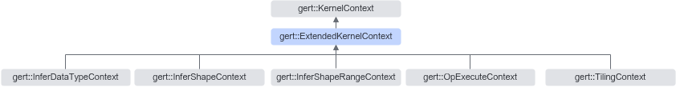

# 简介

**页面ID:** atlasopapi_07_00546  
**来源:** https://www.hiascend.com/document/detail/zh/CANNCommunityEdition/850/API/basicdataapi/atlasopapi_07_00546.html

---

ExtendedKernelContext是KernelContext的子类，在KernelContext的基础上，封装了与计算节点（Compute Node，即算子）相关的Context信息处理接口。它提供了对计算节点输入、输出、属性、类型、名称等信息的访问接口。该类的主要目的是简化对计算节点信息的获取和处理过程。用户无需感知KernelContext信息的排布，可以直接通过ExtendedKernelContext的接口获取。如下图所示，除KernelContext以外，剩下的各层子类均不再包含任何成员变量，因此，此继承树上的所有类均可以当作POD类与原始的KernelContext强转使用。同时，子类仅仅是包装类，不涉及单独构造和析构场景，因此子类的所有构造函数、析构函数均被禁用。

ExtendedKernelContext继承关系图如下：



#### 需要包含的头文件

```
#include <extended_kernel_context.h>
```

#### Public成员函数

```
const CompileTimeTensorDesc *GetInputDesc(const size_t index) const
const CompileTimeTensorDesc *GetOutputDesc(const size_t index) const
const CompileTimeTensorDesc *GetOptionalInputDesc(const size_t ir_index) const
const CompileTimeTensorDesc *GetDynamicInputDesc(const size_t ir_index, const size_t relative_index) const
const CompileTimeTensorDesc *GetRequiredInputDesc(const size_t ir_index) const
const AnchorInstanceInfo *GetIrInputInstanceInfo(const size_t ir_index) const
const AnchorInstanceInfo *GetIrOutputInstanceInfo(const size_t ir_index) const
size_t GetComputeNodeInputNum() const
size_t GetComputeNodeOutputNum() const
const RuntimeAttrs *GetAttrs() const
const ge::char_t *GetNodeType() const
const ge::char_t *GetNodeName() const
constComputeNodeInfo *GetComputeNodeInfo() const
const ge::char_t *GetKernelName() const
const ge::char_t *GetKernelType() const
const KernelExtendInfo *GetExtendInfo() const
```
