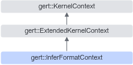

# 简介

**页面ID:** atlasopapi_07_00572  
**来源:** https://www.hiascend.com/document/detail/zh/CANNCommunityEdition/850/API/basicdataapi/atlasopapi_07_00572.html

---

InferFormatContext继承自ExtendedKernelContext，是一个用于Format推导的上下文类。该类的主要作用是在推导算子输出Format的过程中，提供必要的输入输出Format、输入输出Shape和输入Tensor访问接口。InferFormatContext是Format推导函数的入参，Format推导函数的相关解释请参考InferFormat。

InferFormatContext继承关系图如下：



#### 需要包含的头文件

```
#include <infer_format_context.h>
```

#### Public成员函数

```
StorageFormat *GetInputFormat(const size_t index)
StorageFormat *GetRequiredInputFormat(const size_t ir_index)
StorageFormat *GetOptionalInputFormat(const size_t ir_index)
StorageFormat *GetDynamicInputFormat(const size_t ir_index, const size_t relative_index)
const Shape *GetInputShape(const size_t index) const
const Shape *GetRequiredInputShape(const size_t ir_index) const
const Shape *GetOptionalInputShape(const size_t ir_index) const
const Shape *GetDynamicInputShape(const size_t ir_index, const size_t relative_index) const
const Tensor *GetInputTensor(const size_t index) const
const Tensor *GetRequiredInputTensor(const size_t ir_index) const
const Tensor *GetOptionalInputTensor(const size_t ir_index) const
const Tensor *GetDynamicInputTensor(const size_t ir_index, const size_t relative_index) const
StorageFormat *GetOutputFormat(const size_t index)
StorageFormat *GetRequiredOutputFormat(const size_t ir_index)
StorageFormat *GetDynamicOutputFormat(const size_t ir_index, const size_t relative_index)
```
