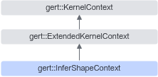

# 简介

**页面ID:** atlasopapi_07_00548  
**来源:** https://www.hiascend.com/document/detail/zh/CANNCommunityEdition/850/API/basicdataapi/atlasopapi_07_00548.html

---

# 简介

InferShapeContext继承自ExtendedKernelContext，是一个用于shape推导的上下文类。该类的主要作用是在推导算子输出shape的过程中，提供必要的输入输出shape和输入tensor访问接口。对于部分推导shape过程依赖输入张量值的算子（例如Slice、Pad），该类提供了GetInputTensor等接口以获取实际输入数据。

InferShapeContext继承关系图如下：



#### 需要包含的头文件

```
#include <infer_shape_context.h>
```

#### Public成员函数

```
const Shape *GetInputShape(const size_t index) const
const Tensor *GetInputTensor(const size_t index) const
const Shape *GetOptionalInputShape(const size_t ir_index) const
const Tensor *GetOptionalInputTensor(const size_t ir_index) const
const Shape *GetDynamicInputShape(const size_t ir_index, const size_t relative_index) const
const Tensor *GetDynamicInputTensor(const size_t ir_index, const size_t relative_index) const
const Shape *GetRequiredInputShape(const size_t ir_index) const
const Tensor *GetRequiredInputTensor(const size_t ir_index) const
Shape *GetOutputShape(const size_t index)
```
