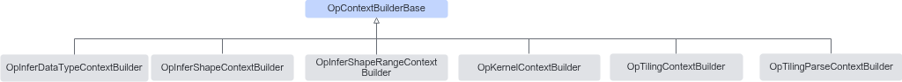

# 简介

**页面ID:** atlasopapi_07_00600  
**来源:** https://www.hiascend.com/document/detail/zh/CANNCommunityEdition/850/API/basicdataapi/atlasopapi_07_00600.html

---

OpContextBuilderBase是各ContextBuilder的基类，用于构造子类context中算子信息，包括算子类型、名称、输入输出原型个数、输入输出实例个数、属性等信息。

OpContextBuilderBase继承关系图如下：



> **注意:** 

不可单独构造OpContextBuilderBase基类对象，只能通过子类构造。

#### 需要包含的头文件

```
#include "base/context_builder/op_context_builder_base.h"
```

#### Public成员函数

```
T &OpType(const ge::AscendString &op_type)
T &OpName(const ge::AscendString &op_name)
T &IONum(size_t input_ir_num, size_t output_ir_num)
T &IOInstanceNum(const std::vector<uint32_t> &input_instance_num, const std::vector<uint32_t> &output_instance_num)
T &AppendAttr(bool attr)
T &AppendAttr(int64_t attr)
T &AppendAttr(float attr)
T &AppendAttr(const ge::AscendString &attr)
T &AppendAttr(const std::vector<bool> &attr)
T &AppendAttr(const std::vector<int64_t> &attr)
T &AppendAttr(const std::vector<float> &attr)
T &AppendAttr(const std::vector<ge::AscendString> &attr)
T &AppendAttr(const std::vector<std::vector<int64_t>> &attr)
virtual ~OpContextBuilderBase()
```
