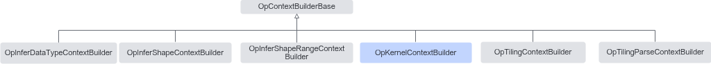

# 简介

**页面ID:** atlasopapi_07_00625  
**来源:** https://www.hiascend.com/document/detail/zh/CANNCommunityEdition/850/API/basicdataapi/atlasopapi_07_00625.html

---

用于构建一个通用的KernelContext对象，该上下文作为算子Host实现实际执行阶段的输入上下文。

OpKernelContextBuilder继承关系图如下：



> **注意:** 

该类继承自OpContextBuilderBase类，在Build构建ContextHolder对象之前，需要调用OpContextBuilderBase的OpType、OpName、IONum或IOInstanceNum，以及AppendAttr接口，分别设置算子的类型、名称、输入输出个数、以及算子的属性。

#### 需要包含的头文件

```
#include "base/context_builder/op_kernel_run_context_builder.h"
```

#### Public成员函数

```
OpKernelContextBuilder &InputTensorDesc(size_t index, ge::DataType dtype, ge::Format origin_format, ge::Format storage_format, const gert::ExpandDimsType &expand_dims_type = {})
OpKernelContextBuilder &OutputTensorDesc(size_t index, ge::DataType dtype, ge::Format origin_format, ge::Format storage_format, const gert::ExpandDimsType &expand_dims_type = {})
OpKernelContextBuilder &Inputs(std::vector<void *> inputs)
OpKernelContextBuilder &Outputs(std::vector<void *> outputs)
ContextHolder<KernelContext> Build()
```
