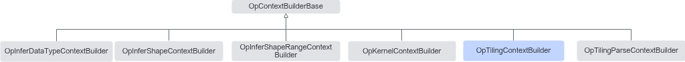

# 简介

**页面ID:** atlasopapi_07_00632  
**来源:** https://www.hiascend.com/document/detail/zh/CANNCommunityEdition/850/API/basicdataapi/atlasopapi_07_00632.html

---

OpTilingContextBuilder用于构建TilingContext。构造出的Context在算子Tiling计算过程中作为入参，用于获取必要的算子输入输出等数据。Tiling计算完成后，结果会被写回上下文中。

OpTilingContextBuilder继承关系图如下：



使用步骤如下：

1. 构造ContextHolder。

调用OpTilingContextBuilder接口，传入相应的输入数据，比如输入的Tensor、PlatformInfo等，最终调用Build()接口构造一个ContextHolder<TilingContext>对象。

2. 获取TilingContext。

通过ContextHolder调用GetContext接口，获取TilingContext。

3. 调用算子Tiling实现函数TilingKernelFunc，将TilingContext作为函数入参，完成Tiling计算，算子写入计算的输出结果。
4. 通过TilingContext的接口可以获取Tiling计算的结果。
5. 根据需要释放ContextHolder，释放完成后，此时Build构造出来的TilingContext中的数据指针均无效。

> **注意:** 

该类继承自OpContextBuilderBase类，在Build构建ContextHolder对象之前，需要调用OpContextBuilderBase的OpType、OpName、IONum或IOInstanceNum，以及AppendAttr接口，分别设置算子的类型、名称、输入输出个数、以及算子的属性。

#### 需要包含的头文件

```
#include "base/context_builder/op_tiling_context_builder.h"
```

#### Public成员函数

```
OpTilingContextBuilder()
~OpTilingContextBuilder() override
OpTilingContextBuilder &CompileInfo(const void *compile_info)
OpTilingContextBuilder &PlatformInfo(const void *platform_info)
OpTilingContextBuilder &Deterministic(int32_t deterministic)
OpTilingContextBuilder &TilingData(const gert::TilingData *tiling_data, gert::Chain::Deleter deleter = nullptr)
OpTilingContextBuilder &TilingDataSize(size_t tiling_data_size)
OpTilingContextBuilder &Workspace(const gert::ContinuousVector *workspace)
OpTilingContextBuilder &InputTensors(const std::vector<gert::Tensor *> &inputs)
OpTilingContextBuilder &OutputTensors(const std::vector<gert::Tensor *> &outputs)
ContextHolder<TilingContext> Build()
```
