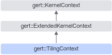

# 简介

**页面ID:** atlasopapi_07_00555  
**来源:** https://www.hiascend.com/document/detail/zh/CANNCommunityEdition/850/API/basicdataapi/atlasopapi_07_00555.html

---

TilingContext继承自ExtendedKernelContext，是用于算子Tiling计算的上下文类，提供了获取算子编译信息（CompileInfo），输入输出shape、输入张量的值以及访问算子Tiling相关参数的接口。在算子Tiling实现中，可以通过该类获取计算Tiling所依赖的参数，然后将Tiling结果（例如TilingKey、TilingData）保存至上下文中，供后续算子执行时使用。

TilingContext继承关系图如下：



#### 需要包含的头文件

```
#include <tiling_context.h>
```

#### Public成员函数

```
const StorageShape *GetInputShape(const size_t index) const
const Tensor *GetInputTensor(const size_t index) const
const Tensor *GetOptionalInputTensor(const size_t ir_index) const
const Tensor *GetDynamicInputTensor(const size_t ir_index, const size_t relative_index) const
const Tensor *GetRequiredInputTensor(const size_t ir_index) const
const StorageShape *GetOptionalInputShape(const size_t ir_index) const
const StorageShape *GetDynamicInputShape(const size_t ir_index, const size_t relative_index) const
const StorageShape *GetRequiredInputShape(const size_t ir_index) const
const StorageShape *GetOutputShape(size_t index) const
ge::graphStatus SetTilingKey(const uint64_t tiling_key)
uint64_t GetTilingKey() const
ge::graphStatus SetBlockDim(const uint32_t block_dim)
uint32_t GetBlockDim() const
ge::graphStatus SetTilingCond(int32_t tiling_cond)
int32_t GetTilingCond() const
ge::graphStatus SetNeedAtomic(const bool atomic)
bool NeedAtomic() const
template<typename T>
auto GetTilingData() -> T*
TilingData *GetRawTilingData()
size_t *GetWorkspaceSizes(const size_t workspace_count)
size_t GetWorkspaceNum() const
fe::PlatFormInfos *GetPlatformInfo() const
template<typename T>
const T *GetCompileInfo() const
const void *GetCompileInfo() const
ge::graphStatus SetScheduleMode(const uint32_t schedule_mode)
uint32_t GetScheduleMode() const
ge::graphStatus SetLocalMemorySize(const uint32_t local_memory_size)
uint32_t GetLocalMemorySize()
int32_t GetDeterministic() const
```
