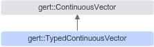

# 简介

**页面ID:** atlasopapi_07_00270  
**来源:** https://www.hiascend.com/document/detail/zh/CANNCommunityEdition/850/API/basicdataapi/atlasopapi_07_00270.html

---

# 简介

本类继承自ContinuousVector类，与ContinuousVector类不同的是MutableData和GetData返回的是指定类型的地址，而不是void *。因此称为Typed。

TypedContinuousVector继承关系图如下：



#### 需要包含的头文件

```
#include <continuous_vector.h>
```

#### Public成员函数

```
T *MutableData()
const T *GetData() const
```
