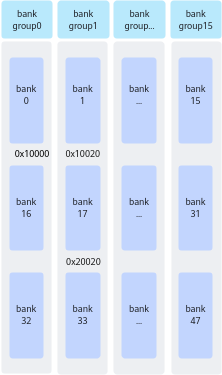
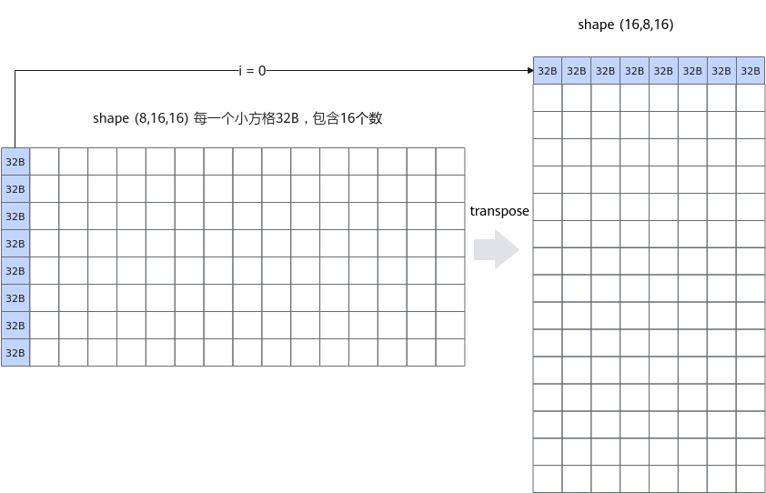
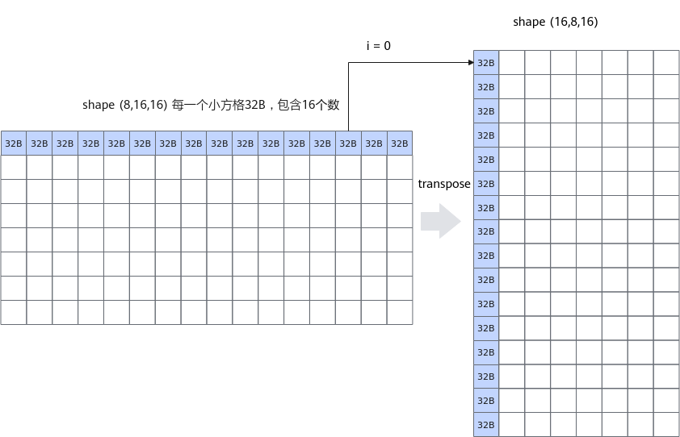
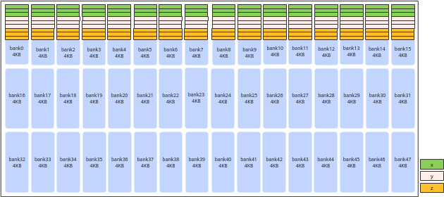
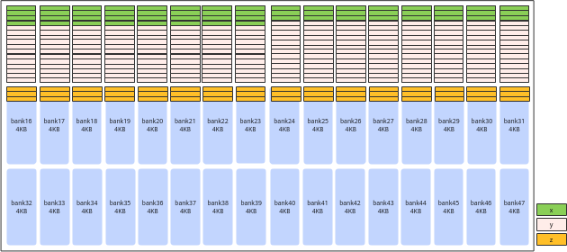

# 避免Unified Buffer的bank冲突

**页面ID:** atlas_ascendc_best_practices_10_0025  
**来源:** https://www.hiascend.com/document/detail/zh/CANNCommunityEdition/850/opdevg/Ascendcopdevg/atlas_ascendc_best_practices_10_0025.html

---

【优先级】高

> **注意:** 

该性能优化指导适用于如下产品型号：

- 
>          Atlas A3 训练系列产品
>         /
>          Atlas A3 推理系列产品
>         
- 
>          Atlas A2 训练系列产品
>         /
>          Atlas A2 推理系列产品
>         

【描述】为了提高数据访问的效率和吞吐量，Unified Buffer采用了bank（大小相等的内存模块）结构设计。Unified Buffer总大小为192K，划分为48个bank。每个bank由128行组成，每行长度为32B。这48个bank进一步组织为16个bank group，每个bank group包含3个bank，例如bank15、bank31和bank47组成一个bank group。

**图1 **bank结构示意图（图中箭头方向表示内存排布的顺序）


每个bank可以独立地进行数据的读写操作，允许多个数据请求同时进行。然而，当多个读写操作试图同时访问同一个bank或bank group时，由于硬件资源的限制，这些操作必须排队等待，会导致bank冲突，引起性能下降。

具体来说，Vector计算单元每拍（一个指令周期）能够从每个bank group中读取或写入一行数据。如果同一个API中的多个操作试图同时访问同一个bank或bank group，Vector计算单元无法在同一个周期内处理所有请求，导致这些请求排队等待。这种排队增加了数据访问的延迟，降低了系统的整体性能。

#### bank冲突的典型场景

bank冲突主要可以分为以下三种场景：

- **读写冲突**：读操作和写操作同时尝试访问同一个bank。
- **写写冲突**：多个写操作同时尝试访问同一个bank group。
- **读读冲突**：多个读操作同时尝试访问同一个bank group。

下文给出了一些具体的示例，假设，0x10000地址在bank16上，0x10020在bank17上，0x20020在bank33上，如下图所示：

**图2 **地址分配示意图


- 读写冲突示例
- 写写冲突示例 
      Vector指令目的操作数dst对应的8个DataBlock（block0-block7）同时写到一个bank group时造成写写冲突，具体分析如下： 

**表1 **写写冲突示例

| 序号 | dst地址 | blk_stride | block0_addr | block1_addr | block2_addr | ... | 结论 |
| --- | --- | --- | --- | --- | --- | --- | --- |
| 示例1 | 0x1FE00 | 16 | 0x1FE00 | 0x20000 | 0x20200 | ... | 8个DataBlock均在一个bank group下，故全部冲突，8拍完成一个Repeat的写入。 |
| 示例2 | 0x1FE00 | 8 | 0x1FE00 | 0x1FF00 | 0x20000 | ... | block0和block2在一个bank group，存在冲突，4拍完成一个Repeat的写入。 |

- 读读冲突 

  - Vector指令多个源操作数同时读到同一个bank group时造成读读冲突，具体分析如下： 

**表2 **双src场景读读冲突示例

| 序号 | src0地址 | src1地址 | bank | bank group | 结论 |
| --- | --- | --- | --- | --- | --- |
| 示例1 | 0x10020 | 0x20020 | bank_id0 != bank_id1 | bank_group_id0 == bank_group_id1 | 存在冲突。 |
| 示例2 | 0x10020 | 0x10000 | bank_id0 != bank_id1 | bank_group_id0 != bank_group_id1 | 无冲突。 |

  - Vector指令某一个源操作数对应的8个DataBlock（block0-block7）读到同一个bank group时造成读读冲突，具体分析如下： 

**表3 **单src场景读读冲突示例

| 序号 | src地址 | blk_stride | block0_addr | block1_addr | block2_addr | ... | 结论 |
| --- | --- | --- | --- | --- | --- | --- | --- |
| 示例1 | 0x1FE00 | 16 | 0x1FE00 | 0x20000 | 0x20200 | ... | 8个DataBlock均在一个bank group下，故全部冲突，8拍完成一个Repeat的读操作。 |
| 示例2 | 0x1FE00 | 8 | 0x1FE00 | 0x1FF00 | 0x20000 | ... | block0和block2在同一个bank group下，存在冲突，4拍完成一个Repeat。 |

> **注意:** 

通过msProf工具可以进行资源冲突占比的相关性能数据采集。

工具的具体使用方法请参考算子调优（msProf）。资源冲突占比文件性能数据文件说明请参考ResourceConflictRatio（资源冲突占比）。

#### 如何避免bank冲突

避免bank冲突的方法有两种：**优化计算逻辑**和**优化地址分配**。

- **优化计算逻辑**

| 实现方案 | 原始实现 | 优化实现 |
| --- | --- | --- |
| 实现方法 | 跳读，连续写            同一Repeat内输入的8个DataBlock都在同一个bank group而发生读读冲突。 | 连续读，跳写            同一个Repeat内输入的8个DataBlock不在同一个bank group内，避免了读读冲突。 |
| 示意图 |  |  |
| ``` uint64_t mask = 128; UnaryRepeatParams params; params.dstBlkStride  = 8; params.srcBlkStride = 1; for(uint32_t i=0; i<8; i++)   {     AscendC::Adds(dstLocal[i * 16], srcLocal[i * 256], 0, mask, 2, params); } ``` |  |  |

- **优化地址分配**

实现连续4096个float元素的加法z = x + y，通过在内存分配时适当扩大内存，保证在一个Repeat内，x和y不会同时出现在同一个bank group内，x/y和z不会同时出现同一个bank内。完整样例可参考[避免bank冲突样例](https://gitee.com/ascend/samples/tree/master/operator/ascendc/4_best_practices/4_bank_conflict)。

| 实现方案 | 原始实现 | 优化实现 |
| --- | --- | --- |
| 实现方法 | 不做地址优化，直接使用InitBuffer分配内存，各个Tensor的地址分别为：            x：起始地址0x0，tensor长度为4096 * sizeof(float)字节            y：起始地址0x4000，tensor长度为4096 * sizeof(float)字节            z：起始地址0x8000，tensor长度为4096 * sizeof(float)字节            在一个Repeat内，x和y同时读同一个bank group，x/y和z同时读写同一个bank。 | 优化地址，使用InitBuffer分配内存时适当扩大内存申请，各个Tensor的地址分别为：            x：起始地址0x0，tensor长度为(4096 * sizeof(float) + 256)字节            y：起始地址0x4100，tensor长度为(64 * 1024 - (4096 * sizeof(float) + 256))字节            z：起始地址0x10000，tensor长度为4096 * sizeof(float) 字节            x多申请256字节，避免一个Repeat内x y同时读同一个bank group；y多申请空间，确保z不会和x/y落入同一个bank |
| 示意图 |  |  |
| ``` pipe.InitBuffer(inQueueX, 1, 4096 * sizeof(float) + 256); // 多申请256字节 pipe.InitBuffer(inQueueY, 1, 64 * 1024 - (4096 * sizeof(float) + 256)); //多申请空间，确保z不会和x/y落入同一个bank， 64 * 1024是16个bank group的空间，4096 * sizeof(float) + 256是x所占的空间 pipe.InitBuffer(outQueueZ, 1, 4096 * sizeof(float)); ``` |  |  |
