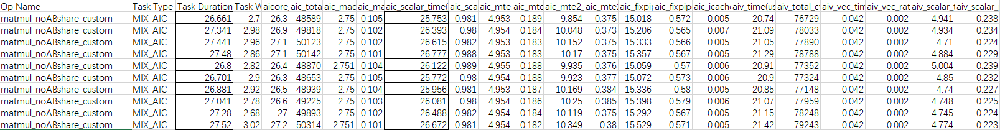

# Matmul高阶API使能IBShare模板共享A和B矩阵数据

**页面ID:** atlas_ascendc_best_practices_10_10000  
**来源:** https://www.hiascend.com/document/detail/zh/CANNCommunityEdition/850/opdevg/Ascendcopdevg/atlas_ascendc_best_practices_10_10000.html

---

#### 案例介绍

本案例呈现了在融合算子场景中，使用Matmul高阶API进行矩阵乘法计算时，A矩阵和B矩阵同时启用IBShare对性能的提升效果。

该案例的关键优化措施包括：

- 分核逻辑：以Cube核视角分核，Matmul计算结果输出到GM，提供给Vector核进行后续计算。
- 开启IBShare：A矩阵和B矩阵同时开启IBShare。

本案例的算子规格如下：

**表1 **算子规格

| 输入 | Shape | Data type | Format |
| --- | --- | --- | --- |
| x | 128,384 | float16 | ND |
| y | 384,256 | float16 | ND |

开启IBShare和未开启IBShare的完整样例请参考[MatmulABshare样例](https://gitee.com/ascend/samples/tree/master/operator/ascendc/2_features/13_matmul_api_ibshare)和[MatmulNoABshare样例](https://gitee.com/ascend/samples/blob/master/operator/ascendc/2_features/13_matmul_api_ibshare/MatmulABshareInvocation/matmul_noABshare_custom.cpp)。

#### 获取性能数据

使用msProf工具获取算子的Profiling的数据，重点分析MTE2，Cube，Scalar的流水情况。

#### 分析主要瓶颈点

**图1 **优化前Profiling数据


通过分析以上Profiling数据可以看出，算子执行多次的平均耗时为27.11us，aic_scalar_time的平均耗时为26.27us，当前性能瓶颈点为Cube的Scalar流水。

#### 设计优化方案

A矩阵和B矩阵均未开启IBShare时，数据需要根据K轴、M轴或N轴进行切分计算。这里以K轴切分为例，未开启IBShare之前，算子以AIV Block为视角进行tiling切分，AIV0发起A0*B0的计算，AIV1发起A1*B1的计算。

**图2 **未开启IBShare


当A矩阵和B矩阵都启用IBShare时，可以一次性加载到L1 Buffer上，省去了切分，分开搬运的过程，同时Cube计算单元完全由AIV0单核驱动，发起一次计算，计算的结果由AIV0和AIV1共享，从而减少Cube响应的次数，减少Scalar计算。

**图3 **开启IBShare


开启IBShare和不开启IBShare的数据交互对比示意图如下：


通过设置A和B矩阵MatmulType的IBShare均为true，开启该优化，具体代码如下：

```
constexpr bool isABshare = true;
template <typename aType, typename bType, typename cType> class MatmulABshareKernel {
public:
    __aicore__ inline MatmulABshareKernel(){};
    __aicore__ inline void Init(GM_ADDR a, GM_ADDR b, GM_ADDR c, GM_ADDR workspace,
                                const TCubeTiling &tiling, AscendC::TPipe *pipe);
    __aicore__ inline void Process(AscendC::TPipe *pipe);
    __aicore__ inline void CalcOffset(int32_t blockIdx, const TCubeTiling &tiling, int32_t &offsetA, int32_t &offsetB,
                                      int32_t &offsetC);
    AscendC::Matmul<AscendC::MatmulType<AscendC::TPosition::GM, CubeFormat::ND, aType, false, LayoutMode::NONE, isABshare>, 
           AscendC::MatmulType<AscendC::TPosition::GM, CubeFormat::ND, bType, false, LayoutMode::NONE, isABshare>,
           AscendC::MatmulType<AscendC::TPosition::VECIN, CubeFormat::ND, cType>>
        matmulObj;
    AscendC::GlobalTensor<aType> aGlobal;
    AscendC::GlobalTensor<bType> bGlobal;
    AscendC::GlobalTensor<cType> cGlobal;
    TCubeTiling tiling;
};
template <typename aType, typename bType, typename cType>
__aicore__ inline void MatmulABshareKernel<aType, bType, cType>::Init(GM_ADDR a, GM_ADDR b, GM_ADDR c, 
                                                                GM_ADDR workspace,const TCubeTiling &tiling, AscendC::TPipe *pipe)
{
    this->tiling = tiling;
    aGlobal.SetGlobalBuffer(reinterpret_cast<__gm__ aType *>(a), tiling.M * tiling.Ka);
    bGlobal.SetGlobalBuffer(reinterpret_cast<__gm__ bType *>(b), tiling.Kb * tiling.N);
    cGlobal.SetGlobalBuffer(reinterpret_cast<__gm__ cType *>(c), tiling.M * tiling.N);
    int32_t offsetA, offsetB, offsetC;
    CalcOffset(AscendC::GetBlockIdx(), tiling, offsetA, offsetB, offsetC); // calculate offset
    aGlobal = aGlobal[offsetA];
    bGlobal = bGlobal[offsetB];
    cGlobal = cGlobal[offsetC];
}
template <typename aType, typename bType, typename cType>
__aicore__ inline void
MatmulABshareKernel<aType, bType, cType>::CalcOffset(int32_t blockIdx, const TCubeTiling &tiling,
                                                             int32_t &offsetA, int32_t &offsetB, int32_t &offsetC)
{
    offsetA = 0;
    offsetB = 0;
    offsetC = 0;
}
```

#### 验证优化方案性能收益

优化后执行多次的平均耗时：22.44us，较优化前有较大提升。

**图4 **优化后Profiling数据


#### 总结

融合算子场景下，Matmul A矩阵和B矩阵同时开启IBShare，以Cube核视角分核，可以有效减少Cube侧的Scalar开销，提升性能。
