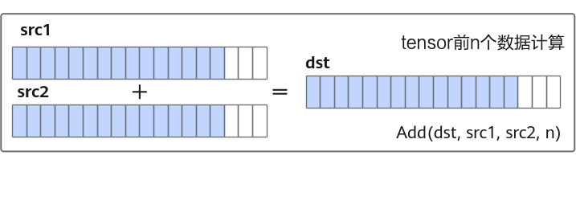

# 连续计算API

**页面ID:** atlas_ascendc_10_00055  
**来源:** https://www.hiascend.com/document/detail/zh/CANNCommunityEdition/850/opdevg/Ascendcopdevg/atlas_ascendc_10_00055.html

---

# 连续计算API

连续计算API，支持Tensor前n个数据计算。针对源操作数的连续n个数据进行计算并连续写入目的操作数，解决一维tensor的连续计算问题。

```
Add(dst, src1, src2, n);
```

下图以矢量加法为例，展示了**连续计算API**的特点。

**图1 ****连续计算API**

