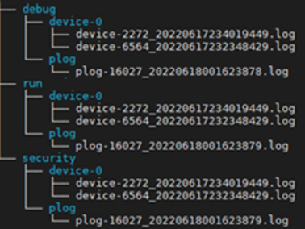

# 查看日志（Ascend EP）

**页面ID:** logreference_0002  
**来源:** https://www.hiascend.com/document/detail/zh/CANNCommunityEdition/850/maintenref/logreference/logreference_0002.html

---

# 查看日志（
     Ascend EP
    ）

本节介绍
      Ascend EP
     形态下，日志文件存储路径以及各日志文件记录的主要信息。

#### 查看应用类日志

应用类日志用于记录运行应用程序产生的日志，例如AscendCL应用程序运行完成后，默认可在“$HOME/ascend/log”下查看应用类日志，如图1所示，详细说明请参见表1。

> **注意:** 

- 应用类日志支持在容器内或物理机内查看。为保证日志工具在容器内正常运行，需要将日志工具动态库文件libascendalog.so及其依赖的libc_sec.so所在路径映射到容器内。所在路径分别为“CANN软件安装目录/ascend-toolkit/latest/compiler/lib64/libascendalog.so”和“CANN软件安装目录/ascend-toolkit/driver/lib64/common/libc_sec.so”。
- Device侧应用类日志会自动回传到Host侧，若回传失败，则会在Device侧直接落盘；若回传成功，则不会在Device侧落盘。
- 应用类日志支持老化，如果日志文件数量或大小超限，将会自动删除最早的日志目录或文件。

**图1 **应用类日志

**表1 **应用类日志介绍

| 存储路径 | 说明 |
| --- | --- |
| $HOME/ascend/log/debug/device-*id*/device-*p**id*_*.log | 在Device侧运行应用程序产生的调试日志。主要包括Device侧AI CPU、HCCP等模块的日志。 |
| $HOME/ascend/log/debug/plog/plog-*pid*_*.log | 在Host侧运行应用程序产生的调试日志。          主要包括compiler中各组件（如GE、FE、AI CPU、TBE、HCCL等）、runtime中各组件（如AscendCL、GE、Runtime等）和Driver用户态日志。 |
| $HOME/ascend/log/run/device-*id*/device-*p**id*_*.log | 在Device侧运行应用程序产生的运行日志。 |
| $HOME/ascend/log/run/plog/plog-*pid*_*.log | 在Host侧运行应用程序产生的运行日志。 |
| $HOME/ascend/log/security/device-*id*/device-*p**id*_*.log | 在Device侧运行应用程序产生的安全日志。 |
| $HOME/ascend/log/security/plog/plog-*pid*_*.log | 在Host侧运行应用程序产生的安全日志。 |
| 注1：上述日志中*id*和*pid*分别代表Device ID和业务进程ID，请以实际为准；日志文件中的“*”表示该日志文件创建时的时间戳。          注2：以上目录是容器或物理机内所有应用程序共同使用的，会不断增加新的应用进程，日志会不断增多，因此需要用户定期清理该目录（可以使用系统自带的logrotate实现日志切分），否则可能导致磁盘空间不足，影响业务正常运行。          注3：如果存储在只有emmc/flash等有写次数限制的介质下，建议将日志落盘路径设置到内存文件系统路径下，启动业务进程时通过环境变量ASCEND_PROCESS_LOG_PATH设置日志落盘路径，可以另起一个常驻进程定时定量将内存文件系统下的日志转储在emmc/flash。          注4：在容器内，目录中的device-*id*为逻辑ID。 |  |

其他相关配置：

- **修改应用类日志落盘路径**：可以使用环境变量ASCEND_PROCESS_LOG_PATH指定日志落盘路径；若开发者期望编译运行过程中产生的文件落盘到归一路径，可通过ASCEND_WORK_PATH设置单机独享文件的存储路径。
- **设置Device侧应用类日志回传延时**：
       Ascend EP
      标准形态下，Device侧的slogd进程会将Device侧应用类日志自动回传到Host侧，使用户在Host侧可以直接查看Device侧的应用类日志。在业务进程退出前，系统有2000ms的默认延时将Device侧应用类日志回传到Host侧，超时后业务进程退出。未回传到Host侧的日志直接在Device侧落盘。可以通过环境变量ASCEND_LOG_DEVICE_FLUSH_TIMEOUT设置更高的Device侧应用类日志回传到Host侧的延时时间。
- **设置应用类日志目录（plog和device-*id*）下存储每个进程日志文件的数量**：plog和device-*id*日志目录下能够存储的单个进程回传的日志文件数量，默认为10个，该数量可以通过环境变量ASCEND_HOST_LOG_FILE_NUM进行设置。
- **指定日志拥塞处理方式**：在日志拥塞或IO访问性能差的情况下，为保证业务性能不劣化，系统可能会丢失日志。为便于问题定位，用户可通过ASCEND_LOG_SYNC_SAVE配置在日志拥塞或IO访问性能差的情况下，不丢失日志。
- **设置日志展示方式**：日志的默认输出方式为将日志保存在log文件中，如果需要打印日志，可以配置环境变量ASCEND_SLOG_PRINT_TO_STDOUT。开启日志打印功能后，也可以在启动应用进程时，通过输出重定向方式将日志保存到指定文件中。例如：./main > log.txt

#### 查看系统类日志

系统类日志用于记录系统运行信息，
       Ascend EP
      标准形态下，用户没有Device的登录权限，因此需要通过msnpureport工具将Device侧的系统类日志传输到Host侧进行查看，具体请参考《[msnpureport工具使用指南](https://support.huawei.com/enterprise/zh/ascend-computing/ascend-hdk-pid-252764743?category=reference-guides&subcategory=command-reference)》。

> **注意:** 

- 容器内不支持查看Device侧系统类日志，也不支持通过msnpureport工具导出Device侧系统类日志。
- 系统类日志支持老化，如果日志文件数量或大小超限，将会自动删除最早的日志目录或文件。
