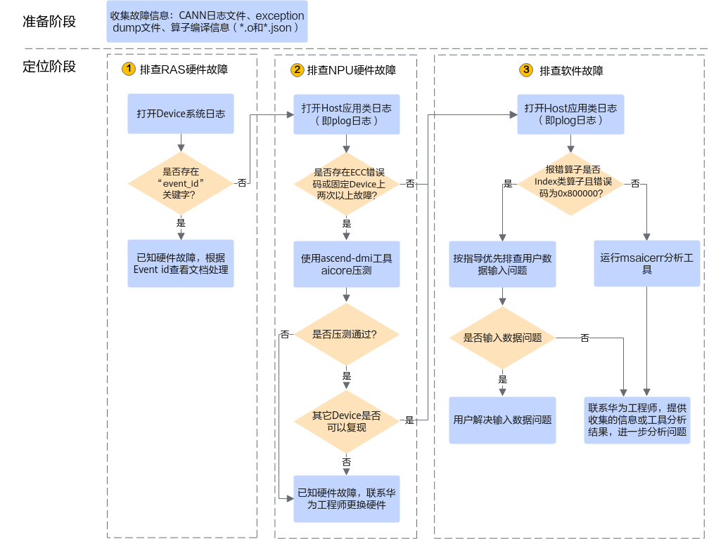

# AI Core Error问题定位思路

**页面ID:** troubleshooting_0005  
**来源:** https://www.hiascend.com/document/detail/zh/CANNCommunityEdition/850/maintenref/troubleshooting/troubleshooting_0005.html

---

您可以按如下步骤定位问题，若无法解决问题，再联系技术支持。您可以获取日志后单击Link联系技术支持。

**图1 **定位流程


准备阶段，需收集故障信息，包括：CANN日志文件、exception dump文件、算子编译信息（*.o和*.json）。如何收集故障信息，请参见收集AI Core Error问题信息。

1. 排查RAS硬件故障。

RAS硬件故障是指与硬件的可靠性（Reliability）、可用性（Availability）和可服务性（Serviceability）有关的故障。

从收集的日志中，在slog/dev-os-*id*/run/event/event_*.log中找到发生AI Core Error问题附近时间、对应Device的系统日志，检查日志中是否存在“event_id”关键字，若不存在，则跳转到2继续排查；若存在，则获取“event_id”的值（即RAS硬件故障码），单击《[健康管理故障定义](https://support.huawei.com/enterprise/zh/ascend-computing/ascend-hdk-pid-252764743)》获取对应版本的手册并查阅其中的解决方法，典型问题案例请参见HBM比特ECC故障、icache数据校验故障、AI Core超时故障。

2. 排查NPU硬件故障。

从收集的应用类日志中，找到发生AI Core Error问题附近时间的日志log/[run|debug]/plog/plog-*pid*_*.log，检查日志中的报错信息是否存在ECC相关报错（报错中有“ECC”或“ECC error”关键字）或者存在多次报错在同一个chipId上：

  - 若不存在，则跳转到3继续排查；

若存在，则继续使用ascend-dmi工具压测AI Core，若压测异常，则表示已知硬件故障，需联系技术支持更换硬件（典型问题案例请参见AI Core硬件故障）；若压测正常，则需要在程序中指定其它Device，再执行程序看问题是否可以复现，如果复现则跳转3继续排查，如果不复现则表示可能为硬件故障，需联系技术支持更换硬件。您可以获取日志后单击Link联系技术支持。

ascend-dmi工具需要单独安装，压测AI Core的命令示例如下，若报错**GENERAL_WARN**或**EMERGENCY_WARN**表示可能存在AI Core问题：

```
ascend-dmi --dg -i aicore -s
```

ascend-dmi工具在MindCluster ToolBox软件包中，该软件与CANN的配套关系请单击Link查询，ascend-dmi工具的安装及详细使用指导请参见[Link](https://hiascend.com/document/redirect/mindxdl-ascenddmiug)。

3. 排查软件故障。

  1. 从收集的应用类日志中，找到发生AI Core Error问题附近时间的日志log/[run|debug]/plog/plog-*pid*_*.log，检查日志中是否存在索引类算子0x800000的报错，若不存在，则跳转到3.b继续排查；若存在，则参考索引类算子索引越界排查算子输入数据问题。

典型索引类算子包括GatherV2、Scatter、GatherElements等。

  2. 借助msaicerr工具分析准备阶段收集的信息，msaicerr工具输出分析报告（info.txt文件），将执行msaicerr工具的结果数据（包括分析AI Core Error问题的最小集信息、分析报告等）提供给技术支持，待进一步分析定位。您可以获取日志后单击Link联系技术支持。

msaicerr工具的详细操作请参见使用msaicerr工具分析AI Core Error问题。
