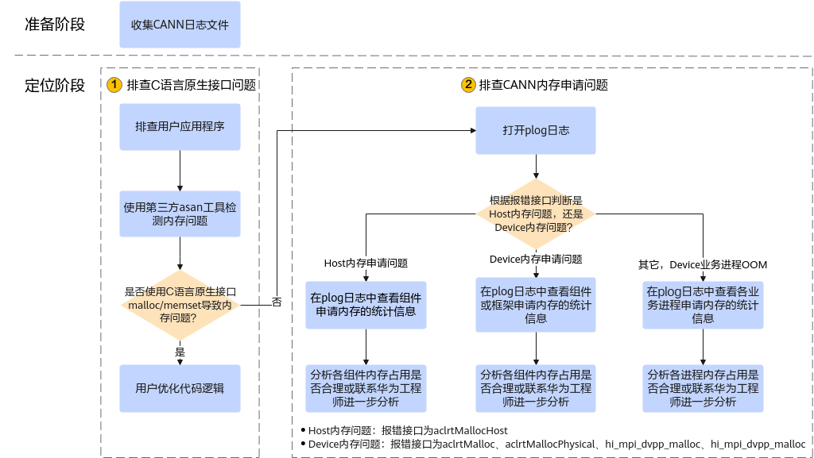

# 内存OOM问题定位思路

**页面ID:** troubleshooting_0051  
**来源:** https://www.hiascend.com/document/detail/zh/CANNCommunityEdition/850/maintenref/troubleshooting/troubleshooting_0051.html

---

# 内存OOM问题定位思路

您可以按如下步骤定位问题，若无法解决问题，再联系技术支持。您可以获取日志后单击Link联系技术支持。

**准备阶段，需收集CANN日志文件**。如何收集CANN日志文件（包括应用类日志、Device侧系统类日志），请参见收集内存OOM问题信息。收集的日志所存放的目录，下文以${HOME}/err_log_info/为例。

1. 排查C/C++语言接口问题。

用户检查应用程序中是否使用C标准接口malloc/memset等申请Host内存，若使用C标准接口申请Host内存，可使用第三方asan工具检测内存问题并优化代码逻辑。

2. 在Host应用类日志中${HOME}/err_log_info/log/[run|debug]/plog/plog-*pid*_*.log中，根据报错接口判断问题类别。

  - 如果报错处的提示信息使用CANN提供的aclrtMallocHost接口申请Host内存，则是因为**Host内存问题导致OOM**。

针对该场景的问题，则可在日志中搜索“_svm_mem_stats_show”关键字，查看各组件申请内存的统计信息，日志分析方法请参见查看CANN各组件内存统计信息，若各组件占用的内存不符合预期，需联系技术支持进一步定位问题。

  - 如果报错处的提示信息是使用CANN提供的aclrtMalloc、aclrtMallocPhysical、hi_mpi_dvpp_malloc等接口申请Device内存，则是因为**Device内存问题导致OOM**。

针对该场景的问题，可在日志中搜索“_svm_mem_stats_show”关键字，查看各组件或框架申请内存的统计信息，日志分析方法请参见查看CANN各组件内存统计信息，若各组件占用的内存不符合预期，需联系技术支持进一步定位问题。

  - 其它报错提示信息，一般是因为**Device业务进程异常导致OOM**，可在日志中搜索“svm_mem_stats_show_device_proc_mem”关键字，查看各业务进程的内存统计信息，日志分析方法请参见查看Device业务进程内存统计信息，若业务进程占用的内存不符合预期，需联系技术支持进一步定位问题。
