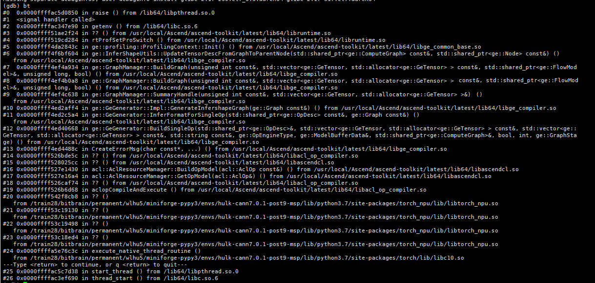

# 环境变量访问冲突，导致应用程序异常终止

**页面ID:** troubleshooting_0068  
**来源:** https://www.hiascend.com/document/detail/zh/CANNCommunityEdition/850/maintenref/troubleshooting/troubleshooting_0068.html

---

# 环境变量访问冲突，导致应用程序异常终止

#### 问题现象

多卡训练场景，出现多次core dump，应用程序异常终止。

#### 原因分析

1. 生成coredump文件。

  - 物理机场景，执行**ulimit -c unlimited**命令，表示在程序崩溃时生成coredump文件：

完成问题定位后，如果不需要生成coredump文件，可执行**ulimit -c 0**命令。

  - Docker场景，在Docker启动命令中增加**--ulimit core=-1**设置。

2. 运行训练脚本，若进程崩溃，即可在当前目录下生成coredump文件。
3. 使用gdb工具调试core文件、打印堆栈信息。

进入gdb模式，调试coredump文件，命令示例如下。其中，python3表示产生coredump文件的可执行程序名称，可根据实际情况修改；coredump文件名需根据实际文件名称修改。

```
gdb python3 core*.*
```

执行命令后，gdb工具会将发生异常的代码、其所在的函数、文件名和所在文件的行数打印到屏幕，堆栈信息的最上面是最底层的调用栈信息，方便定位问题。堆栈信息举例如下：



**注意**，调试coredump文件、打印堆栈信息要在出现问题的运行环境中，如果换一套环境，可能导致调试的堆栈信息不准确。

若环境中未安装gdb，则需要安装gdb，可通过包管理（如apt-get install gdb、yum install gdb）进行安装，详细安装步骤及使用方法请参见[GDB官方文档](https://sourceware.org/gdb/)。

4. 分析堆栈信息。

生成coredump文件、检查打印的堆栈信息后，发现应用程序集中在getenv()函数时异常退出，因此初步判断可能是getenv()函数使用问题，该函数用于读取环境变量。

在程序中，对于环境变量的操作，如果同时存在读、写操作，例如getenv、putenv，则可能导致环境变量访问冲突，进而导致程序异常。

5. 排查训练脚本中是否存在写环境变量的操作，导致与读环境变量的操作getenv冲突。

环境变量支持通过命令、接口、配置等方式实现，包括export命令、putenv/getenv/setenv/unsetenv/clearenv函数、os.environ、os.getenv等。您可以在训练脚本中排查这些方式，若存在，则可能引起环境变量访问冲突，导致程序异常。

本例中，训练脚本存在如下设置环境变量的代码，该方式实际调用的是C语言的putenv函数，putenv函数与算子编译时的getenv函数存在环境变量访问冲突。

```
os.environ["xxxxxxxxx"] = "xxxxxxxxx"
```

#### 解决方法

修改用户程序代码逻辑，删除代码中动态设置环境变量的逻辑，可在执行程序前设置环境变量。
