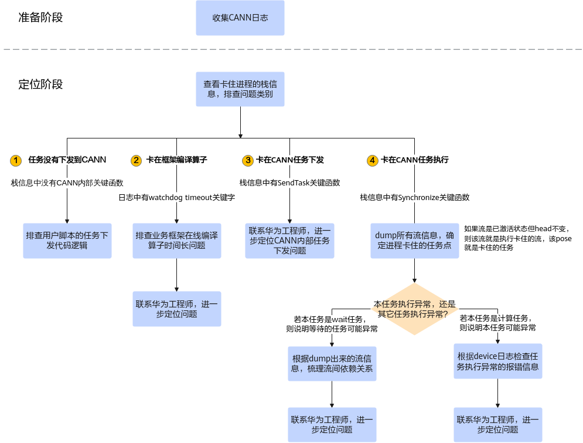
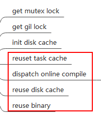
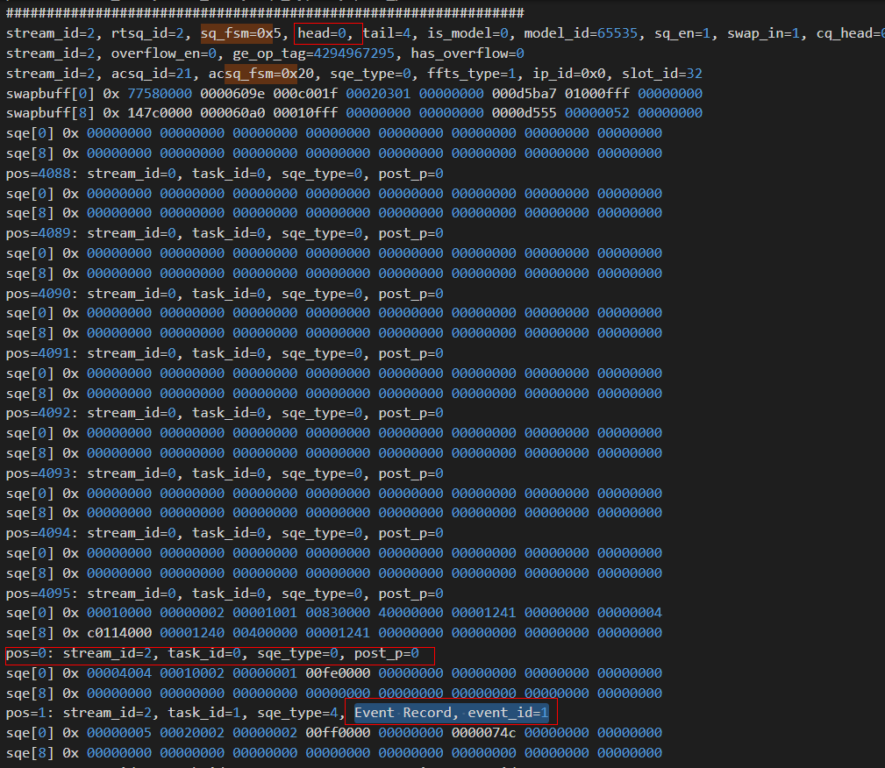

# 进程卡住问题定位思路

**页面ID:** troubleshooting_0072  
**来源:** https://www.hiascend.com/document/detail/zh/CANNCommunityEdition/850/maintenref/troubleshooting/troubleshooting_0072.html

---

您可以按如下步骤定位问题，若无法解决问题，再联系技术支持。您可以获取日志后单击Link联系技术支持。



**准备阶段，需收集CANN日志文件。**如何收集CANN日志文件，请参见收集进程卡住问题信息。收集的日志所存放的目录，下文以${HOME}/err_log_info/为例。

1. 使用asys工具获取卡住进程的调用栈信息，同时结合plog运行日志排查框架在线编译算子时间长的问题。

      asys工具命令示例如下，其安装及详细参数说明请参见环境准备。

```
# *pid*表示卡住的用户进程ID，请根据实际情况替换
asys collect -r=stacktrace --remote=*pid* --all --quiet
```

asys命令执行成功后，可根据终端窗口中的stackcore file path提示获取堆栈结果文件。若使用gdb工具，也可参见查看C/C++应用程序的堆栈中的内容获取堆栈信息。

      根据堆栈信息及日志，定位过程如下：

  - **如果栈信息中没有任何CANN内部关键函数**，说明任务没有下发到CANN，需定位客户脚本任务下发的问题。

CANN内部函数来源于CANN软件安装目录下的库文件，CANN软件默认安装目录为“/usr/local/Ascend”。

  - 如果plog运行日志中有“**watchdog timeout**”关键字，说明可能算子在线编译时间长导致进程卡住，需要联系技术支持进一步定位问题。

         plog运行日志（即${HOME}/err_log_info/log/run/plog/plog-*pid*_*.log日志）示例片段如下：

```
[INFO][pid:2241703]awatchdog_monitor.c:145 **watchdog timeout**, dogId 65584, timeout : 3s
```

若由于算子编译时长问题导致进程超时退出，或由上层业务框架终止进程，这时可以通过trace日志确认是否存在算子编译时间太长导致进程卡住：

```
# 在trace日志目录下，查找记录算子编译信息的日志文件
find *<trace日志目录>* -name "schedule_tracer_FE_Global_Trace.txt"
find *<trace日志目录>* -name "schedule_tracer_FE_Statistics_Trace.txt"
find *<trace日志目录>* -name "schedule_tracer_FE_CompileTd_*.txt"
```

trace日志中的关键字说明：

    - schedule_tracer_FE_Global_Trace.txt用于记录算子初始化&销毁、缓存老化等全局性的设置&状态、时间点信息。

该日志中存在“Compile process status.”关键字表示算子在编译中，存在“Finish subgraph compile”关键字表示算子编译结束。若某个算子停留在“Compile process status.”状态，还需要结合schedule_tracer_FE_CompileTd_*.txt日志查看该算子具体处理哪个处理阶段。

日志片段示例如下：

```
atrace/trace_160081_160353_20240614161350257811/schedule_event_160353_20240614161504656402/schedule_tracer_FE_Global_Trace.txt
2024-06-14 16:13:53.548.098 Begin to initialize TeFusion.
2024-06-14 16:13:53.549.392 Dfx manager has been initialized.
2024-06-14 16:13:58.854.521 CannKb has been initialized.
2024-06-14 16:13:58.890.273 Multi process has been checked.
2024-06-14 16:13:58.892.068 Cache manager has been initialized.
2024-06-14 16:13:59.785.505 TbeCompiler has been initialized.
2024-06-14 16:14:00.399.061 Parallel Compilation has been initialized.
2024-06-14 16:14:00.399.368 PythonApiCall has been initialized.
2024-06-14 16:14:00.400.672 TeFusion has been initialized successfully.
2024-06-14 16:14:38.536.555 **Compile process status. ThreadId:139857490806528**|Total task count:1|Finished task count:1|Waiting task count:0
2024-06-14 16:14:38.536.718 ThreadId:139857490806528|SingleOp:Assign_2|Task wait second:12
2024-06-14 16:14:38.536.753 **Finish subgraph compile. ThreadId:139857490806528**|Total task count:1
2024-06-14 16:15:19.548.089 Compile process status. ThreadId:139857456973568|Total task count:6|Finished task count:2|Waiting task count:4
2024-06-14 16:15:19.548.229 ThreadId:139857456973568|SingleOp:Sub_18|Task wait second:14
2024-06-14 16:15:40.628.425 Compile process status. ThreadId:139857456973568|Total task count:6|Finished task count:4|Waiting task count:2
2024-06-14 16:15:40.628.583 ThreadId:139857456973568|SingleOp:GatherV2_10|Task wait second:6
2024-06-14 16:16:01.959.390 Compile process status. ThreadId:139857456973568|Total task count:6|Finished task count:6|Waiting task count:0
2024-06-14 16:16:01.959.541 ThreadId:139857456973568|SingleOp:Pow_16|Task wait second:7
2024-06-14 16:16:01.959.579 Finish subgraph compile. ThreadId:139857456973568|Total task count:6
2024-06-14 16:16:32.408.784 Compile process status. ThreadId:139857456973568|Total task count:2|Finished task count:2|Waiting task count:0
2024-06-14 16:16:32.408.943 ThreadId:139857456973568|SingleOp:Pow_2|Task wait second:12
2024-06-14 16:16:32.409.027 Finish subgraph compile. ThreadId:139857456973568|Total task count:2
2024-06-14 16:16:43.550.284 PreBuildManager has been finalized.
2024-06-14 16:16:43.550.286 Begin to finalize TeFusion.
2024-06-14 16:16:43.559.052 ParallelCompilation has been finalized.
2024-06-14 16:16:43.591.007 Files under kernel meta dir and kernel meta temp dir has been removed.
2024-06-14 16:16:43.808.544 CannKb has been finalized.
2024-06-14 16:16:43.808.737 Python object has been reset.
2024-06-14 16:16:43.823.564 TeFusion has been finalized successfully.
```

    - schedule_tracer_FE_CompileTd_*.txt用于记录当前正在编译的算子状态及变更

一般来说，若算子的状态停留在“init disk cache”状态，表示算子编译卡住，若进入“reuse task cache”、“dispatch online compile”、“reuse disk cache”、“reuse binary”状态，表明算子编译正常进行中。

日志片段示例：

```
cat atrace/trace_160081_160353_20240614161350257811/schedule_event_160353_20240614161504666001/schedule_tracer_FE_CompileTd_8.txt
2024-06-14 16:14:35.340.781 Compile process detail:Thread Id:139857456973568|Op Id:10|Op Type:GatherV2|get mutex lock
2024-06-14 16:14:35.340.846 Compile process detail:Thread Id:139857456973568|Op Id:10|Op Type:GatherV2|get gil lock
2024-06-14 16:14:35.340.876 Compile process detail:Thread Id:139857456973568|Op Id:10|Op Type:GatherV2|init disk cache
2024-06-14 16:14:35.346.571 Compile process detail:Thread Id:139857456973568|Op Id:10|Op Type:GatherV2|dispatch online compile
......
2024-06-14 16:15:52.991.561 Compile process detail:Thread Id:139857456973568|Op Id:4|Op Type:Xdivy|get mutex lock
2024-06-14 16:15:52.991.674 Compile process detail:Thread Id:139857456973568|Op Id:4|Op Type:Xdivy|get gil lock
2024-06-14 16:15:52.991.706 Compile process detail:Thread Id:139857456973568|Op Id:4|Op Type:Xdivy|init disk cache
2024-06-14 16:15:52.996.765 Compile process detail:Thread Id:139857456973568|Op Id:4|Op Type:Xdivy|reuse binary
```

算子编译各阶段的状态一般包括：



    - schedule_tracer_FE_Statistics_Trace.txt用于记录整体算子的编译状态，有缓存未使用、更新缓存失败

日志片段示例：

```
atrace/trace_160081_160353_20240614161350257811/schedule_event_160353_20240614161504656977/schedule_tracer_FE_Statistics_Trace.txt
2024-06-14 16:16:43.550.032 Disk cache statistics:match times:9|reuse fail times:9|copy times:8|copy success times:7|copy fail times:1
2024-06-14 16:16:43.550.043 Disk cache statistics:cache not existed times:9
2024-06-14 16:16:43.550.044 Online compile statistics:compile task submit times:7
2024-06-14 16:16:43.550.044 Binary reuse statistics:match times:9|reused times:3|reuse fail times:1|reuse check fail times:7
2024-06-14 16:16:43.550.044 Binary reuse statistics:simple key mismatch times:1
```

  - **如果栈信息中有“****SendTask****”关键函数**，说明卡在CANN任务下发阶段，需联系技术支持定位任务下发代码逻辑问题。

栈信息片段示例如下：

```
[stack]
Thread 1 (3491807)
#00 0x0000ffff32ccfd84 0x0000ffff32992000 /usr/local/Ascend/8.3.RC1/aarch64-linux/lib64/libruntime_v100.so (_ZN3cce7runtime16DirectHwtsEngine11TaskReclaimEjbRj)
#01 0x0000ffff32ccdedc 0x0000ffff32992000 /usr/local/Ascend/8.3.RC1/aarch64-linux/lib64/libruntime_v100.so (_ZN3cce7runtime16DirectHwtsEngine11SendingWaitEPNS0_6StreamERh)
#02 0x0000ffff32bf30e8 0x0000ffff32992000 /usr/local/Ascend/8.3.RC1/aarch64-linux/lib64/libruntime_v100.so (_ZN3cce7runtime6Engine8**SendTask**EPNS0_15tagTaskInfoStruERtPj)
#03 0x0000ffff32cce49c 0x0000ffff32992000 /usr/local/Ascend/8.3.RC1/aarch64-linux/lib64/libruntime_v100.so (_ZN3cce7runtime16DirectHwtsEngine10SubmitSendEPNS0_15tagTaskInfoStruEPj)
#04 0x0000ffff32bf3ec8 0x0000ffff32992000 /usr/local/Ascend/8.3.RC1/aarch64-linux/lib64/libruntime_v100.so (_ZN3cce7runtime6Engine16SubmitTaskNormalEPNS0_15tagTaskInfoStruEPj)
#05 0x0000ffff32bf4d28 0x0000ffff32992000 /usr/local/Ascend/8.3.RC1/aarch64-linux/lib64/libruntime_v100.so (_ZN3cce7runtime6Engine10SubmitTaskEPNS0_15tagTaskInfoStruEPji)
```

  - **如果栈信息中有“****Synchronize****”关键函数**，说明卡在任务执行阶段，需跳转到2继续追溯卡住任务。

栈信息片段示例如下：

```
[stack]
Thread 1 (332418, rtstest_host)
#00 0x00007fe235f255cb 0x00007fe235e11000 /usr/lib/x86_64-linux-gnu/libc-2.31.so (ioctl)
#01 0x00007fe1f06456f5 0x00007fe1f0570000 /usr/local/Ascend/driver/lib64/driver/libascend_hal.so (trs_dev_ioctl)
#02 0x00007fe1e9bcc5ca 0x00007fe1e97b3000 /usr/local/Ascend/8.5.0/x86_64-linux/lib64/libruntime_v200.so (_ZN3cce7runtime9NpuDriver15LogicCqReportV2ERKNS0_15LogicCqWaitInfoEPhjRj)
#03 0x00007fe1e9b2a417 0x00007fe1e97b3000 /usr/local/Ascend/8.5.0/x86_64-linux/lib64/libruntime_v200.so (_ZN3cce7runtime8SyncTaskEPNS0_6StreamEji)
#04 0x00007fe1e9b28ae7 0x00007fe1e97b3000 /usr/local/Ascend/8.5.0/x86_64-linux/lib64/libruntime_v200.so (_ZN3cce7runtime18SubmitTaskPostProcEPNS0_6StreamEjbi)
#05 0x00007fe1e9ad849d 0x00007fe1e97b3000 /usr/local/Ascend/8.5.0/x86_64-linux/lib64/libruntime_v200.so (_ZN3cce7runtime20ProcStreamRecordTaskEPNS0_6StreamEi)
#06 0x00007fe1e9b68fc6 0x00007fe1e97b3000 /usr/local/Ascend/8.5.0/x86_64-linux/lib64/libruntime_v200.so (_ZN3cce7runtime11DavidStream16SubmitRecordTaskEi)
#07 0x00007fe1e9b4c723 0x00007fe1e97b3000 /usr/local/Ascend/8.5.0/x86_64-linux/lib64/libruntime_v200.so (_ZN3cce7runtime6Stream16StarsWaitForTaskEjbi)
#08 0x00007fe1e9b550f2 0x00007fe1e97b3000 /usr/local/Ascend/8.5.0/x86_64-linux/lib64/libruntime_v200.so (_ZN3cce7runtime6Stream11**Synchronize**Ebi)
#09 0x00007fe1e9982895 0x00007fe1e97b3000 /usr/local/Ascend/8.5.0/x86_64-linux/lib64/libruntime_v200.so (_ZN3cce7runtime7ApiImpl17StreamSynchronizeEPNS0_6StreamEi)
```

2. 查看日志，找到卡住的流，确定卡住的任务。

  1. 根据收集的trace日志，查看ERROR报错处的流信息。

trace日志（schedule_tracer_*.txt文件）报错示例如下：

```
[ERROR] TSCH(-1,null):2024-02-08-01:41:14.977.406 3986 (dieid:0,cpuid:0) stars_timewheel.c:90 stars_wait_sqe_is_timeout: Timeout: sq_pid=80029, sq_id=3, is_need_process=1, exe_time=16, time_out=10, **stream_id=3, task_id=47****, cur_head=47,** wait_sqe_head=47.
[ERROR] TSCH(-1,null):2024-02-08-01:41:14.977.431 3987 (dieid:0,cpuid:0) stars_interrupt.c:1221 stars_proc_wait_timeout: wait task timeout, rtsq_id=3, type=5, sq_pid=80029
```

  2. 在trace日志（schedule_tracer_*.txt文件）中根据stream_id查找dump出来的流信息，例如执行**grep -rn "****stream_id=3****"**命令搜索关键字。

**日志示例及解析如下**：

    - stream 3的sq_en状态是1，表示流为激活状态；
    - head用于标识流上当前正在执行的任务，head的值为47，表示任务索引为47，表示任务执行持续停留在任务47上；
    - pos表示具体要执行的任务，由于任务执行持续停留在任务47上，因此pos[47]就是卡住的任务。

```
################################################################
**stream_id=3**, rtsq_id=3, sq_fsm=0x9, cur_wait_time=16, head=47, tail=49, is_model=0, model_id=65535, exe_times=65535, **sq_en=1**, swap_in=0, cq_head=10, cq_tail=10, pid=80029, vf_id=0, is_mc2_sq=0
stream_id=3, overflow_en=0, ge_op_tag=4294967295, has_overflow=0
swapbuff[0] 0x 59080000 0000001f 000d001f 00030201 00000000 0001389d 010007ff 00000000
swapbuff[8] 0x 3e5c8000 00000007 000107ff 00000000 00000000 0000d555 00000052 00000000
sqe[0] 0x 00004003 00278003 0000ffff 00fe0000 00000000 00000000 00000000 00000000
sqe[8] 0x 00000000 00000000 00000000 00000000 00000000 00000000 00000000 00000000
pos=39: stream_id=32771, task_id=39, sqe_type=3, post_p=0
sqe[0] 0x 00010000 00280003 00001000 00fe0000 40400000 00001241 00000000 00000004
sqe[8] 0x c00197c0 00001240 8000a000 00001241 00000000 00000000 00000000 00000000
pos=40: stream_id=3, task_id=40, sqe_type=0, FFTS
sqe[0] 0x 00000004 00290003 00000008 00fe0000 00000000 00000000 00000000 00000000
sqe[8] 0x 00000000 00000000 00000000 00000000 00000000 00000000 00000000 00000000
pos=41: stream_id=3, task_id=41, sqe_type=4, Event Record, event_id=8, isSync=0
sqe[0] 0x 00010000 002a0003 00001000 00fe0000 40400000 00001241 00000000 00000004
sqe[8] 0x c00197c0 00001240 8000a800 00001241 00000000 00000000 00000000 00000000
pos=42: stream_id=3, task_id=42, sqe_type=0, FFTS
sqe[0] 0x 00000005 002b0003 00000009 00ff0000 00000000 0000000a 00000000 00000000
sqe[8] 0x 00000000 00000000 00000000 00000000 00000000 00000000 00000000 00000000
pos=43: stream_id=3, task_id=43, sqe_type=5, Event Wait, event_id=9
sqe[0] 0x 00010000 002c0003 00001000 00fe0000 40400000 00001241 00000000 00000004
sqe[8] 0x c00197c0 00001240 8000b000 00001241 00000000 00000000 00000000 00000000
pos=44: stream_id=3, task_id=44, sqe_type=0, FFTS
sqe[0] 0x 00010000 002d0003 00001000 00fe0000 40400000 00001241 00000000 00000004
sqe[8] 0x c00197c0 00001240 8000b400 00001241 00000000 00000000 00000000 00000000
pos=45: stream_id=3, task_id=45, sqe_type=0, FFTS
sqe[0] 0x 00010000 002e0003 00001000 00fe0000 40400000 00001241 00000000 00000004
sqe[8] 0x c00197c0 00001240 8000b800 00001241 00000000 00000000 00000000 00000000
pos=46: stream_id=3, task_id=46, sqe_type=0, FFTS
sqe[0] 0x 00000005 002f0003 0000000b 00ff0000 00000000 0000000a 00000000 00000000
sqe[8] 0x 00000000 00000000 00000000 00000000 00000000 00000000 00000000 00000000
**pos=47: stream_id=3, task_id=47, sqe_type=5, Event Wait, event_id=1**
sqe[0] 0x 00004003 00308003 0000ffff 00fe0000 00000000 00000000 00000000 00000000
sqe[8] 0x 00000000 00000000 00000000 00000000 00000000 00000000 00000000 00000000
pos=48: stream_id=32771, task_id=48, sqe_type=3, post_p=0
################################################################
```

  3. 排查卡住的原因是本任务执行异常，还是其它任务执行异常导致。

    - 如果卡住任务的任务类型是wait任务（日志有Event Wait关键字，同时日志中会打印event_id），则说明该任务是在等待另一个任务的执行结果，另一个任务可能执行异常，需跳转到2.d继续排查；
    - 对于非wait任务，任务类型可能为计算任务，则需联系技术支持进一步定位问题。

  4. 梳理流间依赖关系，排查任务卡住的原因。

在trace日志（schedule_tracer_*.txt文件）中通过event_id，例如执行**grep -rn "****event_id=1****"**命令搜索关键字，找到下发Event Record任务的流，该流的record任务没执行，导致另一条流的event wait任务卡住。定位到任务卡住的原因后，需联系技术支持进一步排查软件问题或用户调用逻辑问题。

**日志示例及解析如下**：通过event_id=1，找到对应的event_record任务所在的stream 2，通过日志中的信息发现stream 2上的任务执行停留在任务0（即pos[0]任务），导致任务卡住，这是因为该流的event_record任务（即pos[1]）没有执行，进而导致其它流卡住。


