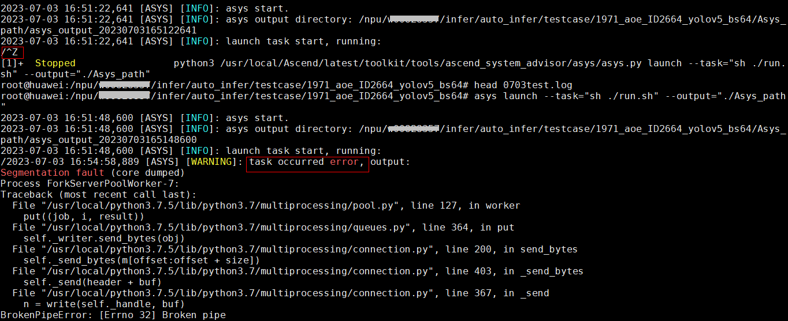

# FAQ

**页面ID:** troubleshooting_0517  
**来源:** https://www.hiascend.com/document/detail/zh/CANNCommunityEdition/850/maintenref/troubleshooting/troubleshooting_0517.html

---

#### 业务复跑报错FAQ

- **问题现象**

先使用ctrl+z中止业务复跑task，接着再次拉起业务复跑task，屏显日志显示业务复跑task错误，如下图所示。

**图1 **业务复跑报task occurred error

- **可能原因**

执行ctrl+z操作等导致任务异常终止，但还存在任务进程残留（且还进行重定向写文件操作等操作），与后面新启动的asys复跑任务相互冲突，导致复跑异常。

- **处理方法**

在asys复跑前查询是否存在运行中的推理/训练进程id，需要手工kill相关进程，然后再重新asys复跑。

#### asys工具导出实时堆栈超时报错FAQ

- **问题现象**

使用asys工具导出实时堆栈时，存在部分场景下导出超时报错，报错如下：

```
[ASYS] [ERROR]: Generating the stackcore bin file timeout. For details, see the related description in the document.
```

- **可能原因****&解决方法**

  1. 实时堆栈导出功能还未初始化完成。

这时，需等待初始化完成后，可根据plog日志（默认路径为$HOME/ascend/log/run|debug/plog/plog-*pid*_*.log）中的**attr init success**关键字判断初始化已完成，再尝试导出实时堆栈信息。

  2. ASCEND_COREDUMP_SIGNAL环境变量被设置为none，关闭了部分信号集，导致实时堆栈导出功能不可用。

这时，可根据plog日志（默认路径为$HOME/ascend/log/run|debug/plog/plog-*pid*_*.log）中的**close the signal capture function**关键字判断信号集被关闭了，需设置ASCEND_COREDUMP_SIGNAL环境变量，打开信号集。关于ASCEND_COREDUMP_SIGNAL环境变量及trace处理的信号集的详细说明请参见《环境变量参考》。

  3. 用户业务执行完成，实时堆栈导出功能相关的资源已释放。

这时，可根据plog日志（默认路径为$HOME/ascend/log/run|debug/plog/plog-*pid*_*.log）中的**unregister all signal handlers, can not capture signal**关键字判断实时堆栈导出功能相关的资源已释放，需再次执行用户业务，才可以导出实时堆栈信息。

  4. 实时堆栈导出功能异常。

这时，可在plog日志（默认路径为$HOME/ascend/log/run|debug/plog/plog-*pid*_*.log）中搜**ERROR**关键字，查看具体报错信息，联系技术支持。单击Link联系技术支持。
